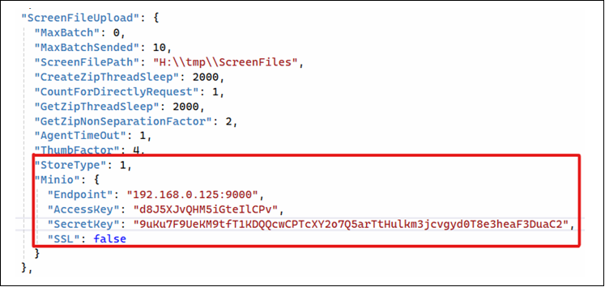
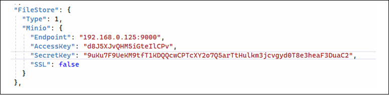
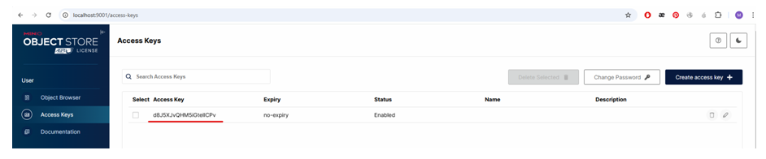

# Интеграция с S3-хранилищем

Для хранения файлов скринов, передаваемых роботами вместе с логами (**RobotLogs**), и архивов дистрибутивов роботов и агентов (**WebApi**) имеется возможность сконфигурировать службы RobotLogs и WebApi 
для использования S3-хранилища (Minio).

В службе **RobotLogs** в секцию *ScreenFileUpload* требуется добавить параметры: 

В службе **WebApi** требуется добавить секцию *FileStore*:

### Описание параметров подключения к S3 в ScreenFileUpload/FileStore

| №п/п | Наименование параметра | Назначение | Примечание |
| --- | --- | --- | --- |
| 1. | StoreType/Type | 0 – файловое хранилище,1 – S3 (minio) |  |
| 2. | Minio.Endpoint | Адрес конечной точки minio |  |
| 3. | Minio.AccessKey | Параметры доступа. Настраиваются администратором minio (см. рисунок ниже) |  |
| 4. | Minio.SecretKey |  | Должен быть зашифрован утилитой шифрования |
| 5. | Minio.SSL | Устанавливается в true, если minio настроен на использование https |  |

### Параметры подключения к minio:

