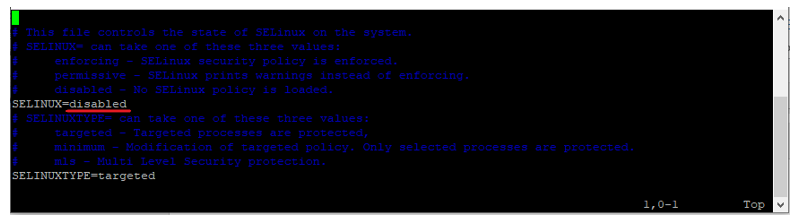
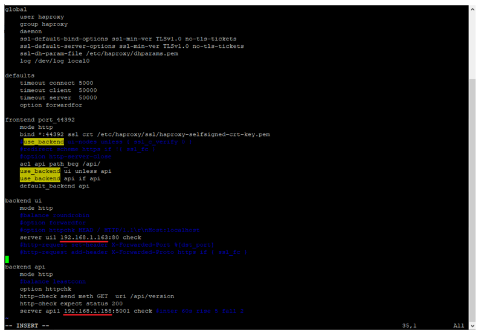
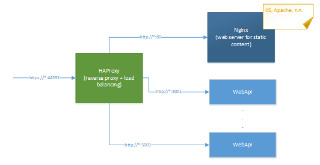

# Развертывание HAProxy на CentOS 8.5

1.	Выключаем SELinux:
```
# sudo vim /etc/selinux/config
# reboot
```



2. Устанавливаем HAProxy из rpm-пакета (идет в комплекте поставки):
```
# sudo yum install haproxy-2.2.2-1.el8.x86_64.rpm
```
3. Создаем папку, в которой будут храниться файлы SSL-сертификата:
```
# sudo mkdir /etc/haproxy/ssl
```
4. Обязательно даем права только на чтение для файлов папки /etc/haproxy/ssl:
```
# sudo chmod 700 /etc/haproxy/ssl
```
5. Копируем в эту папку файл SSL-сертификата haproxy-selfsigned-crt-key.pem (идет в комплекте поставки)\*  или самостоятельно генерируем самоподписанный SSL-сертификат.

> \* - Должен быть заменен в последующем валидным SSL-сертификатом 

* Для самостоятельной генерации SSL-сертификата используем команды:
```
# sudo openssl req -x509 -nodes -days 365 -newkey rsa:2048 -keyout /etc/haproxy/ssl/haproxy-selfsigned.key -out /etc/haproxy/ssl/haproxy-selfsigned.crt
# sudo cat /etc/haproxy/ssl/haproxy-selfsigned.crt /etc/haproxy/ssl/haproxy-selfsigned.key > /etc/haproxy/ssl/haproxy-selfsigned-crt-key.pem
```
6. В папку /etc/haproxy копируем файл dhparams.pem с параметрами Diffie-Hellman group (идет в комплекте поставки) или генерируем его самостоятельно.

* Для самостоятельной генерации dhparams.pem используем команду:
```
# sudo openssl dhparam -out /etc/haproxy/dhparams.pem 2048
```
7. Копируем конфигурационный файл haproxy.cfg в папку /etc/haproxy и редактируем его в части IP-адресов nginx и WebApi:
```
sudo vim /etc/haproxy/haproxy.cfg
```



8. Открываем порт 44392 на файерволе:
```
# firewall-cmd --zone=public --add-port=44392/tcp --permanent
# firewall-cmd –reload
```
9. Добавляем haproxy в автозагрузку и стартуем службу:
```
# sudo systemctl enable haproxy
# sudo systemctl start haproxy
```
10. Меняем конфигурационный файл nginx.conf на сервере nginx – оставляем только раздачу статики по http на 80-м порту (должен быть открыт). Файл nginx.conf для работы nginx под HAProxy идет в комплекте поставки.

11. Открываем порт 5001 на узлах с WebApi.

12. Итоговая конфигурация приведена на рисунке ниже:


