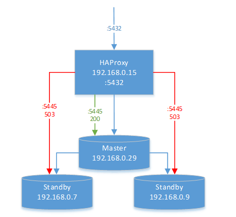
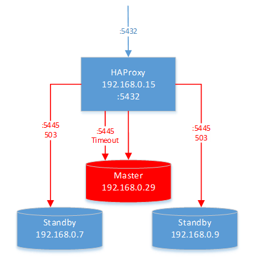
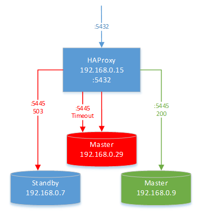
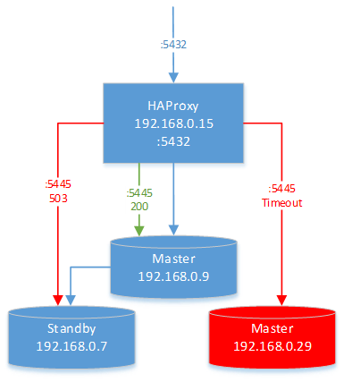

# Настройка кластера PostgreSQL на основе repmgr на CentOS 8

Для организации отказоустойчивого кластера PostgreSQL используется синхронная репликация master-standby, настроенная при помощи утилиты repmgr, и HAProxy. 
HAProxy используется для скрытия от клиента IP mastera, который изменится после автоматического failover. 
Для примера рассмотрим настройку кластера из 3-х нод.

Штатная работа кластера:



Выход из строя (недоступность) master:



Автоматический failover и реструктуризация кластера:



Штатная работа кластера с новым master:



Чтение и запись производится клиентом через HAProxy только в master \*. 
Для определения, является ли нода master, HAProxy по порту 5445 вызывает http-сервисы, развернутые на всех нодах  кластера. 
Если нода является master, сервис вернет http-статус 200, иначе 503.

> \* - Со standby возможно только чтение, но этот сценарий в данной статье не рассматривается.

## Репликация на основе repmgr12

https://www.youtube.com/watch?v=LvDHdgQqaQw

Установим PostgreSQL (локально из пакетов или из репозитория в интернет, см. «Руководство по установке TimescaleDB под CentOS 8») и repmgr12 на всех нодах:
```
# sudo dnf install -y https://download.postgresql.org/pub/repos/yum/reporpms/EL-8-x86_64/pgdg-redhat-repo-latest.noarch.rpm
# sudo dnf -qy module disable postgresql
# sudo dnf install -y postgresql12-server repmgr12 postgresql12 postgresql12-contrib postgresql12-libs  
# sudo /usr/pgsql-12/bin/postgresql-12-setup initdb
# sudo systemctl enable postgresql-12
# sudo systemctl start postgresql-12
```
На всех нодах настроим переменную окружения PATH для удобства работы с pgsql:
```
# sudo vim /var/lib/pgsql/.bash_profile

PATH=$PATH:$HOME/bin:/usr/pgsql-12/bin
export PATH
```
На всех нодах добавляем repmgr12 в автозапуск:
```
# sudo systemctl enable repmgr12
```
Добавляем настройки repmgr в postgresql.conf (достаточно для ноды 1):
```
# sudo vim /var/lib/pgsql/12/data/repmgr.conf

shared_preload_libraries = 'repmgr'
max_wal_senders = 10
max_replication_slots = 15
wal_level = 'replica'
hot_standby = on
archive_mode = on
archive_command = '/bin/true'

# sudo echo -e "include_if_exists 'repmgr.conf'" >> /var/lib/pgsql/12/data/postgresql.conf
# sudo tail /var/lib/pgsql/12/data/postgresql.conf
```
Добавляем пользователей для репликации в pg_hba.conf (достаточно для ноды 1):
```
# sudo vim /var/lib/pgsql/12/data/pg_hba.conf

# TYPE  DATABASE        USER            ADDRESS                 METHOD

# "local" is for Unix domain socket connections only
local   all             all                                     		trust
# IPv4 local connections:
host    all             all             0.0.0.0/0               	trust
# IPv6 local connections:
host    all             all             ::1/128                 	ident
# Allow replication connections from localhost, by a user with the
# replication privilege.
local   replication     repmgr                                  	trust
host    replication     repmgr          0.0.0.0/0               trust
host    replication     repmgr          ::1/128                 trust

local   repmgr          repmgr                                  trust
host    repmgr          repmgr          0.0.0.0/0               trust
```
Назначаем владельца и права на конфигурационные файлы (достаточно для ноды 1):
```
# sudo chown postgres:postgres /var/lib/pgsql/12/data/{pg_hba.conf,repmgr.conf}
# sudo chmod 600 /var/lib/pgsql/12/data/{pg_hba.conf,repmgr.conf}
```
Перезапускаем postgresql12 на ноде 1:
```
# sudo systemctl restart postgresql-12
# sudo systemctl status postgresql-12
```
Теперь настраиваем repmgr:

Выполняем настройку схемы по умолчанию (достаточно для ноды 1):
```
# sudo su - postgres
# createuser -s repmgr
# createdb repmgr -O repmgr
# psql
# postgres=# \c repmgr
# postgres=# ALTER USER repmgr SET search_path TO repmgr, "$user", public; 
# postgres=# \q
```
Дальнейшая настройка repmgr происходит для каждой ноды. Полезно сначала сохранить оригинальный конфигурационный файл:
```
# sudo mv /etc/repmgr/12/repmgr.conf{,.b}
# sudo vim /etc/repmgr/12/repmgr.conf
```
Для ноды 1:
```
# vim /etc/repmgr/12/repmgr.conf

node_id=1
node_name='node1'
conninfo='host=192.168.0.29 dbname=repmgr user=repmgr connect_timeout=4'
data_directory='/var/lib/pgsql/12/data/'
use_replication_slots=yes
log_file='/var/log/repmgr/repmgr.log'
pg_bindir='/usr/pgsql-12/bin/'
ssh_options='-q -o ConnectTimeout=10 -o "StrictHostKeyChecking no"'
failover=automatic
priority=100
reconnect_attempts=6
reconnect_interval=10
promote_command='/usr/pgsql-12/bin/repmgr standby promote -f /etc/repmgr/12/repmgr.conf'
follow_command='/usr/pgsql-12/bin/repmgr standby follow -f /etc/repmgr/12/repmgr.conf -W --upstream-node-id=%n'
service_start_command='sudo systemctl start postgresql-12'
service_stop_command='sudo systemctl stop postgresql-12'
service_restart_command='sudo systemctl restart postgresql-12'
service_reload_command='sudo systemctl reload postgresql-12'
```
Регистрируем ноду 1 как master:
```
# sudo su - postgres
# repmgr primary register
# repmgr cluster show
```
Для ноды 2:
```
# vim /etc/repmgr/12/repmgr.conf

node_id=2
node_name='node2'
conninfo='host=192.168.0.9 dbname=repmgr user=repmgr connect_timeout=4'
data_directory='/var/lib/pgsql/12/data/'
use_replication_slots=yes
log_file='/var/log/repmgr/repmgr.log'
pg_bindir='/usr/pgsql-12/bin/'
ssh_options='-q -o ConnectTimeout=10 -o "StrictHostKeyChecking no"'
failover=automatic
priority=90
reconnect_attempts=6
reconnect_interval=10
promote_command='/usr/pgsql-12/bin/repmgr standby promote -f /etc/repmgr/12/repmgr.conf'
follow_command='/usr/pgsql-12/bin/repmgr standby follow -f /etc/repmgr/12/repmgr.conf -W --upstream-node-id=%n'
service_start_command='sudo systemctl start postgresql-12'
service_stop_command='sudo systemctl stop postgresql-12'
service_restart_command='sudo systemctl restart postgresql-12'
service_reload_command='sudo systemctl reload postgresql-12'
```
Регистрируем ноду 2 как standby:
```
# sudo su - postgres
# repmgr standby register
# repmgr cluster show
```
Для ноды 3:
```
# vim /etc/repmgr/12/repmgr.conf 

node_id=3
node_name='node3'
conninfo='host=192.168.0.7 dbname=repmgr user=repmgr connect_timeout=4'
data_directory='/var/lib/pgsql/12/data/'
use_replication_slots=yes
log_file='/var/log/repmgr/repmgr.log'
pg_bindir='/usr/pgsql-12/bin/'
ssh_options='-q -o ConnectTimeout=10 -o "StrictHostKeyChecking no"'
failover=automatic
priority=80
reconnect_attempts=6
reconnect_interval=10
promote_command='/usr/pgsql-12/bin/repmgr standby promote -f /etc/repmgr/12/repmgr.conf'
follow_command='/usr/pgsql-12/bin/repmgr standby follow -f /etc/repmgr/12/repmgr.conf -W --upstream-node-id=%n'
service_start_command='sudo systemctl start postgresql-12'
service_stop_command='sudo systemctl stop postgresql-12'
service_restart_command='sudo systemctl restart postgresql-12'
service_reload_command='sudo systemctl reload postgresql-12'
```
Регистрируем ноду 3 как standby:
```
# sudo su - postgres
# repmgr standby register
# repmgr cluster show
```
Дальше на всех узлах создаем скрипты и службы для определения, является ли нода master.

Редактируем файл sudoers: 
```
# sudo visudo

Defaults:postgres !requiretty
postgres ALL = NOPASSWD: /bin/systemctl stop postgresql-12, \
                         /bin/systemctl start postgresql-12, \
                         /bin/systemctl restart postgresql-12, \
                         /bin/systemctl reload postgresql-12, \
                         /bin/systemctl status postgresql-12

```
Устанавливаем socat (чтобы запускать скрипты в службах):
```
# sudo dnf install socat
```
Копируем скрипт pg_ms.sh  в /usr/local/bin и делаем его исполняемым:
```
# sudo vim /usr/local/bin/pg_ms.sh
# sudo chmod +x /usr/local/bin/pg_ms.sh
```
Создаем службу, которая будет по http-запросу выполнять скрипт pg_ms.sh:
```
# sudo vim /etc/systemd/system/pg_ms.service

[Unit]
Description=PostgreSQL master check

[Service]
Type=simple

User=postgres
Group=postgres

ExecStart=/usr/bin/socat -t20 TCP-LISTEN:5445,reuseaddr,fork EXEC:/usr/local/bin/pg_ms.sh
Restart=on-failure

[Install]
WantedBy=multy-user.target
```
Перезагружаем юниты, добавляем созданную службу в автозагрузку, запускаем:
```
# sudo systemctl daemon-reload
# sudo systemctl enable pg_ms
# sudo systemctl start pg_ms
# sudo systemctl status pg_ms
```
Проверяем отдачу службы для всех нод:
```
# sudo curl -i 192.168.0.29:5445
# sudo curl -i 192.168.0.7:5445
# sudo curl -i 192.168.0.9:5445
```
Добавляем правила в firewal:
```
# sudo firewall-cmd --zone=public --permanent --add-port 5445/tcp
# sudo firewall-cmd --zone=public --permanent --add-port 5432/tcp
# sudo firewall-cmd --reload
```

## HAProxy

Устанавливаем HAProxy с [официального сайта](http://www.haproxy.org/download/2.5/src/haproxy-2.3.5.tar.gz).
```
# sudo wget http://www.haproxy.org/download/2.5/src/haproxy-2.5.5.tar.gz -O ~/haproxy.tar.gz
# sudo tar xzvf ~/haproxy.tar.gz -C ~/
# cd ~/haproxy-2.5.5

# sudo yum groupinstall "Development tools"

# sudo make TARGET=linux-glibc USE_PCRE=1 USE_OPENSSL=1 USE_ZLIB=1 
# sudo make install

# sudo mkdir -p /etc/haproxy
# sudo mkdir -p /var/lib/haproxy 
# sudo touch /var/lib/haproxy/stats

# sudo ln -s /usr/local/sbin/haproxy /usr/sbin/haproxy

# sudo cp ~/haproxy-2.5.5/examples/haproxy.init /etc/init.d/haproxy
# sudo chmod 755 /etc/init.d/haproxy
# sudo systemctl daemon-reload
# sudo chkconfig haproxy on
# sudo useradd -r haproxy
```
Настраиваем конфигурацию haproxy:
```
# sudo vim /etc/haproxy/haproxy.cfg

defaults
   mode tcp

frontend pgmaster_front
   bind *:5432
   default_backend pgmaster_back

backend pgmaster_back
   option httpchk GET
   http-check expect status 200
   server pgmaster1 192.168.0.29:5432 check port 5445
   server pgmaster2 192.168.0.7:5432 check port 5445
   server pgmaster3 192.168.0.9:5432 check port 5445  
```
 
Перезагружаем haproxy:
```
# sudo systemctl restart haproxy
# sudo systemctl status haproxy
```
