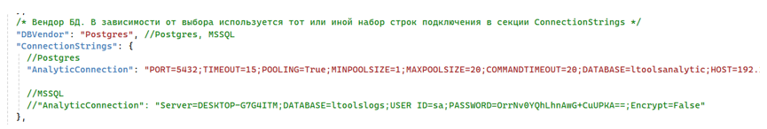
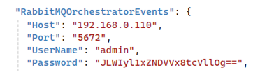

# Установка Analytic под CentOS 8

Подключаемся к серверу по SSH с пользователем с правами root. 

Копируем папку /srv/samba/shared/install/Analytic в /opt/Primo:
```
# cp -R  /srv/samba/shared/install/Analytic /opt/Primo
```

Создаем службу:

Переходим в каталог /opt/Primo/Analytic
```
# cd /opt/Primo/Analytic
```

Копируем файл службы (идет с комплектом поставки) в /etc/systemd/system:
```
# cp Primo.Orchestrator.Analytic.service /etc/systemd/system/Primo.Orchestrator.Analytic.service
# systemctl daemon-reload
```

Помещаем службу в автозапуск:
```
# systemctl enable /etc/systemd/system/Primo.Orchestrator.Analytic.servic
```
Редактируем конфигурационный файл:
```
# vim appsettings.ProdLinux.json
```
Правим строку подключения к аналитической БД:



И секцию подключения к RabbitMQ:



Даем права на запуск:
```
# chmod -R 777 /opt/Primo/Analytic/Primo.Orchestrator.Analytic
```
Стартуем службу:
```
# systemctl start Primo.Orchestrator.Analytic
```
Проверяем состояние службы:
```
# systemctl status Primo.Orchestrator.Analytic
```
