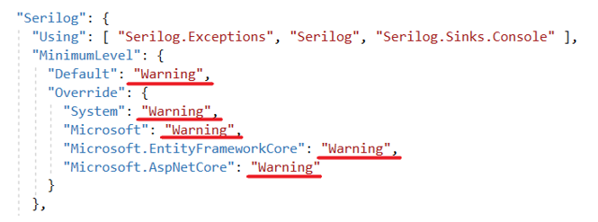
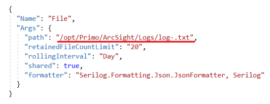
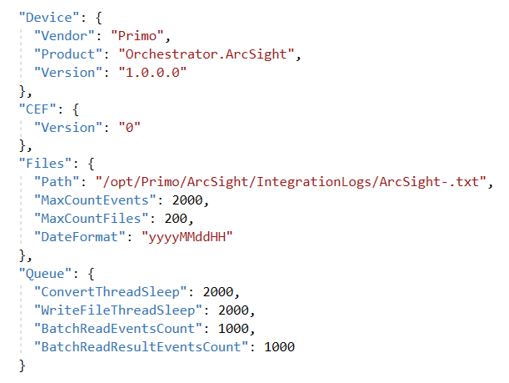

# Установка ArcSight под CentOS 8

Подключаемся к серверу по SSH с пользователем с правами root. 

Копируем папку /srv/samba/shared/install/ArcSight в /opt/Primo:
```
# cp -R  /srv/samba/shared/install/ArcSight /opt/Primo/ArcSight
```
Создаем службу:

Переходим в каталог /opt/Primo/ArcSight:
```
# cd /opt/Primo/ArcSight
```
Копируем файл службы (идет с комплектом поставки) в /etc/systemd/system:
```
# cp Primo.Orchestrator.ArcSight.service /etc/systemd/system/Primo.Orchestrator.ArcSight.service

# systemctl daemon-reload
```	
Помещаем службу в автозапуск:
```
# systemctl enable /etc/systemd/system/Primo.Orchestrator.ArcSight.service
```
Даем права на запуск:
```
# chmod -R 777 /opt/Primo/ArcSight /Primo.Orchestrator.ArcSight
```
Настраиваем уровни логирования приложения (Information, Warning, Error):



Настраиваем путь до папки с логами приложения и шаблон имени файлов логов:



Настраиваем параметры интеграции с ArcSight:



**Описание параметров интеграции с ArcSight:**


| № п/п |	Секция   |     Параметр     |	Тип	    |  Рекомендуемое значение	      |   Описание   |
|-------|------------|------------------|-----------|---------------------------------|--------------|
|   1.	|   Device	 |  Vendor          | String    |  Primo	                      | По спецификации ArcSight |
|   2.	|	         |  Product         | String	|  Orchestrator.ArcSight          |	По спецификации ArcSight |
|   3.	|        	 |	Version	        | String	|  1.0.0.0	                      | По спецификации ArcSight |
|   4.	|	CEF	     |  Version         | String	|  0	                          | По спецификации ArcSight |
|   5.	|	Files	 |  Path	        | String	| /opt/Primo/ArcSight/IntegrationLogs/ArcSight-.txt | Папка, из которой ArcSight будет забирать логи и префикс имени файла логов. Например, ArcSight-20220521.txt, ArcSight-20220521 1.txt, ArcSight-20220521 2.txt. Нумерация, 1, 2 и т.д. для одной даты. См. п. 6 |
|   6.	|            |	MaxCountEvents	| Int       |  2000                           | Максимальное количество строк в одном файле логов. После этого значения создается новый файл. Для нового файла для одной даты используется автоматическая нумерация. **Должно быть согласовано с механизмом чтения файлов из папки обмена ArcSight** |
|   7.  |            |	MaxCountFiles   | Int       |  200	                          | Максимальное количество файлов в папке обмена. Старые файлы логов удаляются. **Должно быть согласовано с механизмом чтения файлов из папки обмена ArcSight** |
|   8.	|            |	DateFormat      | String	|  yyyyMMddHH                     | Формат даты в постфиксе имени файла |
|   9.  |	Queue    |	ConvertThreadSleep  | Int	|  2000                           |	Время (миллисекунды) засыпания потока обработки входной очереди событий для их сопоставления формату ArcSight |
|   10. |	         |  WriteFileThreadSleep| Int   |  2000                           |	Время (миллисекунды) засыпания потока записи событий в папку обмена. **Должно быть согласовано с механизмом чтения файлов из папки обмена ArcSight** |
|   11.	|            |	BatchReadEventsCount| int	|  1000	                          | Максимальное количество событий, считываемых из входной очереди за один раз. Считанные события обрабатываются и помещаются в выходную очередь |
|   12. |   		 |	BatchReadResultEventsCount | int    |  1000	                  | Максимальное количество событий, считываемых из выходной очереди за один раз. Считанные события конвертируются в строки ArcSight и записываются в файлы в папке обмена |

Стартуем службу:
```
# systemctl start Primo.Orchestrator.ArcSight
```
Проверяем состояние службы:
```
# systemctl status Primo.Orchestrator.ArcSight
```
После установки ArcSight требуется настройка интеграционного шлюза LogEventsWebhook.


