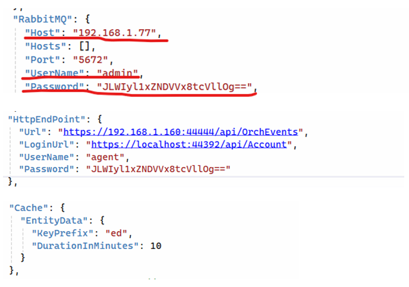

# Установка LogEventsWebhook под CentOS 8

Подключаемся к серверу по SSH с пользователем с правами root. 

Копируем папку /srv/samba/shared/install/LogEventsWebhook в /opt/Primo:
```
# cp -R  /srv/samba/shared/install/LogEventsWebhook /opt/Primo/LogEventsWebhook
```
Создаем службу:

Переходим в каталог /opt/Primo/LogEventsWebhook:
```
# cd /opt/Primo/LogEventsWebhook
```
Копируем файл службы (идет с комплектом поставки) в /etc/systemd/system:
```
# cp Primo.Orchestrator.LogEventsWebhook.service /etc/systemd/system/Primo.Orchestrator.LogEventsWebhook.service

# systemctl daemon-reload
```
Помещаем службу в автозапуск:
```
# systemctl enable /etc/systemd/system/Primo.Orchestrator.LogEventsWebhook.service
```	
Даем права на запуск:
```
# chmod -R 777 /opt/Primo/MachineInfo/Primo.Orchestrator.LogEventsWebhook
```
Настраиваем appsettings/appsettings.ProdLinux.json (некоторые параметры):



**RabbitMQ:Host** – адрес сервера с RabbitMQ, учетные данные для подключения.

Полностью задаем все параметры секции **HttpEndPoint**:  
* Url – адрес end-point приема событий.  
* LoginUrl – адрес end-point получения токена.  
* UserName – имя пользователя для получения токена.  
* Password – пароль для получения токена. Пароль должен быть зашифрован утилитой LTools.Orchestrator.PasswordEncriptor  

**Cache:EntityData:DurationInMinutes** – время (минут) жизни кэша для получения расширенной информации о связанной с событием сущности Оркестратора.

Настраиваем уровни логирования (Information, Warning, Error):


Настраиваем путь до папки с логами и шаблон имени файлов логов:


Стартуем службу:
```
# systemctl start Primo.Orchestrator.LogEventsWebhook
```
Проверяем состояние службы:
```
# systemctl status Primo.Orchestrator.LogEventsWebhook
```
В конфигурационном файле службы WebApi разрешаем интеграцию:


