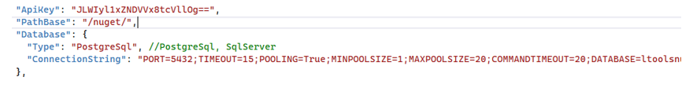
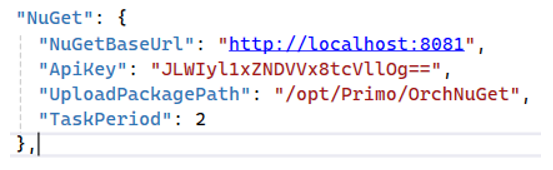

# Установка NuGet2 под CentOS 8

Если используется PostgreSQL, предварительно нужно установить на сервере БД расширение для PostgreSQL citext (если не установлено):
```
# sudo apt-get install postgresql-contrib-13 
```	
> *Команда выше применима для 13-й версии*

Создаем БД ltoolsnuget в которой устанавливаем расширение citext:
```
# sudo -i -u postgres psql -U postgres -c 'create database ltoolsnuget;'
# sudo -i -u postgres psql -d ltoolsnuget -c 'CREATE EXTENSION IF NOT EXISTS citext WITH SCHEMA public;'
```
Подключаемся к серверу по SSH с пользователем с правами root. 

Разархивируем папку NuGet2-linux.zip в /opt/Primo/NuGet2:
```
# cd  /srv/samba/shared/install
# sudo unzip NuGet2-linux.zip -d /opt/Primo/NuGet2
```
Создаем службу:

Переходим в каталог /opt/Primo/NuGet2:
```
# cd /opt/Primo/NuGet2
```
Копируем файл службы (идет с комплектом поставки) в /etc/systemd/system:
```
# sudo cp Primo.Orchestrator.NuGet.service /etc/systemd/system/Primo.Orchestrator.NuGet.service
# sudo systemctl daemon-reload
```	
Помещаем службу в автозапуск:
```
# sudo systemctl enable /etc/systemd/system/Primo.Orchestrator.NuGet.service
```	
Редактируем конфигурационный файл NuGet-сервера:
```
# sudo vim appsettings.ProdLinux.json
```
Устанавливаем ApiKey, предварительно зашифровав его, и ConnectionString с зашифрованным паролем:



Даем права на запуск:
```
# sudo chmod -R 777 /opt/Primo/NuGet2/BaGet
```
Стартуем службу:
```
# sudo systemctl start Primo.Orchestrator.NuGet
```
Проверяем состояние службы:
```
# sudo systemctl status Primo.Orchestrator.NuGet
```
Редактируем конфиг WebApi:
```
# sudo vim appsettings.ProdLinux.json
```
Задаем параметры интеграции с NuGet-сервером:



**NuGetBaseUrl** – адрес NuGet-сервера. Если порт в конфигурационном файле NuGet-сервера не менялся, и он на том же сервере, что и WebApi, остается без изменения.

**ApiKey** – такой же, как в конфигурационном файле NuGet-сервера. Внешнее обращение в Nuget-серверу происходит через прокси (nginx/IIS).   
:small_orange_diamond: **Поэтому сертификат у nginx/IIS обязательно должен быть валидным!**

