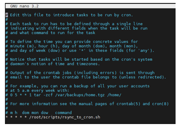

# Установка и настройка синхронизации папки с помощью Rsync

**Дано:**
* машина с Astra Linux
* машина с WS2019

На машине WS2019 есть сетевая папка, расшаренная для всех (включен гостевой вход и анонимный доступ) (`\\192.168.61.189\_share`)

**Задача:**  
На машине Astra Linux есть папка (`/opt/tmp/scr`), содержимое которой необходимо синхронизировать с сетевой папкой на машине WS2019 c помощью службы rsync.

### Монтирование сетевой папки:
```
# mount -t cifs //192.168.61.189/_share /mnt/share
```
### Настройка синхронизации

Установка rsync:
```
# apt-get install rsync
```
Включение автоматической синхронизации:

Создадим скрипт в директории `/root/scripts/rsync_to_cron.sh`

Добавим в него следующее содержимое:
```
#!/bin/bash
rsync -avzhHl /opt/tmp/scr /mnt/share
```
Добавим его в cron c таким параметром (запуск каждую минуту):
```
# crontab -e
* * * * * /root/scripts/rsync_to_cron.sh`
```



