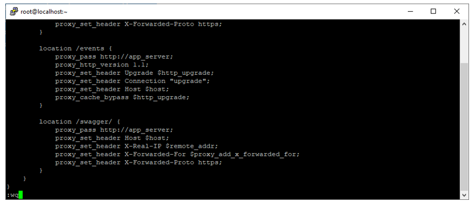
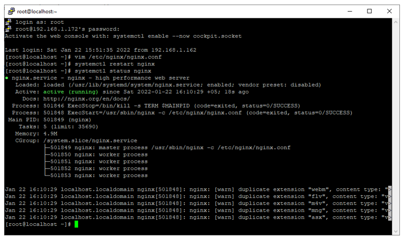
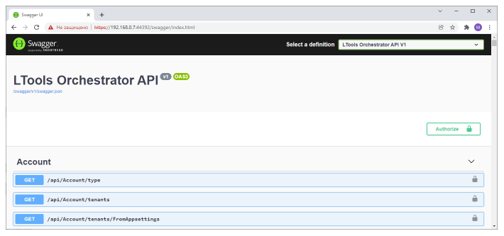

# Открытие Swagger в Nginx под CentOS 8

**Swagger** – интерактивная документация к Api Оркестратора. По умолчанию Swagger доступен только на машине Оркестратора по адресу: 
`http://localhost:5001/swagger/index.html`

Чтобы им можно было пользоваться на любой машине в сети организации, не открывая порт 5001 Оркестратора, требуется настроить в nginx проксирование этого адреса:

1. Редактируем файл nginx.conf – добавляем в конец файла секцию для проксирования Swagger:
```
# vim /etc/nginx/nginx.conf
```



```
location /swagger/ {
     proxy_pass http://app_server;
     proxy_set_header Host $host;
     proxy_set_header X-Real-IP $remote_addr;
     proxy_set_header X-Forwarded-For $proxy_add_x_forwarded_for;
     proxy_set_header X-Forwarded-Proto https;
}
```

2. Открываем порт 5001 на файерволе:

```
# firewall-cmd --zone=public --add-port=5001/tcp --permanent
# firewall-cmd –reload
```

3. Перезапускаем nginx и проверяем, что служба удачно перезапустилась:
```
# systemctl restart nginx
# systemctl status nginx
```



4. Проверяем доступность Swagger по адресу:
```
https://{IP}:44392/swagger/index.html 
```




