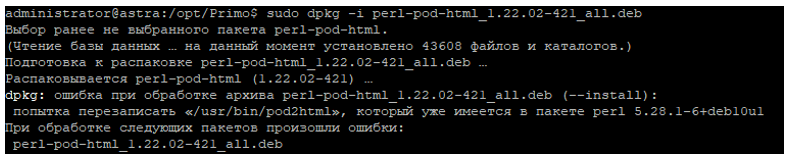
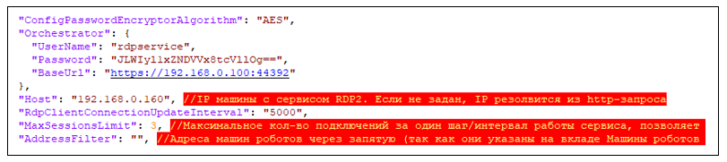
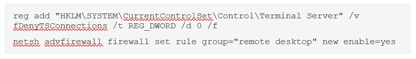
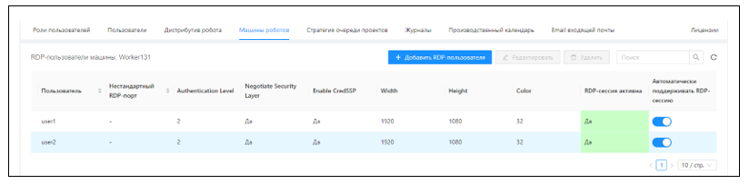
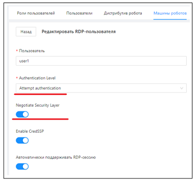

# Установка RDP2 под Astra Linux 1.7

## Предварительная настройка машины

Установите пакеты для perl из поставки 
```
dpkg -i perl-ipc-cmd_0.80-5_all.deb
dpkg -i perl-pod-html_1.22.02-421_all.deb
```
При установке второго пакета в консоли может появится ошибка:



С ошибкой ничего делать не нужно.

Установите dotnet SDK 7.0:

Для установки .NET без подключения репозитория от имени непривилегированного пользователя для этого пользователя:

Создайте в домашнем каталоге пользователя подкаталог `dotnet`:

`mkdir ~/dotnet`

Загрузите архив версии .NET, перейдя с помощью web-браузера по ссылке на сайт [Microsoft](https://dotnet.microsoft.com/en-us/download/dotnet/7.0). Обязательно используйте версии для Linux x64. По умолчанию загрузка выполняется в подкаталог Загрузки домашнего каталога.

Скопируйте (переместите) загруженный архив в созданный каталог `~/dotnet`;

Распакуйте архив:

`tar xf ~/dotnet/dotnet-sdk-*.tar.gz`

Установите переменные окружения:
```
#export DOTNET_ROOT=$HOME/dotnet
#export PATH=$PATH:$HOME/dotnet
```

Для того, чтобы переменные окружения автоматически восстанавливались после входа в сессию, добавьте в файл `.profile` в домашнем каталоге пользователя строки:
```
DOTNET_ROOT=$HOME/dotnet
PATH=$PATH:$HOME/dotnet
```

Проверьте:
`dotnet --list-sdks`

## Установка сервиса для удержания RDP-сессий

Подключитесь к серверу по SSH с пользователем с правами root. 
Скопируйте `/srv/samba/shared/install/RDP2 в /opt/Primo/RDP2`:

`cp -R  /srv/samba/shared/install/RDP2 /opt/Primo/RDP2`

Создайте службу:

Перейдите в каталог `/opt/Primo/RDP2`

`cd /opt/Primo/RDP2`

Скопируйте файл службы (идет с комплектом поставки) в `/etc/systemd/system`:
```
cp Primo.Orchestrator.RDP2.service /etc/systemd/system/Primo.Orchestrator.RDP2.service
systemctl daemon-reload
```

Поместите службу в автозапуск:
	
`systemctl enable /etc/systemd/system/Primo.Orchestrator.RDP2.service` 

Дайте права на запуск:

`chmod -R 755 /opt/Primo/RDP2`

Замените в секции Orchestrator конфигурационного файла адрес Оркестратора и учетную запись пользователя; используйте только системного пользователя rdpservice:



Если поменялся пароль пользователя rdpservice – поменяйте его. Пароль предварительно зашифруйте программой шифрования паролей.

При необходимости установите значение AddressFilter для фильтрации по машине Агента, либо оставьте поле пустым (будут использованы все Агенты системы). 

Значение RdpClientConnectionUpdateInterval задает шаг/интервал работы сервиса в мсек, менять его не рекомендуется.

Значение MaxSessionsLimit задает максимально допустимое количество новых подключений за один шаг/интервал работы сервиса, позволяет сгладить нагрузку на Агента при большом количестве одновременных подключений. Если возникнет необходимость подключить сразу N сессий (где N > MaxSessionsLimit), то за первый шаг будут подключены только MaxSessionsLimit сесиий, далее через шаг/интервал RdpClientConnectionUpdateInterval еще MaxSessionsLimit сесиий и так далее пока не будут подключены все N сессий.

Настройте путь до файла с логом и период ротации файла с логом (по умолчанию - день).

**Важно:** перед стартом службы выполните следующие две команды на все машинах роботов, для которых нужно удерживать сессии (если ранее они не были выполнены при настройке машины робота):



Установите переменную среды для корректной работы OpenSSL:

`export LD_LIBRARY_PATH=/opt/Primo/RDP2/OpenSSL3/`

Скопируйте содержимое папки `/opt/Primo/RDP2/OpenSSL3/` в папку `/usr/local/lib64`, если этой папки нет – создайте ее:
```
mkdir -p /usr/local/lib64

cd  /opt/Primo/RDP2/OpenSSL3/
cp -R  * /usr/local/lib64
```

Запустите службу:

`systemctl start Primo.Orchestrator.RDP2`

Проверьте состояние службы:

`systemctl status Primo.Orchestrator.RDP2`

Проверьте записи в системном журнале:

`journalctl --since "2 min ago"`

Проверьте, что RDP-сессия устанавливается корректно:



Параметры сессии должны быть установлены:  

Authentication Level = Attempt Authentication  
Negotiate Security Layer = True


