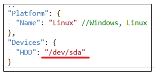
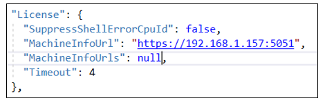
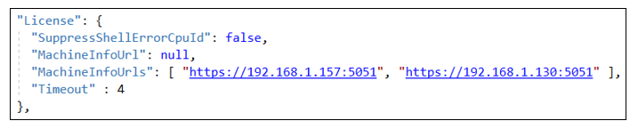

# Установка MachineInfo под CentOS 8

Подключитесь к серверу по SSH с пользователем с правами root. 

Создайте папку `/opt/Primo/MachineInfo`:

`sudo mkdir /opt/Primo/MachineInfo`

Разархивируйте MachineInfo-linux.zip в `/opt/Primo/MachineInfo`:

`sudo unzip /srv/samba/shared/install/MachineInfo-linux.zip -d /opt/Primo/MachineInfo`
	
Создайте службу:

Перейдите в каталог `/opt/Primo/MachineInfo`

`cd /opt/Primo/MachineInfo`

Скопируйте файл службы (идет с комплектом поставки) в `/etc/systemd/system`:
```
sudo cp Primo.Orchestrator.MachineInfo.service /etc/systemd/system/Primo.Orchestrator.MachineInfo.service
sudo systemctl daemon-reload
```
Поместите службу в автозапуск:
	
`sudo systemctl enable /etc/systemd/system/Primo.Orchestrator.MachineInfo.service`
	
Дайте права на запуск:

`sudo chmod -R 777 /opt/Primo/MachineInfo/Primo.Orchestrator.MachineInfo`

Проверьте выполнение команды

`sudo lsblk --nodeps -no serial /dev/sda`

Если она выполнится с ошибкой, найдите вместо `/dev/sda` какое-то другое блочное устройство (диск) и пропишите его в конфигурационном файле:



Запустите службу:

`sudo systemctl start Primo.Orchestrator.MachineInfo`

Проверьте состояние службы:

`sudo systemctl status Primo.Orchestrator.MachineInfo`

Откройте порт на файерволе:
``
sudo firewall-cmd --zone=public --add-port=5051/tcp --permanent
sudo firewall-cmd --reload
``

Если используется один сервер с MachineInfo, в конфигурационном файле службы WebApi пропишите ссылка на него:



Timeout (по умолчанию 4 сек) – время ответа, после которого сервис считается недоступным.

Если используется кластер MachineInfo, или MachineInfo используется в гео-кластере, в конфигурационном файле службы WebApi пропишите ссылки на все узлы кластера:



Порядок узлов имеет значение. В момент генерации запроса на лицензию должны быть доступны все узлы. 

**Важно**: Узлы нельзя скрывать за лоадбалансером!

