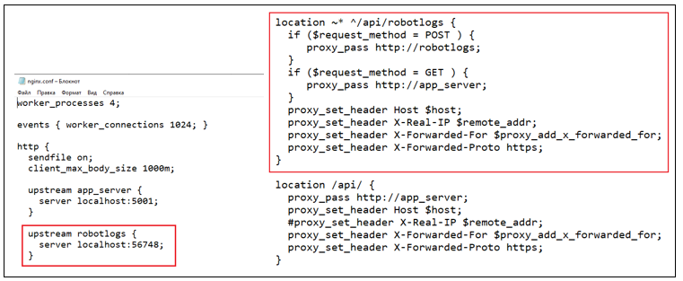

# Установка Nginx под CentOS 8

Установите nginx:

Подключитесь к серверу по SSH с пользователем с правами root. Перейдите в папку `/srv/samba/shared/install/nginx-linux`:

`cd /srv/samba/shared/install/nginx-linux`

Запустите установку пакета nginx-1.16.0-1.el8.ngx.x86_64.rpm, везде согласитесь (введите y):

`sudo yum install nginx-1.16.0-1.el8.ngx.x86_64.rpm`

Откройте порт на файерволе:
```
sudo firewall-cmd --zone=public --add-port=44392/tcp --permanent
sudo firewall-cmd --reload
```

Включите службу в автозагрузку:  

`sudo systemctl enable nginx`

Разрешите setsebool:  

`setsebool -P httpd_can_network_connect 1`
	 
Для Ubuntu:  

`sysctl -w net.ipv4.ip_forward=1`
	
Скопируйте файлы сертификатов и конфигурационный файл:
```
cp cert1.rsa /etc/nginx/cert1.rsa
cp cert1.crt /etc/nginx/cert1.crt
cp nginx.conf /etc/nginx/nginx.conf
```

При необходимости откорректируйте конфигурационный файл:  

`vim /etc/nginx/nginx.conf`

Если для приема логов роботов не используется внешний сервис RobotLogs, удалите из конфига nginx.conf проксирование в RobotLogs: 



Запустите службу:  

`systemctl start nginx`

Проверьте состояние:  

`systemctl status nginx`

