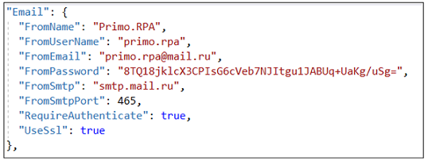
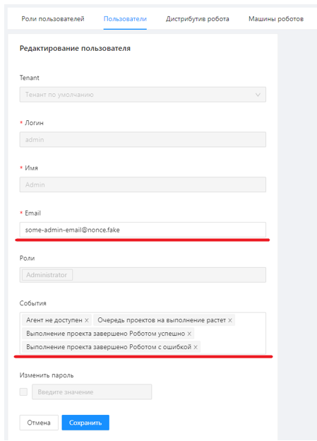

# Установка Notifications под CentOS 8

Подключитесь к серверу по SSH с пользователем с правами root. 
Скопируйте папку `/srv/samba/shared/install/Notifications` в `/opt/Primo`:

`cp -R  /srv/samba/shared/install/Notifications /opt/Primo`

Создайте службу:

Перейдите в каталог `/opt/Primo/Notifications`

`cd /opt/Primo/Notifications`

Скопируйте файл службы (идет с комплектом поставки) в `etc/systemd/system`:
```
cp Primo.Orchestrator.Notifications.service /etc/systemd/system/Primo.Orchestrator.Notifications.service
systemctl daemon-reload
```
Поместите службу в автозапуск:
	
`systemctl enable /etc/systemd/system/Primo.Orchestrator.Notifications.service`
	
Отредактируйте конфигурационный файл:

`vim appsettings.ProdLinux.json`

Поменяйте параметры SMTP-сервера ящика, с которого происходит рассылка:



Дайте права на запуск:

`chmod -R 777 /opt/Primo/Notifications/Primo.Orchestrator.Notifications`

Запустите службу:

`systemctl start Primo.Orchestrator.Notifications`

Проверьте состояние службы:

`systemctl status Primo.Orchestrator.Notifications`

Через интерфейс Оркестратора в Настройки/Пользователи отредактируйте для пользователей параметры рассылки – укажите e-mail и типы событий:


