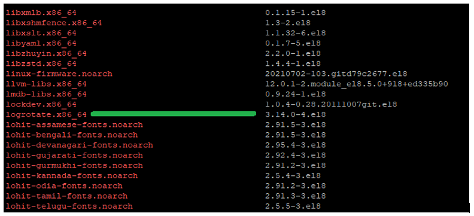
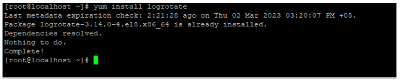
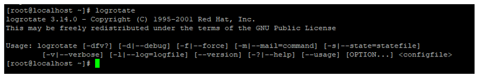

# Установка pgbouncer под CentOS 8

## Установка 

Для корректной работы pgbouncer на машине должен быть установлен `postgresql-server`. 
Если установка производится на той же машине, что и база данных, то `postgresql-server` уже установлен:

`yum install -y pgbouncer`

После выполнения команды проверьте папку `/usr/lib/systemd/system/` и найдите в ней файл `pgbouncer.service`. 
Если такого файла нет – создайте его. Содержимое файла:
```
[Unit]
Description=A lightweight connection pooler for PostgreSQL
Documentation=man:pgbouncer(1)
After=syslog.target network.target
[Service]
RemainAfterExit=yes
User=postgres
Group=postgres

# Path to the init file
Environment=BOUNCERCONF=/etc/pgbouncer/pgbouncer.ini
ExecStart=/usr/bin/pgbouncer -q ${BOUNCERCONF}
ExecReload=/usr/bin/pgbouncer -R -q ${BOUNCERCONF}

# Give a reasonable amount of time for the server to start up/shut down
TimeoutSec=300
[Install]
WantedBy=multi-user.target
```

Откройте файл `/etc/pgbouncer/pgbouncer.ini` и отредактируйте его:
```
[databases]
;; fallback connect string
* = host=10.10.10.35 port=5432 auth_user=postgres
```
Можно не указывать IP, если база данных расположена на этом же сервере
```
[pgbouncer]
logfile = /var/log/pgbouncer/pgbouncer.log
pidfile = /var/run/pgbouncer/pgbouncer.pid
listen_addr = 127.0.0.1, ::1
listen_port = 6432
// listen_addr = * //все адреса 
auth_type = trust
auth_file = /etc/pgbouncer/userlist.txt
admin_users = postgres
stats_users = stats, postgres
pool_mode = transaction
max_client_conn = 100
default_pool_size = 100
```
Откройте файл `/etc/pgbouncer/userlist.txt` и проверьте,  что там есть строка `"postgres" "postgres"`; если нет – добавьте ее. 

Для папок `/etc/pgbouncer`, `/var/log/pgbouncer` и `/var/run/pgbouncer` установите владельца на root и выставите права на 777 с ключом –R.

Запустите службу и проверьте ее статус:
```
systemctl start pgbouncer
systemctl status pgbouncer
```

Проверьте соединение с БД:
```
su postgres
psql -U postgres -h 127.0.0.1 -p 6432 -d ltools
```

Если в качестве listen_addr выбран другой IP, например, внешний, то можно проверить подключение к БД по этому IP.

## Настройка ротации логов с использованием утилиты logrotate

Как правило, утилита logrotate предустановлена во многие дистрибутивы. Проверьте, есть ли она на машине:

`yum list installed`

Проверьте, есть ли запись logrotate:



Если утилита не установлена, ее необходимо установить:

`yum install logrotate`



Проверьте, что утилита установлена корректно:

`logrotate`



Отредактируйте `/etc/logrotate.conf`, основные параметры: `rotation-interval`, `rotation-count` и `compression`. 

По умолчанию интервал выбран weekly (еженедельно); доступны также варианты: hourly, daily, monthly. 

Подробнее о параметрах и допустимых значениях можно уточнить в справочнике утилиты, для этого выполните команду:

`man logrotate`

Параметр `rotation-count` определяет, сколько раз лог-файл будет ротирован перед удалением. Если значение равно 0, то файл сразу удаляется без ротации. По умолчанию значение равно 4, то есть, если выбрана ежедневная ротация, то файлы будут храниться максимум 4 дня и потом удаляться.

Сжатие по умолчанию выключено.

Перейдите в папку `/etc/logrotate.d` и найдите там файл конфигурации для ротации логов pgbouncer. Отредактируйте этот файл:
```
/var/log/pgbouncer/pgbouncer.log {
    missingok
    notifempty
    sharedscripts
    create 0644 pgbouncer pgbouncer
    nodateext
    daily
    rotate 10
}
```

`create 0644 pgbouncer pgbouncer – create mode owner group` - группу и владельца можно задать как root,root или другие подходящие.


Таким образом будет создан лог для ежедневной ротации логов pgbouncer с их хранением в течении 10 дней.

Ручная ротация:

`logrotate -f /etc/logrotate.conf`

Проверить статус последней ротации можно в файле `/var/lib/logrotate/ logrotate.status`, строка с датой последней ротации будет выглядеть примерно так:  
`"/var/log/pgbouncer/pgbouncer.log" 2023-3-2-21:10:25`

Настройка автоматической ротации логов pgbouncer:

Проверьте, что файл `/etc/cron.daily/logrotate` содержит строку: 

`/usr/sbin/logrotate /etc/logrotate.conf`

Если такой строки нет – допишите ее.

## Устранение конфликта с внутренним пуллером

При использовании pgbouncer внутренний пуллер следует выключить, прописав в коннекшстрин POOLING=False.  
Это необходимо, чтобы избежать конфликта между внутренним пуллером и pgbouncer (внешним пуллером).


