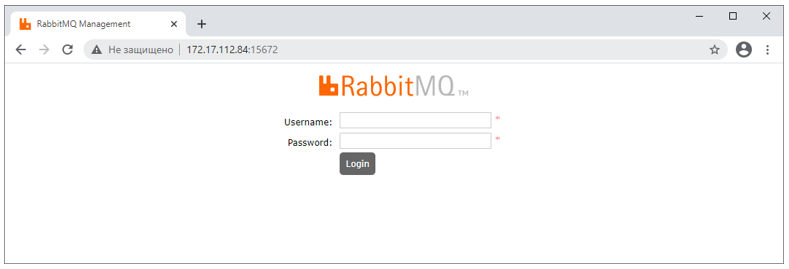
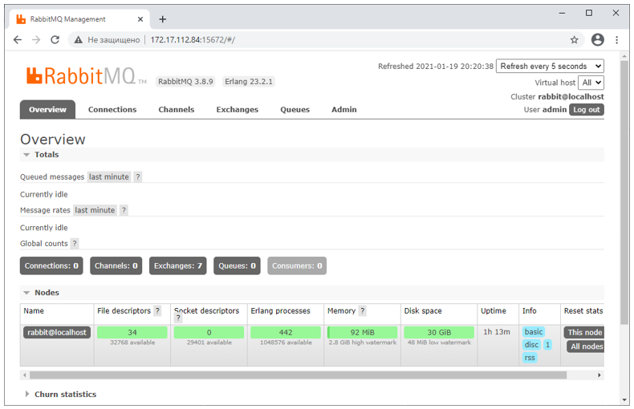

# Установка RabbitMQ под CentOS 8

Скачайте и установите нужную версию, используя инструкции для [Debian, Ubuntu и основанных на них дистрибутивах](https://www.rabbitmq.com/docs/install-debian), либо инструкции для [RPM дистрибутивов](https://www.rabbitmq.com/docs/install-rpm).  

Чтобы демон RabbitMQ запускался по умолчанию при загрузке системы, выполните:

`sudo chkconfig rabbitmq-server on`
	
Включите плагин для управления RabbitMQ:

`sudo rabbitmq-plugins enable rabbitmq_management`	

Запустите RabbitMQ:

`sudo /sbin/service rabbitmq-server start`
	
Откройте на файерволе нужные RabbitMQ порты, сохраните конфигурацию и перезагрузите файервол:

```
# sudo firewall-cmd --zone=public --add-port=25672/tcp --permanent
# sudo firewall-cmd --zone=public --add-port=5672/tcp --permanent
# sudo firewall-cmd --zone=public --add-port=15672/tcp --permanent
# sudo firewall-cmd --reload
```
	
Убедитесь, что нужные RabbitMQ порты открыты:

`firewall-cmd --list-all`


С другой машины в сети откройте веб-интерфейс управления RabbitMQ, убедитесь, что он открывается:



Создайте пользователя RabbitMQ, назначьте ему права:

```
sudo rabbitmqctl add_user 'admin' 'Qwe123!@#'
sudo rabbitmqctl set_user_tags admin administrator
sudo rabbitmqctl set_permissions -p / admin '.*' '.*' '.*'
```

Проверьте, что пользователь admin/Qwe123!@# имеет доступ к веб-интерфейсу управления RabbitMQ:



Дальнейшее управление RabbitMQ можно осуществлять через этот веб-интерфейс.