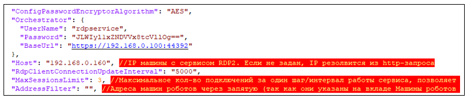
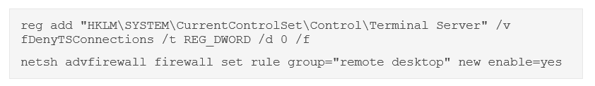

# Установка RDP2 под CentOS 8

Подключитесь к серверу по SSH с пользователем с правами root. 

Создайте папку `/opt/Primo/RDP2`:

`sudo -p mkdir /opt/Primo/RDP2`

Разархивируйте RDP2_CentOS.zip в `/opt/Primo/RDP2`:

`sudo unzip /srv/samba/shared/install/RDP2_CentOS.zip -d /opt/Primo/RDP2`

Создайте службу:

Перейдите в каталог `/opt/Primo/RDP2`

`cd /opt/Primo/RDP2`

Скопируйте файл службы (идет с комплектом поставки) в `/etc/systemd/system`:
```
cp Primo.Orchestrator.RDP2.service /etc/systemd/system/Primo.Orchestrator.RDP2.service
systemctl daemon-reload
```

Поместите службу в автозапуск:
	
`systemctl enable /etc/systemd/system/Primo.Orchestrator.RDP2.service`
	
Дайте права на запуск:

`chmod -R 755 /opt/Primo/RDP2`

Поменяйте в секции Orchestrator конфигурационного файла адрес Оркестратора и учетную запись пользователя.   
*Используйте только системного пользователя rdpservice*:

`vim appsettings.ProdLinux.json`



Если поменялся пароль пользователя rdpservice – поменяйте его. Пароль предварительно зашифруйте программой шифрования паролей.  

При необходимости установите значение AddressFilter для фильтрации по машине Агента, либо оставьте поле пустым (будут использованы все Агенты системы).   

Значение RdpClientConnectionUpdateInterval задает шаг/интервал работы сервиса в мсек; менять его не рекомендуется.  

Значение MaxSessionsLimit задает максимально допустимое количество новых подключений за один шаг/интервал работы сервиса, позволяет сгладить нагрузку на Агента при большом количестве одновременных подключений. Если возникнет необходимость подключить сразу N сессий (где N > MaxSessionsLimit), то за первый шаг будут подключены только MaxSessionsLimit сесиий, далее через шаг/интервал RdpClientConnectionUpdateInterval еще MaxSessionsLimit сесиий и так далее пока не будут подключены все N сессий.

Настройте путь до файла с логом и период ротации файла с логом (по умолчанию - день).

**Важно**: перед стартом службы выполните следующие две команды на все машинах роботов, для которых нужно удерживать сессии (если ранее они не были выполнены при настройке машины робота):



Установите переменную среды для корректной работы OpenSSL:

`export LD_LIBRARY_PATH=/opt/Primo/RDP2/OpenSSL3/`

Скопируйте содержимое папки `/opt/Primo/RDP2/OpenSSL3`/ в папку `/usr/local/lib64`, если этой папки нет – создайте ее:
```
mkdir --p /usr/local/lib64

cd  /opt/Primo/RDP2/OpenSSL3/
cp -R  * /usr/local/lib64
```

Запустите службу:

`systemctl start Primo.Orchestrator.RDP2`

Проверьте состояние службы:

`systemctl status Primo.Orchestrator.RDP2`

Проверьте записи в системном журнале:

`journalctl --since "2 min ago"`

