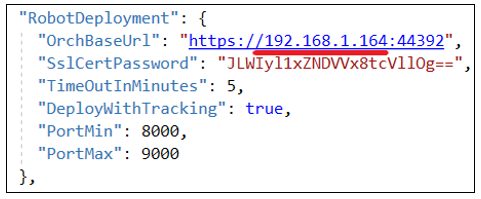
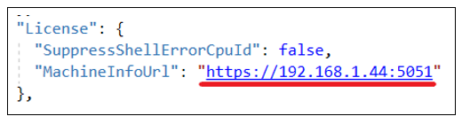

# Установка WebApi под CentOS 8

Подключитесь к серверу по SSH с пользователем с правами root. 

Создайте папку /opt/Primo:

`sudo mkdir /opt/Primo`

Разархивируйте WebApi-linux.zip в `/opt/Primo/WebApi`:

`sudo unzip /srv/samba/shared/install/WebApi-linux.zip -d /opt/Primo/WebApi`

Создайте службу:

Перейдите в каталог /opt/Primo/WebApi

`cd /opt/Primo/WebApi`

Скопируйте файл службы (идет с комплектом поставки) в /etc/systemd/system:
```
sudo cp Primo.Orchestrator.WebApi.service /etc/systemd/system/Primo.Orchestrator.WebApi.service
sudo systemctl daemon-reload
```

Поместите службу в автозапуск:
	
`sudo systemctl enable /etc/systemd/system/Primo.Orchestrator.WebApi.service`
	
Отредактируйте конфигурационный файл:

`sudo vim appsettings.ProdLinux.json`

Замените на реальный IP сервера:



Если для работы лицензий используется сервис получения параметров оборудования, то настройте WebApi на работу с этим сервисом – введите адрес этого сервиса:



Отредактируйте строки подключения к БД.

Дайте права на запуск:

`sudo chmod -R 777 /opt/Primo/WebApi/Primo.Orchestrator.WebApi`

Запустите службу:

`sudo systemctl start Primo.Orchestrator.WebApi`

> Начиная с версии 1.24.8.0, WebApi требует наличия базы данных `ltoolsltwrepo`. Если учетная запись, под которой работает Оркестратор, не имеет прав на создание баз данных, `ltoolsltwrepo`
должна быть создана вручную администратором перед запуском WebApi. Убедитесь, что учетная запись имеет необходимые права на доступ и использование этой базы данных.

Проверьте состояние службы:

`sudo systemctl status Primo.Orchestrator.WebApi`

## Работа с входящей почтой

Для работы с входящей почтой MS Exchange Server в триггере на запуск заданий необходимо установить gssntlmssp:

`yum -y install gssntlmssp`
 
Для Astra Linux (Ubuntu):

`sudo apt install -y gss-ntlmssp`
