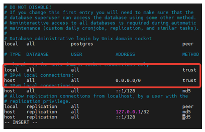
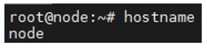
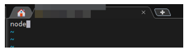
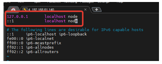

# Установка Primo RPA Orchestrator на Ubuntu Server 22.04
(при наличии интернета на сервере) 

- **Шаг 1**:   

Обновите список пакетов и систему
```
sudo apt update
sudo apt upgrade
sudo reboot
```
Перейдите в режим root:  
`sudo -i` (введите пароль) - далее все действия будут выполняться под пользователем root

- **Шаг 2**:  

Скачайте и установите соответствующую вашей операционной системе версию **PostgreSQL**, используя [инструкцию](https://www.postgresql.org/download/). 

Разрешите подключение к PostgreSQL по сети:  

`vim /etc/postgresql/13/main/postgresql.conf`

Найдите строку:  

`listen_addresses = 'localhost'`  

и внесите следующие изменения:   

`listen_addresses = '*'`  

Далее откройте файл pg_hba.conf: 

`vim /etc/postgresql/13/main/pg_hba.conf`

Найдите строки и внесите туда следующие изменения:  


`systemctl restart postgresql`

Далее:  
```
sudo -i -u postgres psql -U postgres -c 'create database ltoolslicense;'
sudo -i -u postgres psql -c 'grant all privileges on database ltoolslicense to postgres;'
sudo -i -u postgres psql -c "alter user postgres with password 'postgres'"
systemctl restart postgresql
systemctl status postgresql
```

- **Шаг 3**

Скачайте и установите нужную версию **RabbitMQ**, используя инструкции для [Debian, Ubuntu и основанных на них дистрибутивах](https://www.rabbitmq.com/docs/install-debian), либо инструкции для [RPM дистрибутивов](https://www.rabbitmq.com/docs/install-rpm).

Далее посмотрите имя вашего сервера:  
`hostname`



`vim /etc/hostname`

Пропишите его в файл:



`vim /etc/hosts`



`reboot`

После перезагрузки от root:
```
adminPassword="Qwe123"'!'"@#"
systemctl enable rabbitmq-server
rabbitmq-plugins enable rabbitmq_management
rabbitmqctl add_user 'admin' ${adminPassword}
rabbitmqctl set_user_tags admin administrator
rabbitmqctl set_permissions -p / admin '.*' '.*' '.*'
systemctl restart rabbitmq-server
```

Проверьте статус:

`systemctl status rabbitmq-server`

Дополнительную информацию по установке Rabbit MQ можно найти в статье [Установка RabbitMQ на CentOS 8](https://azure-dos.s1.primo1.orch/PrimoCollection/Documentation/_git/Documentation.RU?path=/orchestrator-new/install/linux/centos/rabbitmq-centos.md&version=GBOrchestrator-NewDocumentation-InProgress&_a=preview)

- **Шаг 4**

Установите **nginx** из репозиториев

`apt install nginx -y`

Далее используйте архив nginx-linux.zip из `\Primo Orchestrator 1.23.5.0\Distr\Linux`.

Распакуйте его в папку:
`unzip nginx-linux.zip -d /tmp/nginx/`

И скопируйте содержимое:
```
cp /tmp/nginx/* /etc/nginx
systemctl restart nginx
```

> ***Конфигурационный файл и файлы сертификатов из данного архива строго необходимы для работы Оркестратора.***

Проверьте статус:

`systemctl status nginx`

С более подробной информацией об установке nginx (на CentOS 8) можно ознакомиться в статье [Установка nginx под CentOS 8](https://azure-dos.s1.primo1.orch/PrimoCollection/Documentation/_git/Documentation.RU?path=/orchestrator-new/install/linux/centos/nginx-centos.md&version=GBOrchestrator-NewDocumentation-InProgress&_a=preview).

- **Шаг 5**

Установите **веб-интерфейс**:

`unzip UI.zip -d /opt/Primo/UI`

Перейдите адресу: 
[https://ipaddr:44392](https://ipaddr:44392)

Информация об установке UI на CentOS 8 содержится в соответствующей [статье](https://azure-dos.s1.primo1.orch/PrimoCollection/Documentation/_git/Documentation.RU?path=/orchestrator-new/install/linux/centos/ui-centos.md&version=GBOrchestrator-NewDocumentation-InProgress).

- **Шаг 6**

Установите **WebApi**:
```
mkdir -p /opt/Primo/WebApi
unzip WebApi-linux.zip -d /opt/Primo/WebApi/
cp /opt/Primo/WebApi/Primo.Orchestrator.WebApi.service /etc/systemd/system/
systemctl daemon-reload
systemctl enable /etc/systemd/system/Primo.Orchestrator.WebApi.service
chmod -R +x /opt/Primo/WebApi/Primo.Orchestrator.WebApi
vim /opt/Primo/WebApi/appsettings.ProdLinux.json
```
Задайте переменную окружения:
```
export ASPNETCORE_ENVIRONMENT=ProdLinux
systemctl start Primo.Orchestrator.WebApi
systemctl status Primo.Orchestrator.WebApi
```

Вы также можете ознакомиться с более подробной [инструкцией по установе WebApi](https://azure-dos.s1.primo1.orch/PrimoCollection/Documentation/_git/Documentation.RU?path=/orchestrator-new/install/linux/centos/webapi-centos.md&version=GBOrchestrator-NewDocumentation-InProgress&_a=preview).

> **Дальнейшие пункты (7-11) могут выполняться в произвольном порядке.**

- **Шаг 7**

Установите **RDP2**:

```
mkdir -p /opt/Primo/RDP2
unzip RDP2-Astra.zip -d /opt/Primo/RDP2/
cp /opt/Primo/RDP2/Primo.Orchestrator.RDP2.service /etc/systemd/system/
systemctl daemon-reload
systemctl enable /etc/systemd/system/Primo.Orchestrator.RDP2.service
chmod -R +x /opt/Primo/RDP2/Primo.Orchestrator.RDP2
vim /opt/Primo/RDP2/appsettings.ProdLinux.json
systemctl start Primo.Orchestrator.RDP2
systemctl status Primo.Orchestrator.RDP2
```

Дополнительную информацию о процедуре установки RDP2 можно найти в статьях [Установка RDP2 под CentOS 8](https://azure-dos.s1.primo1.orch/PrimoCollection/Documentation/_git/Documentation.RU?path=/orchestrator-new/install/linux/centos/rdp2-centos.md&version=GBOrchestrator-NewDocumentation-InProgress&_a=preview) и [Установка RDP2 под Astra Linux 1.7](https://azure-dos.s1.primo1.orch/PrimoCollection/Documentation/_git/Documentation.RU?path=/orchestrator-new/install/linux/astra/RDP2-astra.md&version=GBOrchestrator-NewDocumentation-InProgress&_a=preview).

- **Шаг 8**

Установите **States**:

```
mkdir -p /opt/Primo/States
unzip States-linux.zip -d /opt/Primo/States/
cp /opt/Primo/States/Primo.Orchestrator.States.service /etc/systemd/system/
systemctl daemon-reload
systemctl enable /etc/systemd/system/Primo.Orchestrator.States.service
chmod -R +x /opt/Primo/States/Primo.Orchestrator.States
vim /opt/Primo/States/appsettings.ProdLinux.json
systemctl start Primo.Orchestrator.States
systemctl status Primo.Orchestrator.States
```

Вы также можете ознакомиться с процедурой установки службы States в статье [Установка States под CentOS 8](https://azure-dos.s1.primo1.orch/PrimoCollection/Documentation/_git/Documentation.RU?path=/orchestrator-new/install/linux/centos/states-centos.md&version=GBOrchestrator-NewDocumentation-InProgress&_a=preview).

- **Шаг 9**

Установите **RobotLogs**:

```
mkdir -p /opt/Primo/RobotLogs
unzip RobotLogs-linux.zip -d /opt/Primo/RobotLogs/
cp /opt/Primo/RobotLogs/Primo.Orchestrator.RobotLogs.service /etc/systemd/system/
systemctl daemon-reload
systemctl enable /etc/systemd/system/Primo.Orchestrator.RobotLogs.service
chmod -R +x /opt/Primo/RobotLogs/Primo.Orchestrator.RobotLogs
vim /opt/Primo/RobotLogs/appsettings.ProdLinux.json
systemctl start Primo.Orchestrator.RobotLogs
systemctl status Primo.Orchestrator.RobotLogs
```

Более подробную информацию об установке RobotLogs можно найте в [статье](https://azure-dos.s1.primo1.orch/PrimoCollection/Documentation/_git/Documentation.RU?path=/orchestrator-new/install/linux/centos/robotlogs-centos.md&version=GBOrchestrator-NewDocumentation-InProgress&_a=preview).

- **Шаг 10**

Установите **Notifications**:

```
mkdir -p /opt/Primo/Notifications
unzip Notifications-linux.zip -d /opt/Primo/Notifications/
cp /opt/Primo/Notifications/Primo.Orchestrator.Notifications.service /etc/systemd/system/
systemctl daemon-reload
systemctl enable /etc/systemd/system/Primo.Orchestrator.Notifications.service
chmod -R +x /opt/Primo/Notifications/Primo.Orchestrator.Notifications
vim /opt/Primo/Notifications/appsettings.ProdLinux.json
systemctl start Primo.Orchestrator.Notifications
systemctl status Primo.Orchestrator.Notifications
```

С дополнительной информацией об установке Notifications можно ознакомиться в статье [Установка Notifications на CentOS 8](https://azure-dos.s1.primo1.orch/PrimoCollection/Documentation/_git/Documentation.RU?path=/orchestrator-new/install/linux/centos/notifications-centos.md&version=GBOrchestrator-NewDocumentation-InProgress&_a=preview).

- **Шаг 11**

Установите **MachineInfo**:

```
mkdir -p /opt/Primo/MachineInfo
unzip MachineInfo-linux.zip -d /opt/Primo/MachineInfo/
cp /opt/Primo/MachineInfo/Primo.Orchestrator.MachineInfo.service /etc/systemd/system/
systemctl daemon-reload
systemctl enable /etc/systemd/system/Primo.Orchestrator.MachineInfo.service
chmod -R +x /opt/Primo/MachineInfo/Primo.Orchestrator.MachineInfo
vim /opt/Primo/MachineInfo/appsettings.ProdLinux.json
systemctl start Primo.Orchestrator.MachineInfo
systemctl status Primo.Orchestrator.MachineInfo
```


