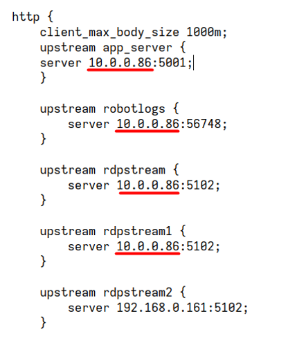
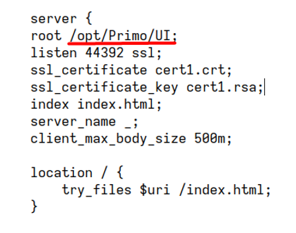

# Развёртывание Orchestrator на Angie (РЕДОС v.7.3)

## Предварительные действия

Установите в соответствии с Руководством по развертыванию следующие компоненты:
1.	Dotnet-sdk-7.0
2.	RabbitMQ
3.	PostgreSQL
4.	WebApi
5.	MachineInfo
6.	RDP2
7.	RobotLogs
8.	States
9.	Notifications

При необходимости установите:
1.	ArcSight
2.	LogEventsWebhook
3.	NuGet2

## Установка Angie

### Подключение репозитория и установка Angie

1. Создайте файл `angie.repo` в `/etc/yum.repos.d/` со следующим содержимым:
```
[angie]
name=Angie repo
baseurl=https://download.angie.software/angie/redos/$releasever/
gpgcheck=1
enabled=1
gpgkey=https://angie.software/keys/angie-signing.gpg.asc
```
   
Установите Angie:
```
# sudo yum install -y angie
```
Запустите сервис:
```
# sudo systemctl start angie
```
Добавьте в автозагрузку:
```
# sudo systemctl enable angie
```
Проверьте работу сервиса:
```
# sudo systemctl status angie.service
```

Добавьте сертификаты из архива `cert1.crt` и `cert1.rsa в `/etc/angie`.

### Конфигурирование Angie

Замените файл конфигурации `angie.conf` в `/etc/angie` файлом конфигурации из архива.

Отредактируйте конфигурационный файл:

В указанных ниже секциях поменяйте текущий адрес на адрес сервера, на который устанавливается Angie:
http > upstream app_server  
http > upstream robotlogs  
http > ustream rdpstream  
http > upstream rdpstream1  



В секции server > root укажите путь к папке *UI* Оркестратора:



Перезапустите службу и убедитесь, что она работает:
```
# sudo systemctl restart angie
# sudo systemctl status angie
```