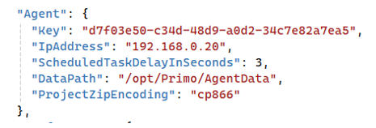
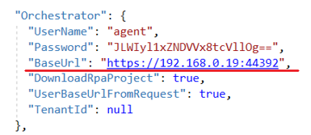
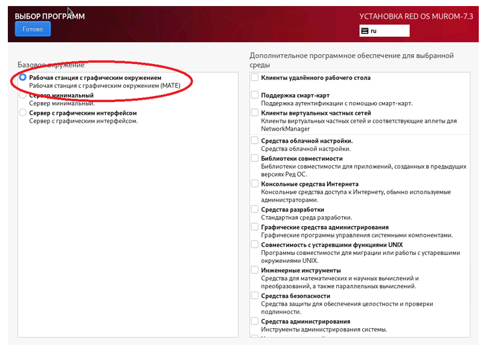
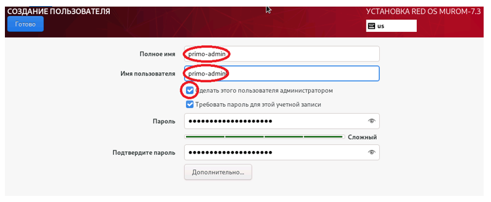
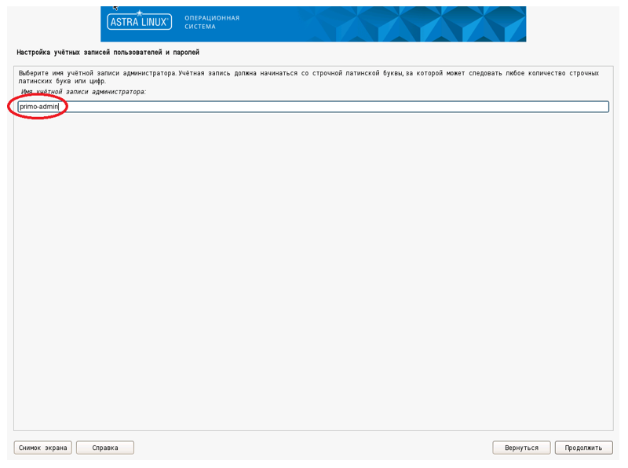
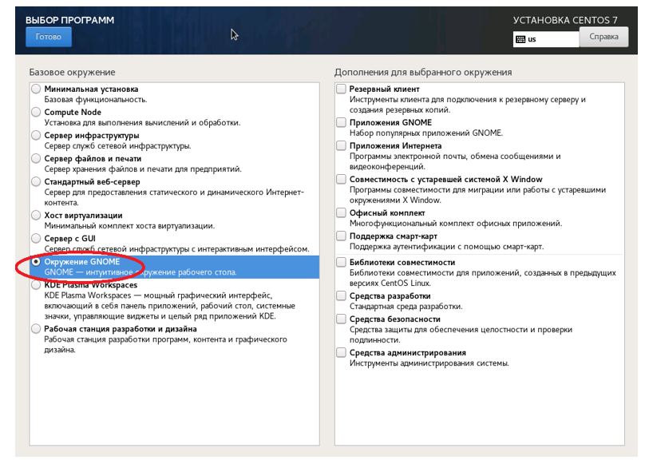
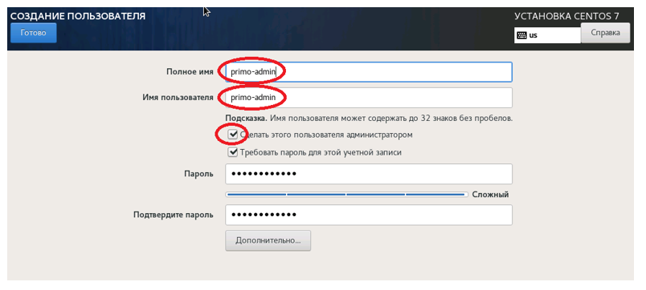

# Установка Агента Оркестратора

Руководство содержит инструкции по установке Агента Оркестратора для следующих операционных систем:

* CentOS 8.5
* РЕДОС 
* Astra Linux 1.7 
* CentOS 7 

В конце данной статьи вы также можете найти Инструкцию по проверке настройки машины робота.

## Общие настройки

Если в RPA-проекте (zip-архив) присутствуют файлы с кириллицей в наименовании, то для корректной распаковки архива перед запуском робота необходимо, чтобы в конфигурационном файле службы Агента был настроен параметр ProjectZipEncoding. 
Наиболее востребованные значения:  utf-8 (для Windows), cp866 (для Linux) и null (кодировка по умолчанию в ОС):




## Действия при установке CentOS 8.5

Подключаемся к серверу по SSH с пользователем с правами root. 
Копируем папку `/srv/samba/shared/install/Agent-linux` в `/opt/Primo/Agent`:
```
cp -R  /srv/samba/shared/install/Agent-linux /opt/Primo/Agent
```
Создаем службу:
Переходим в каталог `/opt/Primo/Agent`
```
cd /opt/Primo/Agent
```
Копируем файл службы (идет с комплектом поставки) в `/etc/systemd/system`:
```
cp Primo.Orchestrator.Agent.service /etc/systemd/system/Primo.Orchestrator.Agent.service
systemctl daemon-reload	
```
Помещаем службу в автозапуск:	
```
systemctl enable /etc/systemd/system/Primo.Orchestrator.Agent.service
```	
Даем права на запуск:
```
chmod -R 777 /opt/Primo/Agent/Primo.Orchestrator.Agent
chmod -R 777 /opt/Primo/Agent/BashScripts
```
В конфигурационном файле службы appsettings.ProdLinux.json прописываем адрес Оркестратора и TenantId (если эта машина не в тенанте по умолчанию) и пользователя из тенанта (встроенная учетная запись agent из тенанта по умолчанию):



Стартуем службу:
```
systemctl start Primo.Orchestrator.Agent
```
Проверяем состояние службы:
```
systemctl status Primo.Orchestrator.Agent
```
Открываем порт на файерволе:
```
firewall-cmd --zone=public --add-port=5002/tcp --permanent
firewall-cmd --reload
```
Проверяем журнал службы:
```
journalctl -u Primo.Orchestrator.Agent
```

## Действия при установке РЕДОС 7.3

При установке машины робота под управлением РЕДОС 7.3 необходимо:
* на экране **ВЫБОР ПРОГРАММ** отметить базовое окружение **Рабочая станция с графическим окружением (MATE)**



* на экране **СОЗДАНИЕ ПОЛЬЗОВАТЕЛЕЙ** создать пользователя-администратора (далее - primo-admin)



Установка дополнительного ПО и создание дополнительных пользователей будет описана ниже.

### Настройка дополнительного ПО

1.	Выполните подключение машины робота к репозиториям base и updates. Настройка локальных зеркал этих репозиториев описана в [Руководстве РЕДОС](https://redos.red-soft.ru/base/server-configuring/service-repositories/create-repo/). 

:large_orange_diamond: **Локальные репозитории необходимо выгружать на машине, имеющей доступ в Интернет.**

Рекомендуется выделить одну машину под управлением РЕДОС 7.3 для размещения на ней сервера репозиториев.

2.	Проверьте доступность репозиториев, используя следующую команду:
```
[primo-admin@redos-robot ~]$ sudo dnf repolist
```
Репозитории base и updates должны присутствовать в выводе команды.

3.	Удалите приложения для автообновления ПО (чтобы избежать засорения рабочего стола робота оповещениями):
```
[primo-admin@redos-robot ~]$ sudo dnf -y remove dnfdragora
```
4.	Установите необходимое для работы робота ПО:
```
[primo-admin@redos-robot ~]$ sudo dnf -y install at xorg-x11-server-Xvfb python3-numpy python3-opencv xdotool dotnet-sdk-6.0 ImageMagick
```

### Настройка учетной записи агента

Для работы агента оркестратора и роботов создайте общую группу:
```
[primo-admin@redos-robot ~]$ sudo groupadd primo-rpa
```
Для работы агента оркестратора создайте учётную запись:
```
[primo-admin@redos-robot ~]$ sudo useradd -g primo-rpa -m -s /bin/bash agent
```
Если требуется, задайте пароль для учётной записи:
```
[primo-admin@redos-robot ~]$ sudo passwd agent
Изменение пароля пользователя agent.
Новый пароль: ***
Повторите ввод нового пароля: ***
passwd: данные аутентификации успешно обновлены.
```

Для запуска агентом оркестратора заданий роботов без прав пользователя root установите следующую настройку:
```
[primo-admin@redos-robot ~]$ sudo sh -c "echo 'agent ALL = (%primo-rpa) NOPASSWD: /usr/bin/at' > /etc/sudoers.d/primo-rpa-agent"
[primo-admin@redos-robot ~]$ sudo sh -c "echo 'agent ALL = (ALL) NOPASSWD: /usr/sbin/reboot' >> /etc/sudoers.d/primo-rpa-agent"
```

### Установка агента

Разворачивание файлов агента оркестратора на машине роботов (файл Agent-linux.zip должен находиться в каталоге `/srv/samba/shared/install`):
```
[primo-admin@redos-robot ~]$ sudo mkdir -p /opt/Primo/Agent /opt/Primo/AgentData /opt/LTools
[primo-admin@redos-robot ~]$ sudo unzip /srv/samba/shared/install/Agent-linux.zip -d /opt/Primo/Agent
[primo-admin@redos-robot ~]$ sudo chmod a+x /opt/Primo/Agent/Primo.Orchestrator.Agent
[primo-admin@redos-robot ~]$ sudo chown -R agent.primo-rpa /opt/Primo/Agent /opt/Primo/AgentData /opt/LTools
[primo-admin@redos-robot ~]$ sudo chmod -R g+w /opt/Primo/Agent /opt/Primo/AgentData /opt/LTools
Установите агент оркестратора как службу и настройте автозапуск:
[primo-admin@redos-robot ~]$ sudo cp /opt/Primo/Agent/Primo.Orchestrator.Agent.service /etc/systemd/system/
[primo-admin@redos-robot ~]$ sudo systemctl daemon-reload
[primo-admin@redos-robot ~]$ sudo systemctl enable /etc/systemd/system/Primo.Orchestrator.Agent.service
```
В конфигурационном файле appsettings.ProdLinux.json укажите адрес Оркестратора и TenantId (если эта машина не в тенанте по умолчанию) и пользователя из тенанта, а также адрес машины робота:
```
  "Orchestrator": {
    "UserName": "agent",
    "Password": "Qwe123!@#",
    "BaseUrl": "https://192.168.1.154:5001",
    "DownloadRpaProject": true,
    "UserBaseUrlFromRequest": true,
    "TenantId": ""
  },
  ...
  "Agent": {
    ...
    "IpAddress": "192.168.0.20",
    ...
  },
```
Убедитесь, что в конфигурационном файле appsettings.ProdLinux.json правильно указаны команды, с помощью которых агент запускает роботов и управляет машиной (здесь указаны правильные команды для РЕДОС 7.3):
```
  "AgentCommands": {
    "At": "/usr/bin/at",
    "Reboot": "/usr/sbin/reboot",
    "Xvfb": "/usr/bin/xvfb-run",
    "Session": "/usr/bin/mate-session"
  },
```

Запуск службы:
```
[primo-admin@redos-robot ~]$ sudo systemctl start Primo.Orchestrator.Agent
```
Просмотр статуса службы:
```
[primo-admin@redos-robot ~]$ sudo systemctl status Primo.Orchestrator.Agent
```
Просмотр журнала службы:
```
[primo-admin@redos-robot ~]$ sudo journalctl -u Primo.Orchestrator.Agent
```

### Настройка правила брандмауэра Firewall

Установка и настройка брандмауэра Firewall описана в [Руководстве РЕДОС](https://redos.red-soft.ru/base/server-configuring/firewall/configuring-firewall/).

Для разрешения доступа к API агента оркестратора выполните следующее:
```
[primo-admin@redos-robot ~]$ sudo firewall-cmd --zone=public --add-port=5002/tcp --permanent
[primo-admin@redos-robot ~]$ sudo firewall-cmd --reload
```

### Настройка учетной записи робота

Создание учётной записи робота robot1:
```
[primo-admin@redos-robot ~]$ sudo useradd -g primo-rpa -m -s /bin/bash robot1
```
Установка пароля учётной записи робота robot1:
```
[primo-admin@redos-robot ~]$ sudo passwd robot1
Изменение пароля пользователя robot1.  
Новый пароль: ***  
Повторите ввод нового пароля: ***  
passwd: данные аутентификации успешно обновлены.  
```
После создания учётной записи робота на машине робота войдите в графический сеанс этой учётной записи для инициализации графического окружения.

Рекомендуется отключить фон рабочего стола для экономии памяти. Для этого используйте:  
**ПКМ на рабочем столе -> Параметры внешнего вида -> Фон -> Без фона рабочего стола**

Запомните разрешение экрана, при котором тестируются действия робота - поиск изображений, клики и т.п., чтобы настроить такое же разрешение пользователю робота в Оркестраторе:
**Пуск -> Параметры -> Экраны**

:small_orange_diamond: Рекомендации по настройке пользователя робота в Оркестраторе (пользователя РДП):  
Для экономии памяти используйте минимально необходимую глубину цвета экрана - 24 или 16 бит.

### Обновление агента оркестратора

Остановка службы:
```
[primo-admin@redos-robot ~]$ sudo systemctl stop Primo.Orchestrator.Agent
```
Обновление файлов агента оркестратора на машине роботов (файл Agent-linux.zip должен находиться в каталоге `/srv/samba/shared/install`):
```
[primo-admin@redos-robot ~]$ sudo unzip -o -u /srv/samba/shared/install/Agent-linux.zip -d /opt/Primo/Agent -x appsettings.ProdLinux.json appsettings.json
[primo-admin@redos-robot ~]$ sudo chmod a+x /opt/Primo/Agent/Primo.Orchestrator.Agent
[primo-admin@redos-robot ~]$ sudo chown -R agent.primo-rpa /opt/Primo/Agent
[primo-admin@redos-robot ~]$ sudo chmod -R g+w /opt/Primo/Agent
```
Запуск службы:
```
[primo-admin@redos-robot ~]$ sudo systemctl start Primo.Orchestrator.Agent
```
Просмотр статуса службы:
```
[primo-admin@redos-robot ~]$ sudo systemctl status Primo.Orchestrator.Agent
```

### Миграция агента оркестратора

Для миграции существующей установки агента оркестратора на версию с возможностью работы без прав root выполните следующее:
* настройте пользователей и группы
* перенесите данные агента оркестратора
* обновите агент и файл конфигурации
* обновите файл управления службой

### Настройка пользователей и групп

Эти команды необходимо выполнять от имени пользователя, настроенного как администратор при установке РЕДОС 7.3:
```
[admin@redos-robot ~]$ sudo systemctl stop Primo.Orchestrator.Agent
[admin@redos-robot ~]$ sudo useradd -m -s /bin/bash primo-admin
[admin@redos-robot ~]$ sudo usermod -G wheel primo-admin
[admin@redos-robot ~]$ sudo passwd primo-admin
Новый пароль : ***
Повторите ввод нового пароля : ***
passwd: пароль успешно обновлён
```

Теперь небходимо войти в систему под пользователем primo-admin и дальнейшие команды выполнять под его именем.
Выполните команды из следующих разделов:
* Настройка дополнительного ПО
* Настройка учетной записи агента

Существующие учётные записи роботов добавьте в группу primo-rpa:
```
[primo-admin@redos-robot ~]$ sudo usermod -G primo-rpa robot
```

### Перенос данных агента оркестратора

В командах этого раздела предполагаются исходные пути каталогов с данными, совпадающие с оригинальным файлом конфигурации. Если эти пути были изменены, подставьте изменённые пути.
```
[primo-admin@redos-robot ~]$ sudo mkdir /opt/Primo/AgentData 
[primo-admin@redos-robot ~]$ sudo mv /opt/Primo/Agent/RobotLocks /opt/PrimoAgent/RobotDistr /opt/Primo/Agent/ScreenFilesZip /opt/Primo/AgentData
[primo-admin@redos-robot ~]$ sudo chown -R agent.primo-rpa /opt/Primo/AgentData /opt/LTools
[primo-admin@redos-robot ~]$ sudo chmod -R g+w /opt/Primo/AgentData /opt/LTools
```

### Обновление агента и файла конфигурации

Обновление файлов агента оркестратора (файл Agent-linux.zip должен находиться в каталоге `/srv/samba/shared/install`):
```
[primo-admin@redos-robot ~]$ sudo unzip -o -u /srv/samba/shared/install/Agent-linux.zip -d /opt/Primo/Agent -x appsettings.ProdLinux.json appsettings.json
[primo-admin@redos-robot ~]$ sudo chown -R agent.primo-rpa /opt/Primo/Agent
[primo-admin@redos-robot ~]$ sudo chmod -R g+w /opt/Primo/Agent 
[primo-admin@redos-robot ~]$ sudo chmod a+x /opt/Primo/Agent/Primo.Orchestrator.Agent
```

В файле конфигурации appsettings.ProdLinux.json внесите следующие изменения:
1.	Вместо:
```
...
"Robot": {
  ...
  "LocksPath": "/opt/Primo/Agent/RobotLocks",
  ...
}
```
укажите:
```
...
"Robot": {
  ...
  "LocksDir": "RobotLocks"
}
```
2.	Вместо:
```
"DeployRobot": {
  ...
  "RobotDistrPath": "/opt/PrimoAgent/RobotDistr",
  ...
}
```
укажите:
```
"DeployRobot": {
  ...
  "RobotDistrDir": "RobotDistr",
  ...
}
```
3.	Вместо:
```
"ScreenFiles": {
  ...
  "ZipPath": "/opt/Primo/Agent/ScreenFilesZip",
  ...
}
```
укажите:
```
"ScreenFiles": {
  ...
  "ZipDir": "ScreenFilesZip",
  ...
}
```
4.	Добавьте:
```
"Agent": {
  ...
  "DataPath": "/opt/Primo/AgentData",
  ...
},
...
"AgentCommands": {
    "At": "/usr/bin/at",
    "Reboot": "/usr/sbin/reboot",
    "Xvfb": "/usr/bin/xvfb-run",
    "Session": "/usr/bin/mate-session"
},
```

### Обновление файла управления службой
```
[primo-admin@redos-robot ~]$ sudo cp /opt/Primo/Agent/Primo.Orchestrator.Agent.service /etc/systemd/system/
[primo-admin@redos-robot ~]$ sudo systemctl daemon-reload
[primo-admin@redos-robot ~]$ sudo systemctl enable /etc/systemd/system/Primo.Orchestrator.Agent.service
```

## Действия при установке Astra Linux 1.7

При установке машины робота под управлением Astra Linux 1.7 необходимо:

* на экране **Настройка учётных записей и паролей** создать пользователя-администратора (далее - primo-admin)



Установка дополнительного ПО и создание дополнительных пользователей будет описана ниже.

### Настройка дополнительного ПО

1. Выполните подключение машины робота к репозиториям main, update, base и extended. 
Сами репозитории описаны в статье [Интернет-репозитории Astra Linux Special Edition x.7](https://wiki.astralinux.ru/pages/viewpage.action?pageId=158598882). 
Настройка локальных зеркал этих репозиториев описана в статье [Создание репозиториев для операционной системы Astra Linux Special Edition x.7 в закрытом сегменте](https://wiki.astralinux.ru/pages/viewpage.action?pageId=199148426). 

:large_orange_diamond: **Локальные репозитории необходимо выгружать на машине, имеющей доступ в Интернет.**

Рекомендуется выделить одну машину под управлением Astra Linux 1.7 для размещения на ней сервера репозиториев.

2. Проверьте доступность репозиториев, используя следующую команду:
```
[primo-admin@astra-robot ~]$ sudo apt update
```
Репозитории main, update, base и extended должны присутствовать в выводе команды.

3. Установите необходимое для работы робота ПО:
```
[primo-admin@astra-robot ~]$ sudo apt -y install at xvfb python3-numpy python3-opencv xdotool dotnet-sdk-6.0 graphicsmagick-imagemagick-compat
```

### Настройка учетной записи агента

Для работы агента оркестратора и роботов создайте общую группу:
```
[primo-admin@astra-robot ~]$ sudo groupadd primo-rpa
```
Для работы агента оркестратора создайте учётную запись:
```
[primo-admin@astra-robot ~]$ sudo useradd -g primo-rpa -m -s /bin/bash agent
```
Если необходимо, задайте пароль учётной записи:
```
[primo-admin@redos-robot ~]$ sudo passwd agent
Новый пароль : ***
Повторите ввод нового пароля : ***
passwd: пароль успешно обновлён
```
Для запуска агентом оркестратора заданий роботов без прав пользователя root установите следующую настройку:
```
[primo-admin@astra-robot ~]$ sudo sh -c "echo 'agent ALL = (%primo-rpa) NOPASSWD: /usr/bin/at' > /etc/sudoers.d/primo-rpa-agent"
[primo-admin@astra-robot ~]$ sudo sh -c "echo 'agent ALL = (ALL) NOPASSWD: /usr/sbin/reboot' >> /etc/sudoers.d/primo-rpa-agent"
```

### Установка агента

Разворачивание файлов агента оркестратора на машине роботов (файл Agent-linux.zip должен находиться в каталоге `/srv/samba/shared/install`):
```
[primo-admin@astra-robot ~]$ sudo mkdir -p /opt/Primo/Agent /opt/Primo/AgentData /opt/LTools
[primo-admin@astra-robot ~]$ sudo unzip /srv/samba/shared/install/Agent-linux.zip -d /opt/Primo/Agent
[primo-admin@astra-robot ~]$ sudo chmod a+x /opt/Primo/Agent/Primo.Orchestrator.Agent
[primo-admin@astra-robot ~]$ sudo chown -R agent.primo-rpa /opt/Primo/Agent /opt/Primo/AgentData /opt/LTools
[primo-admin@astra-robot ~]$ sudo chmod -R g+w /opt/Primo/Agent /opt/Primo/AgentData /opt/LTools
```
Установите агент оркестратора как службу и настройте автозапуск:
```
[primo-admin@astra-robot ~]$ sudo cp /opt/Primo/Agent/Primo.Orchestrator.Agent.service /etc/systemd/system/
[primo-admin@astra-robot ~]$ sudo systemctl daemon-reload
[primo-admin@astra-robot ~]$ sudo systemctl enable /etc/systemd/system/Primo.Orchestrator.Agent.service
```
В конфигурационном файле appsettings.ProdLinux.json укажите адрес Оркестратора и TenantId (если эта машина не в тенанте по умолчанию) и пользователя из тенанта, а также адрес машины робота:
```
  "Orchestrator": {
    "UserName": "agent",
    "Password": "Qwe123!@#",
    "BaseUrl": "https://192.168.1.154:5001",
    "DownloadRpaProject": true,
    "UserBaseUrlFromRequest": true,
    "TenantId": ""
  },
  ...
  "Agent": {
    ...
    "IpAddress": "192.168.0.20",
    ...
  },
```
Убедитесь, что в конфигурационном файле appsettings.ProdLinux.json правильно указаны команды, с помощью которых агент запускает роботов и управляет машиной (здесь указаны правильные команды для Astra Linux 1.7):
```
  "AgentCommands": {
    "At": "/usr/bin/at",
    "Reboot": "/usr/sbin/reboot",
    "Xvfb": "/usr/bin/xvfb-run",
    "Session": "/usr/bin/fly-wm"
  },
```
Запуск службы:
```
[primo-admin@astra-robot ~]$ sudo systemctl start Primo.Orchestrator.Agent
```
Просмотр статуса службы:
```
[primo-admin@astra-robot ~]$ sudo systemctl status Primo.Orchestrator.Agent
```
Просмотр журнала службы:
```
[primo-admin@astra-robot ~]$ sudo journalctl -u Primo.Orchestrator.Agent
```

### Настройка правила брандмауэра ufw

Установка и настройка брандмауэра ufw описана в статье [Межсетевой экран ufw](https://wiki.astralinux.ru/pages/viewpage.action?pageId=27362474).

Для разрешения доступа к API агента оркестратора выполните следующее:
```
[primo-admin@astra-robot ~]$ sudo ufw allow 5002/tcp
```

### Настройка учетной записи робота

Создание учётной записи робота robot1:
```
[primo-admin@astra-robot ~]$ sudo useradd -g primo-rpa -m -s /bin/bash robot1
```
Установка пароля учётной записи робота robot1:
```
[primo-admin@astra-robot ~]$ sudo passwd robot1
Новый пароль : ***
Повторите ввод нового пароля : ***
passwd: пароль успешно обновлён
```
После создания учётной записи робота на машине робота необходимо войти в графический сеанс этой учётной записи для инициализации графического окружения.
Рекомендуется отключить фон рабочего стола для экономии памяти. Для этого используйте:
**ПКМ на рабочем столе -> Свойства -> Обои, удалить обои и логотип.**

Запомните разрешение экрана, при котором тестируются действия робота - поиск изображений, клики и т.п., чтобы настроить такое же разрешение пользователю робота в Оркестраторе:  
**Пуск -> Настройка монитора**.

:small_orange_diamond: Рекомендации по настройке пользователя робота в Оркестраторе (пользователя РДП):
Для экономии памяти используйте минимально необходимую глубину цвета экрана - 24 или 16 бит.

### Обновление агента оркестратора

Остановка службы:
```
[primo-admin@astra-robot ~]$ sudo systemctl stop Primo.Orchestrator.Agent
```
Обновление файлов агента оркестратора на машине роботов (файл Agent-linux.zip должен находиться в каталоге `/`srv/samba/shared/install`):
```
[primo-admin@astra-robot ~]$ sudo unzip -o -u /srv/samba/shared/install/Agent-linux.zip -d /opt/Primo/Agent -x appsettings.ProdLinux.json appsettings.json
[primo-admin@astra-robot ~]$ sudo chown -R agent.primo-rpa /opt/Primo/Agent
[primo-admin@astra-robot ~]$ sudo chmod -R g+w /opt/Primo/Agent 
[primo-admin@astra-robot ~]$ sudo chmod a+x /opt/Primo/Agent/Primo.Orchestrator.Agent
```
Запуск службы:
```
[primo-admin@astra-robot ~]$ sudo systemctl start Primo.Orchestrator.Agent
```
Просмотр статуса службы:
```
[primo-admin@astra-robot ~]$ sudo systemctl status Primo.Orchestrator.Agent
```

### Миграция агента оркестратора

Для миграции существующей установки агента оркестратора на версию с возможностью работы без прав root выполните следующее:
* настройте пользователей и группы
* перенесите данные агента оркестратора
* обновите агент и файл конфигурации
* обновите файл управления службой

### Настройка пользователей и групп

Эти команды необходимо выполнять от имени пользователя, настроенного как администратор при установке Astra Linux 1.7:
```
[admin@astra-robot ~]$ sudo systemctl stop Primo.Orchestrator.Agent
[admin@astra-robot ~]$ sudo useradd -m -s /bin/bash primo-admin
[admin@astra-robot ~]$ sudo usermod -G cdrom,floppy,audio,dip,video,plugdev,netdev,lpadmin,astra-console,astra-admin primo-admin
[admin@astra-robot ~]$ sudo passwd primo-admin
Новый пароль : ***
Повторите ввод нового пароля : ***
passwd: пароль успешно обновлён
```
Теперь войдите в систему под пользователем primo-admin и дальнейшие команды выполняйте под его именем.

Выполните команды из следующих разделов:
* Настройка дополнительного ПО
* Настройка учетной записи агента

Существующие учётные записи роботов добавьте в группу primo-rpa:
```
[primo-admin@astra-robot ~]$ sudo usermod -G primo-rpa robot
```

### Перенос данных агента оркестратора

В командах этого раздела предполагаются исходные пути каталогов с данными, совпадающие с оригинальным файлом конфигурации. Если эти пути были изменены, подставьте изменённые пути.
```
[primo-admin@astra-robot ~]$ sudo mkdir /opt/Primo/AgentData 
[primo-admin@astra-robot ~]$ sudo mv /opt/Primo/Agent/RobotLocks /opt/PrimoAgent/RobotDistr /opt/Primo/Agent/ScreenFilesZip /opt/Primo/AgentData
[primo-admin@astra-robot ~]$ sudo chown -R agent.primo-rpa /opt/Primo/Agent /opt/Primo/AgentData /opt/LTools
[primo-admin@astra-robot ~]$ sudo chmod -R g+w /opt/Primo/Agent /opt/Primo/AgentData /opt/LTools
```

### Обновление агента и файла конфигурации

Обновление файлов агента оркестратора (файл Agent-linux.zip должен находиться в каталоге `/srv/samba/shared/install`):
```
[primo-admin@astra-robot ~]$ sudo unzip -o -u /srv/samba/shared/install/Agent-linux.zip -d /opt/Primo/Agent -x appsettings.ProdLinux.json appsettings.json
[primo-admin@astra-robot ~]$ sudo chown -R agent.primo-rpa /opt/Primo/Agent
[primo-admin@astra-robot ~]$ sudo chmod -R g+w /opt/Primo/Agent 
[primo-admin@astra-robot ~]$ sudo chmod a+x /opt/Primo/Agent/Primo.Orchestrator.Agent
```

В файле конфигурации appsettings.ProdLinux.json внесите следующие изменения:
1.	Вместо:
```
...
"Robot": {
  ...
  "LocksPath": "/opt/Primo/Agent/RobotLocks",
  ...
}
```
укажите:
```
...
"Robot": {
  ...
  "LocksDir": "RobotLocks"
}
```
2.	Вместо:
```
"DeployRobot": {
  ...
  "RobotDistrPath": "/opt/PrimoAgent/RobotDistr",
  ...
}
```
укажите:
```
"DeployRobot": {
  ...
  "RobotDistrDir": "RobotDistr",
  ...
}
```
3.	Вместо:
```
"ScreenFiles": {
  ...
  "ZipPath": "/opt/Primo/Agent/ScreenFilesZip",
  ...
}
```
укажите:
```
"ScreenFiles": {
  ...
  "ZipDir": "ScreenFilesZip",
  ...
}
```
4.	Добавьте:
```
"Agent": {
  ...
  "DataPath": "/opt/Primo/AgentData",
  ...
},
...
"AgentCommands": {
    "At": "/usr/bin/at",
    "Reboot": "/usr/sbin/reboot",
    "Xvfb": "/usr/bin/xvfb-run",
    "Session": "/usr/bin/fly-wm"
},
```

### Обновление файла управления службой

```
[primo-admin@astra-robot ~]$ sudo cp /opt/Primo/Agent/Primo.Orchestrator.Agent.service /etc/systemd/system/
[primo-admin@astra-robot ~]$ sudo systemctl daemon-reload
[primo-admin@astra-robot ~]$ sudo systemctl enable /etc/systemd/system/Primo.Orchestrator.Agent.service
```

## Действия при установке CentOS 7

При установке машины робота под управлением Centos 7 необходимо:

* на экране **ВЫБОР ПРОГРАММ** отметить базовое окружение **Рабочая станция**:



* на экране **СОЗДАНИЕ ПОЛЬЗОВАТЕЛЕЙ** создать пользователя-администратора (далее - primo-admin):



Установка дополнительного ПО и создание дополнительных пользователей будет описана ниже.

### Настройка дополнительного ПО

1. Выполните подключение машины робота к репозиториям base, extra и updates. Настройка локальных зеркал этих репозиториев описана в [Create Local Repos](https://wiki.centos.org/HowTos(2f)CreateLocalRepos.html). 

:large_orange_diamond: **Локальные репозитории необходимо выгружать на машине, имеющей доступ в Интернет.**

Рекомендуется выделить одну машину под управлением CentOS 7 для размещения на ней сервера репозиториев.

2. Проверьте доступность репозиториев base, extra и updates, используя следующую команду:
```
[primo-admin@centos-robot ~]$ sudo yum repolist
```
Репозитории base, extra и updates должны присутствовать в выводе команды.

3. Установите необходимое для работы робота ПО:
```
[primo-admin@centos-robot ~]$ sudo yum -y install at xorg-x11-server-Xvfb numpy opencv-python ImageMagick
[primo-admin@centos-robot ~]$ sudo yum -y install epel-release
[primo-admin@centos-robot ~]$ sudo yum -y install xdotool
[primo-admin@centos-robot ~]$ sudo rpm -Uvh https://packages.microsoft.com/config/centos/7/packages-microsoft-prod.rpm
[primo-admin@centos-robot ~]$ sudo yum -y install dotnet-sdk-6.0
```

Для установки пакетов xdotool и dotnet-sdk-6.0 необходимо подключение к сети Internet.

### Настройка учетной записи агента

Для работы агента оркестратора и роботов создайте общую группу:
```
[primo-admin@centos-robot ~]$ sudo groupadd primo-rpa
```
Для работы агента оркестратора создайте учётную запись:
```
[primo-admin@centos-robot ~]$ sudo useradd -g primo-rpa -m -s /bin/bash agent
```
Если требуется, задайте пароль учётной записи:
```
[primo-admin@centos-robot ~]$ sudo passwd agent
Изменяется пароль пользователя agent.
Новый пароль : ***
Повторите ввод нового пароля : ***
passwd: все данные аутентификации успешно обновлены.
```
Для запуска агентом оркестратора заданий роботов без прав пользователя root установите следующую настройку:
```
[primo-admin@centos-robot ~]$ sudo sh -c "echo 'agent ALL = (%primo-rpa) NOPASSWD: /usr/bin/at' > /etc/sudoers.d/primo-rpa-agent"
[primo-admin@centos-robot ~]$ sudo sh -c "echo 'agent ALL = (ALL) NOPASSWD: /usr/sbin/reboot' >> /etc/sudoers.d/primo-rpa-agent"
```

### Установка агента

Разворачивание файлов агента оркестратора на машине роботов (файл Agent-linux.zip должен находиться в каталоге `/srv/samba/shared/install`):
```
[primo-admin@centos-robot ~]$ sudo mkdir -p /opt/Primo/Agent /opt/Primo/AgentData /opt/LTools
[primo-admin@centos-robot ~]$ sudo unzip /srv/samba/shared/install/Agent-linux.zip -d /opt/Primo/Agent
[primo-admin@centos-robot ~]$ sudo chmod a+x /opt/Primo/Agent/Primo.Orchestrator.Agent
[primo-admin@centos-robot ~]$ sudo chown -R agent.primo-rpa /opt/Primo/Agent /opt/Primo/AgentData /opt/LTools
[primo-admin@centos-robot ~]$ sudo chmod -R g+w /opt/Primo/Agent /opt/Primo/AgentData /opt/LTools
```
Установите агент оркестратора как службу и настройте автозапуск:
```
[primo-admin@centos-robot ~]$ sudo cp /opt/Primo/Agent/Primo.Orchestrator.Agent.service /etc/systemd/system/
[primo-admin@centos-robot ~]$ sudo systemctl daemon-reload
[primo-admin@centos-robot ~]$ sudo systemctl enable /etc/systemd/system/Primo.Orchestrator.Agent.service
```
В конфигурационном файле appsettings.ProdLinux.json укажите адрес Оркестратора и TenantId (если эта машина не в тенанте по умолчанию) и пользователя из тенанта, а также адрес машины робота:
```
  "Orchestrator": {
    "UserName": "agent",
    "Password": "Qwe123!@#",
    "BaseUrl": "https://192.168.1.154:5001",
    "DownloadRpaProject": true,
    "UserBaseUrlFromRequest": true,
    "TenantId": ""
  },
  ...
  "Agent": {
    ...
    "IpAddress": "192.168.0.20",
    ...
  },
```
Убедитесь, что в конфигурационном файле appsettings.ProdLinux.json правильно указаны команды, с помощью которых агент запускает роботов и управляет машиной (здесь указаны правильные команды для Centos 7):
```
  "AgentCommands": {
    "At": "/usr/bin/at",
    "Reboot": "/usr/sbin/reboot",
    "Xvfb": "/usr/bin/xvfb-run",
    "Session": "/usr/bin/gnome-session"
  },
```
Запуск службы:
```
[primo-admin@centos-robot ~]$ sudo systemctl start Primo.Orchestrator.Agent
```
Просмотр статуса службы:
```
[primo-admin@centos-robot ~]$ sudo systemctl status Primo.Orchestrator.Agent
```
Просмотр журнала службы:
```
[primo-admin@centos-robot ~]$ sudo journalctl -u Primo.Orchestrator.Agent
```

## Настройка правила брандмауэра Firewall

Установка и настройка брандмауэра Firewall описана в [Using Firewalls](https://docs.redhat.com/en/documentation/red_hat_enterprise_linux/7/html/security_guide/sec-using_firewalls).

Для разрешения доступа к API агента оркестратора выполните следующее:
```
[primo-admin@centos-robot ~]$ sudo firewall-cmd --zone=public --add-port=5002/tcp --permanent
[primo-admin@centos-robot ~]$ sudo firewall-cmd --reload
```

### Настройка учетной записи робота

Создание учётной записи робота robot1:
```
[primo-admin@centos-robot ~]$ sudo useradd -g primo-rpa -m -s /bin/bash robot1
```
Установка пароля учётной записи робота robot1:
```
[primo-admin@centos-robot ~]$ sudo passwd robot1
Изменяется пароль пользователя robot1.
Новый пароль : ***
Повторите ввод нового пароля : ***
passwd: все данные аутентификации успешно обновлены.
```

После создания учётной записи робота на машине робота войдите в графический сеанс этой учётной записи для инициализации графического окружения.

Рекомендуется отключить фон рабочего стола для экономии памяти. Для этого используйте:  
**ПКМ на рабочем столе -> Изменить фон**

Запомните разрешение экрана, при котором тестируются действия робота - поиск изображений, клики и т.п., чтобы настроить такое же разрешение пользователю робота в Оркестраторе:  
**Приложения -> Системные -> Параметры -> Устройства -> Дисплеи**

:small_orange_diamond: Рекомендации по настройке пользователя робота в Оркестраторе (пользователя РДП):  
Для экономии памяти используйте минимально необходимую глубину цвета экрана - 24 или 16 бит.

### Обновление агента оркестратора

Остановка службы:
```
[primo-admin@centos-robot ~]$ sudo systemctl stop Primo.Orchestrator.Agent
```
Обновление файлов агента оркестратора на машине роботов (файл Agent-linux.zip должен находиться в каталоге `/`srv/samba/shared/install`):
```
[primo-admin@centos-robot ~]$ sudo unzip -o -u /srv/samba/shared/install/Agent-linux.zip -d /opt/Primo/Agent -x appsettings.ProdLinux.json appsettings.json
[primo-admin@centos-robot ~]$ sudo chown -R agent.primo-rpa /opt/Primo/Agent
[primo-admin@centos-robot ~]$ sudo chmod -R g+w /opt/Primo/Agent
[primo-admin@centos-robot ~]$ sudo chmod a+x /opt/Primo/Agent/Primo.Orchestrator.Agent
```
Запуск службы:
```
[primo-admin@centos-robot ~]$ sudo systemctl start Primo.Orchestrator.Agent
```
Просмотр статуса службы:
```
[primo-admin@centos-robot ~]$ sudo systemctl status Primo.Orchestrator.Agent
```

### Миграция агента оркестратора

Для миграции существующей установки агента оркестратора на версию с возможностью работы без прав root выполните следующее:
* настройте пользователей и группы
* перенесите данные агента оркестратора
* обновите агент и файл конфигурации
* обновите файл управления службой

### Настройка пользователей и групп

Эти команды необходимо выполнять от имени пользователя, настроенного как администратор при установке CentOS 7:
```
[admin@centos-robot ~]$ sudo systemctl stop Primo.Orchestrator.Agent
[admin@centos-robot ~]$ sudo useradd -m -s /bin/bash primo-admin
[admin@centos-robot ~]$ sudo usermod -G wheel primo-admin
[admin@centos-robot ~]$ sudo passwd primo-admin
Новый пароль : ***
Повторите ввод нового пароля : ***
passwd: пароль успешно обновлён
```

Теперь небходимо войти в систему под пользователем primo-admin и дальнейшие команды выполнять под его именем.

Выполните команды из следующих разделов:
* Настройка дополнительного ПО
* Настройка учетной записи агента

Существующие учётные записи роботов добавьте в группу primo-rpa:
```
[primo-admin@centos-robot ~]$ sudo usermod -G primo-rpa robot
```

### Перенос данных агента оркестратора

В командах этого раздела предполаются исходные пути каталогов с данными, совпадающие с оригинальным файлом конфигурации. Если эти пути были изменены, то подставьте изменённые пути.
```
[primo-admin@centos-robot ~]$ sudo mkdir /opt/Primo/AgentData 
[primo-admin@centos-robot ~]$ sudo mv /opt/Primo/Agent/RobotLocks /opt/PrimoAgent/RobotDistr /opt/Primo/Agent/ScreenFilesZip /opt/Primo/AgentData
[primo-admin@centos-robot ~]$ sudo chown -R agent.primo-rpa /opt/Primo/AgentData /opt/LTools
[primo-admin@centos-robot ~]$ sudo chmod -R g+w /opt/Primo/AgentData /opt/LTools
```

### Обновление агента и файла конфигурации

Обновление файлов агента оркестратора (файл Agent-linux.zip должен находиться в каталоге `/srv/samba/shared/install`):
```
[primo-admin@centos-robot ~]$ sudo unzip -o -u /srv/samba/shared/install/Agent-linux.zip -d /opt/Primo/Agent -x appsettings.ProdLinux.json appsettings.json
[primo-admin@centos-robot ~]$ sudo chown -R agent.primo-rpa /opt/Primo/Agent
[primo-admin@centos-robot ~]$ sudo chmod -R g+w /opt/Primo/Agent 
[primo-admin@centos-robot ~]$ sudo chmod a+x /opt/Primo/Agent/Primo.Orchestrator.Agent
```

В файле конфигурации appsettings.ProdLinux.json внесите следующие изменения:
1. Вместо:
```
...
"Robot": {
  ...
  "LocksPath": "/opt/Primo/Agent/RobotLocks",
  ...
}
```
укажите:
```
...
"Robot": {
  ...
  "LocksDir": "RobotLocks"
}
```
2. Вместо:
```
"DeployRobot": {
  ...
  "RobotDistrPath": "/opt/PrimoAgent/RobotDistr",
  ...
}
```
укажите:
```
"DeployRobot": {
  ...
  "RobotDistrDir": "RobotDistr",
  ...
}
```
3. Вместо:
```
"ScreenFiles": {
  ...
  "ZipPath": "/opt/Primo/Agent/ScreenFilesZip",
  ...
}
```
укажите:
```
"ScreenFiles": {
  ...
  "ZipDir": "ScreenFilesZip",
  ...
}
```
4.	Добавьте:
```
"Agent": {
  ...
  "DataPath": "/opt/Primo/AgentData",
  ...
},
...
"AgentCommands": {
    "At": "/usr/bin/at",
    "Reboot": "/usr/sbin/reboot",
    "Xvfb": "/usr/bin/xvfb-run",
    "Session": "/usr/bin/gnome-session"
},
```

### Обновление файла управления службой

```
[primo-admin@centos-robot ~]$ sudo cp /opt/Primo/Agent/Primo.Orchestrator.Agent.service /etc/systemd/system/
[primo-admin@centos-robot ~]$ sudo systemctl daemon-reload
[primo-admin@centos-robot ~]$ sudo systemctl enable /etc/systemd/system/Primo.Orchestrator.Agent.service
```

## Проверка настройки машины робота

Проверяем доступность машины Оркестратора с машины робота. На машине робота выполняем команду:
```
curl -k https://<IP-адрес-машины-Оркестратора>:5001/api/version
```
и убеждаемся, что вернется версия Оркестратора.

Проверяем работу Агента на машине робота. На машине Оркестратора выполняем команду:
```
curl -k https://<IP-адрес-машины-Робота>:5002/api/version
```
и убеждаемся, что вернется версия Агента.

