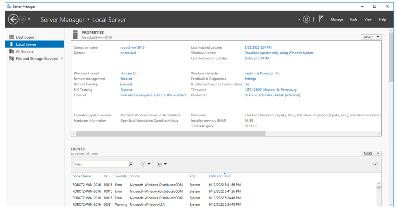
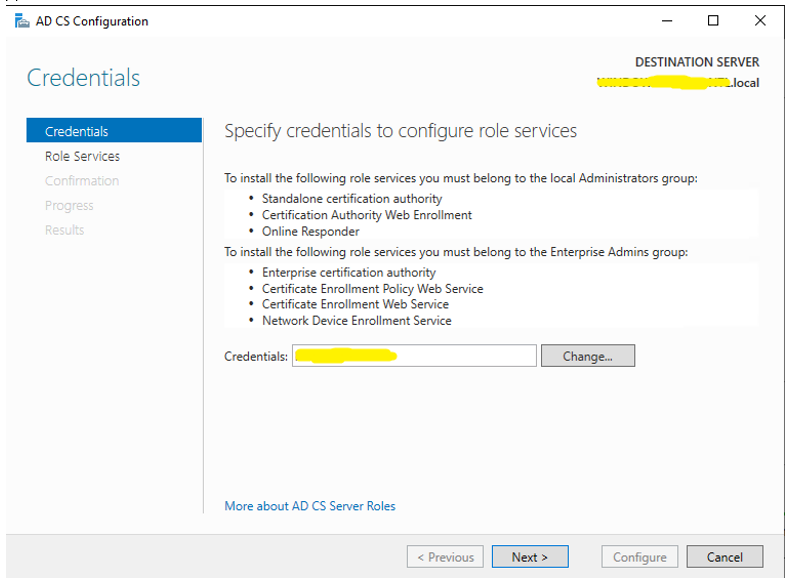
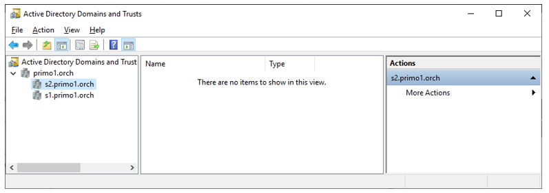

# Настройка AD для тестирования SSO

Для машины контроллера AD и рабочей станции, которая будет введена в этот AD, должны быть прописаны статические IP. 
При этом для рабочей станции «DNS» = «IP контроллера AD».

Должно быть установлено:


AD DS и DNS можно сразу, AD CS – после того, как машина станет контроллером AD.  
В DNS надо прописывать сервис в прямую зону. Имя контроллера пропишется туда автоматически при настройке AD.  
В DNS надо прописывать обратную зону, как для имени контроллера AD, так и для имени сервиса (Оркестратора):


**Обратите внимание: orch\*  – имя сервиса (нижняя строка). Полное имя сервиса\*\*  – orch.primo.local. primo.local – это имя домена \*\*\*.**  

> \* - Заменить на свой  
> \*\* - Полное имя сервиса – имя_сервиса.имя_домена  
> \*\*\* - Заменить на свой  

Проставить для них галочки «Update associated pointer (PTR) record»


Создать в AD пользователя для сервиса\* Оркестратора (через UI), orch.primo.local (совпадает с полным именем сервиса!!!):

> \* - Для регистрации сервиса в AD


Сделать этого пользователя SPN через командную строку:
```
setspn -A HTTP/orch.primo.local@PRIMO.LOCAL orch.primo.local
```


**Обратите внимание: полное имя сервиса совпадает с именем пользователя для Сервиса, регистр имеет значение!**


Ассоциировать SPN со службой (**регистр имеет значение!!!**) через командную строку:
```
ktpass /princ HTTP/orch.primo.local@PRIMO.LOCAL /mapuser orch.primo.local +setupn /pass Qwe123!@# /out C:\krb5.keytab -ptype KRB5_NT_PRINCIPAL
```


**Обратите внимание: полное имя сервиса совпадает с именем пользователя для Сервиса, регистр имеет значение!**


Полученный файл krb5.keytab далее копируем на сервер/серверы со службой WebApi и прописываем в конфигурационном файле в секции с настройкой AD (в данном случае это primo.local) путь до него:


Если используется IIS, пользователя PRIMO\orch.primo.local нужно сделать пользователем, под которым работает пулл приложений сервиса.

Синхронизировать время на рабочей станции и контроллере AD (можно вручную просто выставить часы).

На введенной в AD рабоче станции далее требуется добавить доменных пользователей, которым разрешен вход по удаленному рабочему столу, и настроить (проверить настройки) браузер.

Доменные пользователи удаленного рабочего стола добавляются через «Server Manager/Local Server/Remote Desktop»:



В окне «System Properties» на вкладке «Remote» при помощи кнопки «Select Users…» добавляются пользователи.


Эти доменные пользователи (настраивается на контроллере AD) должны входить в группу Remote Desktop Users:


Настройка браузера производится через «Control Panel/Network and Internet/Internet Options» открывается окно «Internet Options»:


На вкладке «Security» адрес Оркестратора https://orch.primo/local добавляется в сайты зоны «Local intranet»:


По кнопке «Custom level…» открывается окно «Security Settings – Local intranet Zone», в котором в разделе (внизу окна) «User Authentication/Logon» выбирается «Automatic logon only in Intranet zone»:


На вкладке «Advanced» ставится галочка «Enable Integrated Windows Authentication»


Перезагружаем компьютер, на котором были проведены настройки браузера. Заходим под доменным пользователем в систему (по удаленному рабочему столу или локально):


Открываем в браузере Оркестратор по созданному доменному имени https://orch.primo.local:44392


и при помощи кнопки «Войти с доменной учетной записью» логинимся в Оркестраторе. Первый раз будет предложено ввести доменную учетную запись:


Доменная учетная запись primo-user1 для домена primo.local вводится как 
primo-user1@primo.local. Эта учетная запись обязательно должна состоять в AD-группе, для которой настроена привязка к роли Оркестратора:


После успешного входа в Оркестратор в дальнейшем вводить доменную учетную запись не потребуется, аутентификация будет происходить автоматически на основе текущей учетной записи Windows.

## Настройка LDAPS

Предварительно рекомендуется ознакомится со статьей:  
[Включение протокола LDAP через протокол SSL с использованием стороннего центра сертификации](https://docs.microsoft.com/ru-RU/troubleshoot/windows-server/identity/enable-ldap-over-ssl-3rd-certification-authority)

Подготавливаем файл запроса request.inf:
```
[Version]
Signature="$Windows NT

[NewRequest]
Subject = "CN=WIN-QUE9E7MJCJD.primo.local,OU=Domain Controllers,DC=primo,DC=local"
KeySpec = 1
KeyLength = 1024
; Can be 1024, 2048, 4096, 8192, or 16384.
; Larger key sizes are more secure, but have
; a greater impact on performance.
Exportable = TRUE
MachineKeySet = TRUE
SMIME = False
PrivateKeyArchive = FALSE
UserProtected = FALSE
UseExistingKeySet = FALSE
ProviderName = "Microsoft RSA SChannel Cryptographic Provider"
ProviderType = 12
RequestType = PKCS10
KeyUsage = 0xa0

[EnhancedKeyUsageExtension]
OID=1.3.6.1.5.5.7.3.1 ; this is for Server Authentication
```

Достаточно заменить только строку «Subject», указав свой сервер контроллера AD (FQDN). В PowerShell (run as Administrator) на сервере контроллера AD выполняем команду:
```
PS C:\1> certreq -new request.inf request.req
```
Вывод экрана:
CertReq: Request Created

Получившийся в ходе выполнения команды файл запроса сертификата request.req необходимо отправить в CA. Запускаем Server Manager:


Выбираем Tools->Certification Authority. Если оснастка открывается с ошибкой: The system cannot find the file specified. 0x80070002 (WIN32: 2 ERROR_FILE_NOT_FOUND) и пустой, в этом случае требуется предварительная настройка CA.

Нажимаем желтый треугольник как на рисунке ниже:


Далее по шагам:




После этого оснастка (certsrv.msc) должна открыться:


Добавляем созданный нами request.req на создание сертификата:


Выбираем Submit new request:


В открывшемся окне выбираем наш файл request.req. Созданный запрос на создание отобразится на вкладке Pending Requests, открываем этот раздел, выбираем наш запрос – он будет единственный, нажимаем правую клавишу мыши и кликаем Issue (Выпустить).


Выпущенный сертификат отобразится в разделе Issued Certificates, заходим в раздел, кликаем дважды на сертификате, переходим на вкладку «Details» и нажимаем «Copy to file»: 


В открывшемся мастере выбираем кодировку и папку для сохранения сертификата:


После выгрузки сертификата снова запускаем PowerShell (run as Administrator) и выполняем команду (primo02.cer – имя выгруженного сертификата):
```
PS C:\1> certreq -accept primo02.cer
Installed Certificate:
  Serial Number: 7d0000000298de70f33181e1b4000000000002
  Subject: CN=WIN-QUE9E7MJCJD.primo.local, OU=Domain Controllers, DC=primo, DC=local
  NotBefore: 9/5/2022 2:38 PM
  NotAfter: 9/5/2023 2:48 PM
Сертификат установлен в хранилище локального ПК.
```

Проверяем связь:

Запускаем LDP.EXE, нажимаем Connect, указываем порт 636, и полное имя сервера как в сертификате (WIN-QUE9E7MJCJD.primo.local), нажимаем «Connect», проверяем, что соединение прошло без ошибок. 


## Леса с доверительными отношениями

Машина пользователя не обязательно должна быть в том же AD, в котором зарегистрирован сервис. Тогда требуется настроить доверительные отношения между AD1 и AD2:


Сначала требуется настроить DNS (прописать доверенный AD в Conditional Forwarders):


И настроить доверенные отношения:




