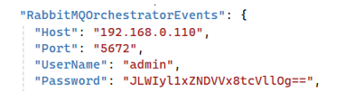

# Установка Analytic под Windows 2016 Server

Разархивируем C:\Install\Analytic.zip в C:\Primo\Analytic

Редактируем конфигурационный файл Analytic (C:\Primo\Analytic\appsettings.ProdWin.json):

Правим строку подключения к аналитической БД:


И секцию подключения к RabbitMQ:



Проверяем, что значение системной переменной окружения `ASPNETCORE_ENVIRONMENT` равно `ProdWin`. Для этого в PoweShell выполняем команду:
```
[Environment]::GetEnvironmentVariable('ASPNETCORE_ENVIRONMENT', 'Machine')
```
Создаем системную переменную окружения `ASPNETCORE_ENVIRONMENT`, если она не создана ранее. Для этого в PowerShell выполняем команду:
```
[System.Environment]::SetEnvironmentVariable('ASPNETCORE_ENVIRONMENT', 'ProdWin', [System.EnvironmentVariableTarget]::Machine)
```
Регистрируем Primo.Orchestrator.Analytic.exe как службу Windows и сразу запускаем её. Для этого в PoweShell последовательно выполняем команды:
```
New-Service -Name Primo.Orchestrator.Analytic -BinaryPathName "C:\Primo\Analytic\Primo.Orchestrator.Analytic.exe" -Description "Primo.Orchestrator.Analytic" -DisplayName "Primo.Orchestrator.Analytic" -StartupType Automatic 
$s = Get-Service "Primo.Orchestrator.Analytic"
$s.Start()
```
После чего созданная служба Primo.Orchestrator.Analytic будет отображаться в списке всех служб как запущенная.

