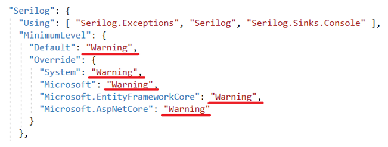
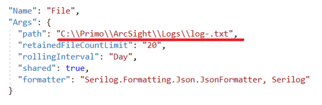
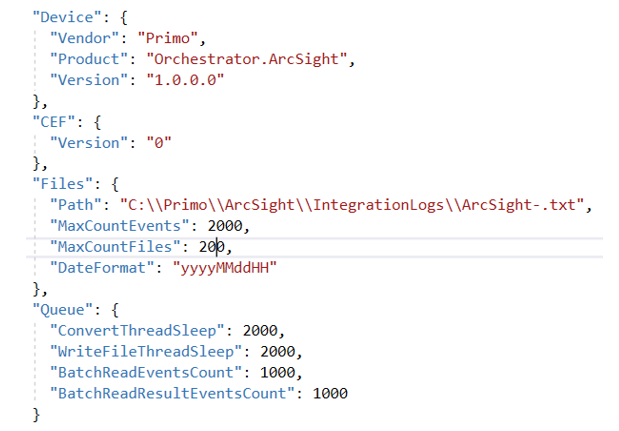
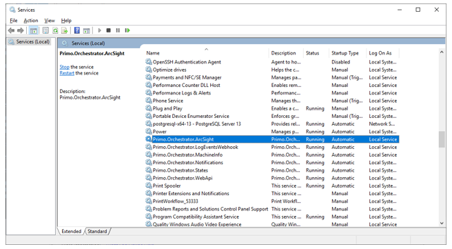
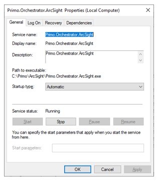

# Установка ArcSight как службы под Windows 2016 Server

В версии Windows 2016 Server среда исполнения ASP .NET Core предустановлена. Поэтому сразу устанавливаем ArcSight. 

Разархивируем C:\Install\ArcSight.zip в C:\Primo\ArcSight. Можно при помощи PowerShell:
```
$InstallPath = "C:\Install"
Expand-Archive -LiteralPath "$InstallPath\ArcSight.zip" -DestinationPath "C:\Primo\ArcSight " -Force
```

Создаем системную переменную окружения. Для этого в PoweShell выполняем команду:
```
[System.Environment]::SetEnvironmentVariable('ASPNETCORE_ENVIRONMENT', 'ProdWin', [System.EnvironmentVariableTarget]::Machine)
```

Настраиваем уровни логирования приложения (Information, Warning, Error):



Настраиваем путь до папки с логами приложения и шаблон имени файлов логов:



Настраиваем параметры интеграции с ArcSight:



**Описание параметров интеграции с ArcSight**

| № п/п |	Секция   |     Параметр     |	Тип	    |  Рекомендуемое значение	      |   Описание   |
|-------|------------|------------------|-----------|---------------------------------|--------------|
|   1.	|   Device	 |  Vendor          | String    |  Primo	                      | По спецификации ArcSight |
|   2.	|	         |  Product         | String	|  Orchestrator.ArcSight          |	По спецификации ArcSight |
|   3.	|        	 |	Version	        | String	|  1.0.0.0	                      | По спецификации ArcSight |
|   4.	|	CEF	     |  Version         | String	|  0	                          | По спецификации ArcSight |
|   5.	|	Files	 |  Path	        | String	| C:\\Primo\\ArcSight\\IntegrationLogs\\ArcSight-.txt  | Папка, из которой ArcSight будет забирать логи и префикс имени файла логов. Например, ArcSight-20220521.txt, ArcSight-20220521 1.txt, ArcSight-20220521 2.txt. Нумерация, 1, 2 и т.д. для одной даты. См. п. 6 |
|   6.	|            |	MaxCountEvents	| Int       |  2000                           | Максимальное количество строк в одном файле логов. После этого значения создается новый файл. Для нового файла для одной даты используется автоматическая нумерация. Должно быть согласовано с механизмом чтения файлов из папки обмена ArcSight |
|   7.  |            |	MaxCountFiles   | Int       |  200	                          | Максимальное количество файлов в папке обмена. Старые файлы логов удаляются. Должно быть согласовано с механизмом чтения файлов из папки обмена ArcSight |
|   8.	|            |	DateFormat      | String	|  yyyyMMddHH                     | Формат даты в постфиксе имени файла |
|   9.  |	Queue    |	ConvertThreadSleep  | Int	|  2000                           |	Время (миллисекунды) засыпания потока обработки входной очереди событий для их сопоставления формату ArcSight |
|   10. |	         |  WriteFileThreadSleep| Int   |  2000                           |	Время (миллисекунды) засыпания потока записи событий в папку обмена. Должно быть согласовано с механизмом чтения файлов из папки обмена ArcSight |
|   11.	|            |	BatchReadEventsCount| int	|  1000	                          | Максимальное количество событий, считываемых из входной очереди за один раз. Считанные события обрабатываются и помещаются в выходную очередь |
|   12. |   		 |	BatchReadResultEventsCount | int    |  1000	                  | Максимальное количество событий, считываемых из выходной очереди за один раз. Считанные события конвертируются в строки ArcSight и записываются в файлы в папке обмена |


Регистрируем Primo.Orchestrator.ArcSight.exe как службу Windows и сразу запускаем её. Служба должна работать как локальная служба. 
Для этого в PowerShell последовательно выполняем команды:
```
$secpasswd = ConvertTo-SecureString 'Qwe123!@#' -AsPlainText -Force 
$mycreds = New-Object System.Management.Automation.PSCredential ('NT AUTHORITY\LOCAL SERVICE', $secpasswd)  
New-Service -Name Primo.Orchestrator.ArcSight -BinaryPathName "C:\Primo\ArcSight\Primo.Orchestrator.ArcSight.exe" -Credential $mycreds -Description "Primo.Orchestrator.ArcSight " -DisplayName "Primo.Orchestrator.ArcSight " -StartupType Automatic 
$s = Get-Service "Primo.Orchestrator.ArcSight"
$s.Start()
```
:small_blue_diamond: В строке `$mycreds = New-Object System.Management.Automation.PSCredential ('NT AUTHORITY\LOCAL SERVICE', $secpasswd)` пароль можно задать любой.

После чего созданная служба Primo.Orchestrator.ArcSight будет отображаться в списке всех служб как запущенная:





После установки ArcSight требуется настройка интеграционного шлюза LogEventsWebhook.

