# Установка и настройка Grafana под Windows 2016 Server

## Общие положения

Grafana используется для построения интерактивных отчетов по временным рядам журналов Оркестратора и Робота с визуализацией результата в виде различных диаграмм. 

Grafana – отдельное приложение с веб-интерфейсом, работающее как служба Windows. По умолчанию служба слушает 3000 порт. Вовне этот порт не открывается, обращение к Grafana осуществляется через Front (nginx или IIS). Опционально Front может устанавливать для Grafana заголовок авторизации, чтобы не требовалось вводить логин и пароль.

Схема интеграции Grafana с Оркестратором: 

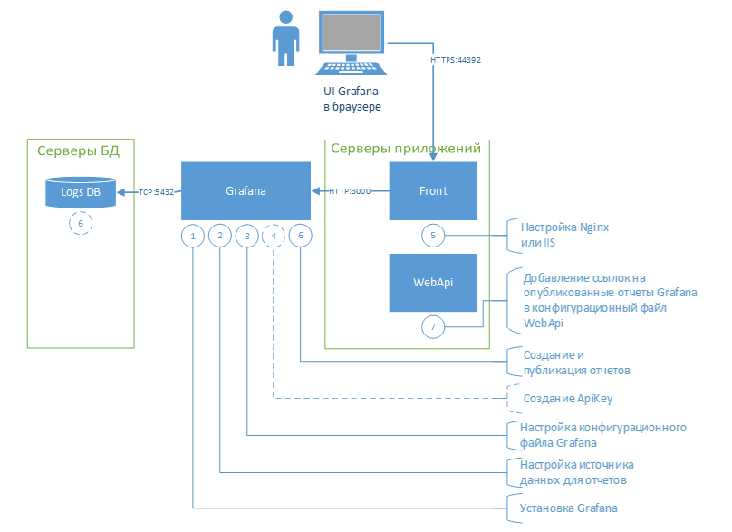

Интеграция с Grafana осуществляется следующим образом:
1.	Устанавливается приложение Grafana. Например, на том же сервере, где и WebApi.
2.	Средствами интерфейса Grafana настраивается источник данных для отчетов – БД ltoolslogs с журналами Оркестратора и Робота.
3.	Настраивается конфигурационный файл Grafana (для возможности настроить проксирование через Front, который является общим с Оркестратором).
4.	Создается ApiKey, который прописывается далее в конфигурационном файле nginx (не обязательный шаг).
5.	Настраивается проксирование с установкой заголовка авторизации в Front. Как было сказано выше, настройка заголовка авторизации необязательна \*.
6.	Средствами интерфейса Grafana создаются или импортируются отчеты \**, отчеты публикуются. При публикации отчетов Grafana формирует внешние ссылки на них. Возможно, некоторые отчеты потребуют создания view в БД.
7.	Ссылки на опубликованные отчеты добавляются в конфигурационный файл WebApi, чтобы они открывались через интерфейс Оркестратора. Больше никакой связи Оркестратор с Grafana не имеет.

> \* - В некоторых случаях нежелательна, так как ослабляет безопасность
> \** - Документация по созданию отчетов (дашбордов в терминах Grafana) находится на [официальном сайте Grafana](https://grafana.com/). Там же можно скачать дистрибутив с последней версией Grafana.


## Установка Grafana

Далее предполагается что Grafana устанавливается на сервере Оркестратора.

Установочный файл Grafana может быть скачан с [официального сайта  Grafana](https://grafana.com/).

1. Запускаем установочный файл C:\Install\grafana-8.0.6.windows-amd64.msi. Принимаем лицензионное соглашение (ставим галочку), все настройки оставляем по умолчанию, дожидаемся окончания установки:

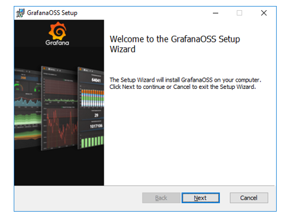

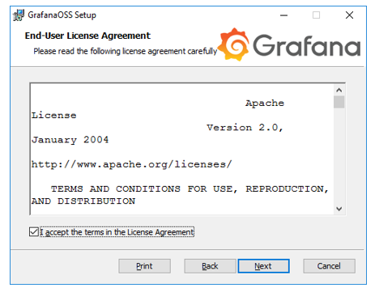

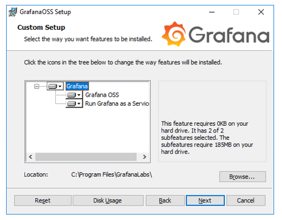

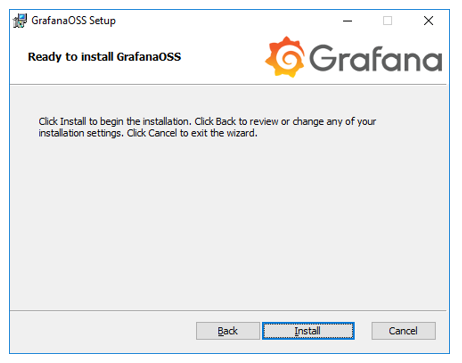

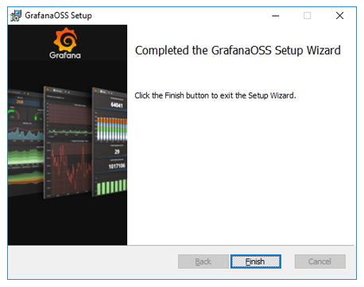

2. Проверяем, что служба Grafana работает. Никакого специального интерфейса для управления этой службой у Grafana нет. Среди всех программ или на рабочем столе ярлыков не появится.

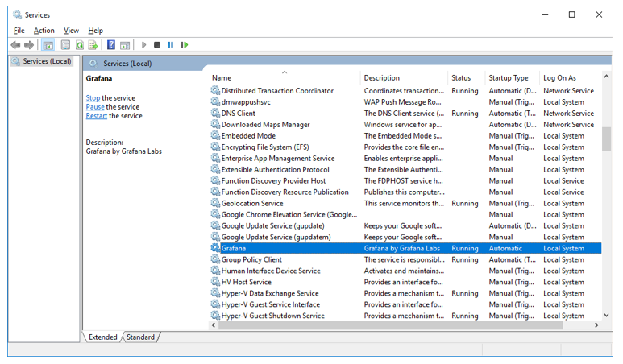

3. Заходим в веб-интерфейс Grafana по адресу `http://localhost:3000` со встроенной учетной записью admin/admin:

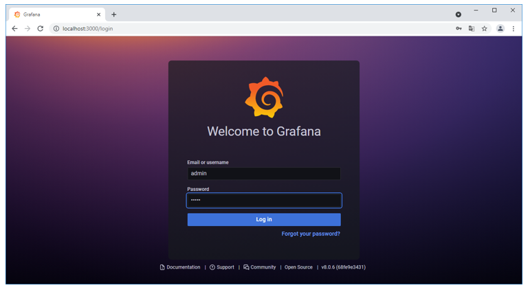

4. Меняем пароль по умолчанию на новый (Grafana сама предложит это сделать):

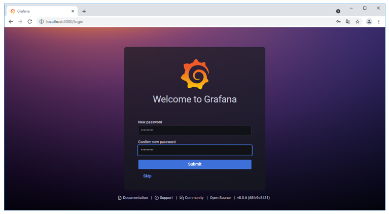

5. Откроется панель управления Grafana. Установка Grafana завершена:

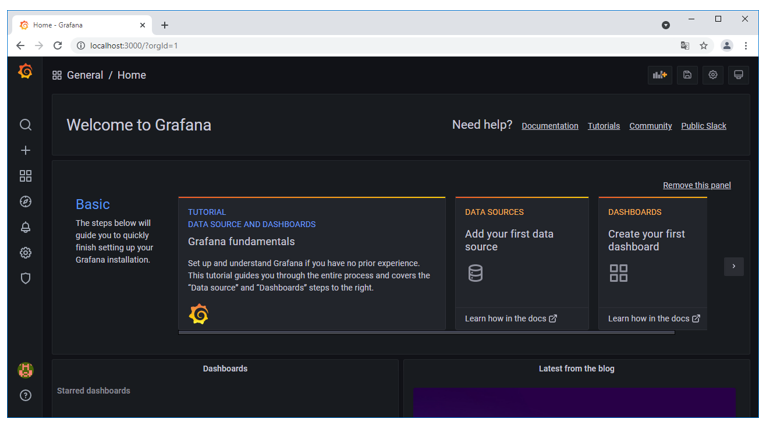


## Настройка источника данных для отчетов

Переходим в раздел Configuration/Data Sources. Для только что установленной Grafana можно перейти из раздела General/Home. 
Можно воспользоваться левым боковым меню «шестеренка»:

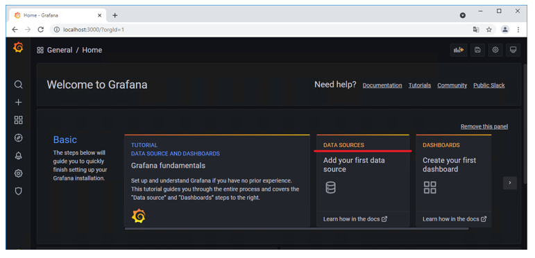

Выбираем поставщика данных PostgreSQL или Microsoft SQL Server (в зависимости от вендора БД Оркестратора):

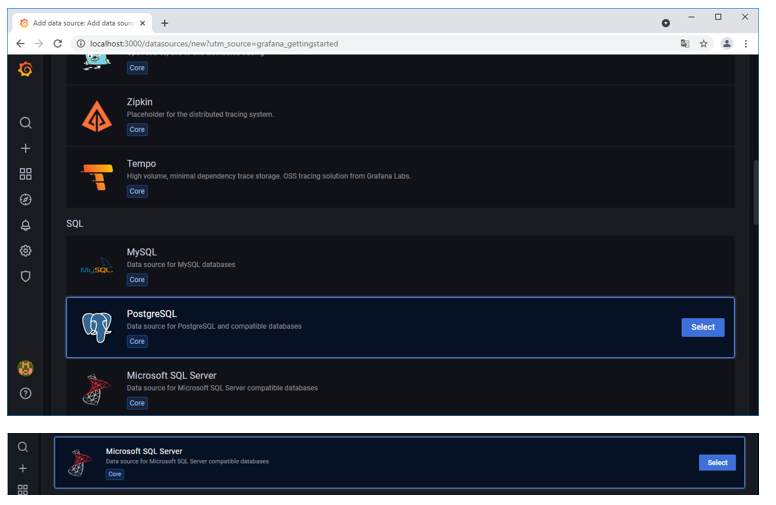

Настраиваем подключение к БД ltoolslogs:

Для PostgreSQL:
    * Name – оставляем по умолчанию PostgreSQL (можно выбрать произвольное);
    * Host – IP-адрес и порт сервера БД (уточнить в конфигурационном файле WebApi);
    * Database – ltoolslogs;
    * User/Password – пользователь/пароль БД (уточнить в конфигурационном файле WebApi);
    * TLS/SSL Mode – disable;
    * Connection limits – все параметры этого блока оставляем по умолчанию;
    * Version – 12;
    * TimescaleDB\* – false;
    * Min time interval – оставляем по умолчанию 1m; 

> \* - Grafana поддерживает TimescaleDB, что находит свое отражение при создании отчетов. 
За подробной информацией необходимо обратиться к официальной документации на [официальном сайте Grafana](https://grafana.com/).


Для Microsoft SQL Server:
    * Name – оставляем по умолчанию Microsoft SQL Server (можно выбрать произвольное);
    * Host – IP-адрес (или имя хоста) и порт сервера БД (уточнить в конфигурационном файле WebApi);
    * Database – ltoolslogs;
    * Authentication – SQL Server Authentication
    * User/Password – пользователь/пароль БД (уточнить в конфигурационном файле WebApi);
    * Encrypt – false;
    * Connection limits – все параметры этого блока оставляем по умолчанию;
    * Min time interval – оставляем по умолчанию 1m;

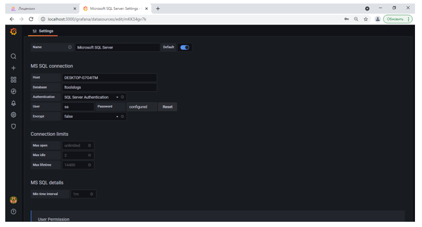

Внизу формы настройки подключения нажимаем кнопку «Save & test»:

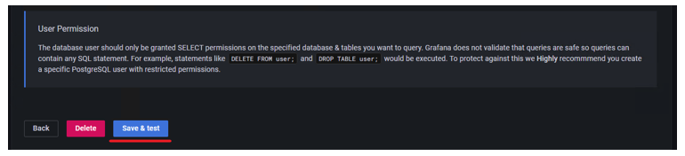

Если все сделано верна и БД ltoolslogs доступна, отобразится сообщение об удачном подключении к БД:

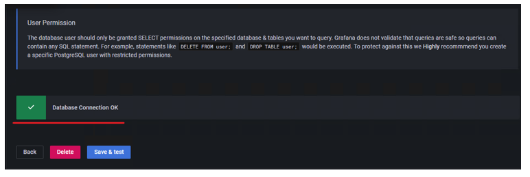

В разделе Configuration/Data Sources будет отображаться созданное подключение с наименованием PostgreSQL (Microsoft SQL Server):

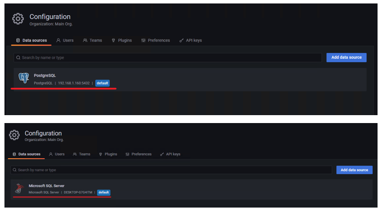


## Настройка конфигурационного файла Grafana

В WordPad (или аналогичной программе, **не Notepad!!!**) открываем конфигурационный файл Grafana C:\Program Files\GrafanaLabs\grafana\conf\defaults.ini

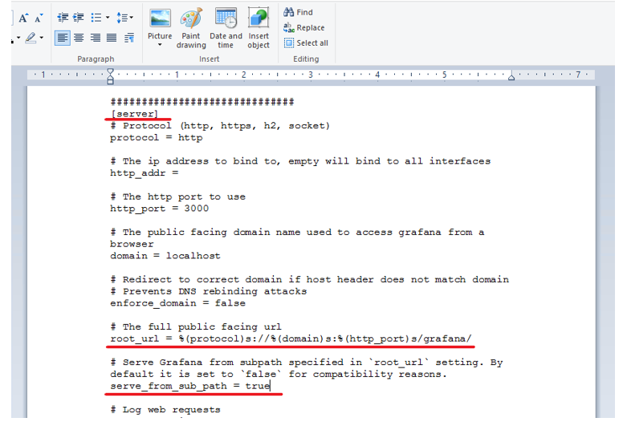

В секции [server] (можно найти писком по файлу, Ctrl + F) меняем дефолтные значения параметров на:
    * `root_url = %(protocol)s://%(domain)s:%(http_port)s/grafana/`
    * `serve_from_sub_path = true`

Сохраняем файл и перезапускаем службу Grafana:

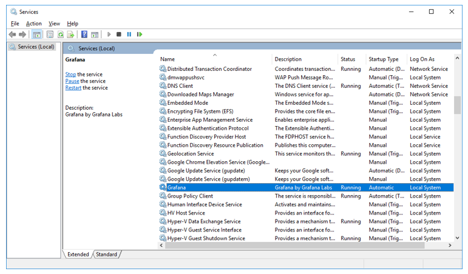

## Создание Api Key (необязательно)

ApiKey создается в интерфейсе Grafana в разделе Configuration/Api keys (боковое левое меню «шестеренка»). Кликаем по кнопке «New API key»:

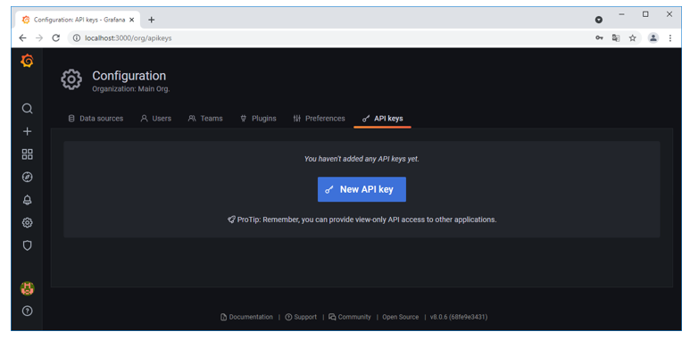

Задаем параметры нового ApiKey:
    * Key name – key1 (произвольное наименование на латинице);
    * Role – оставляем по умолчанию Viewer (только просмотр);
    * Time to life – 1000d. Время в днях, через которое ApiKey станет неактивным и авторизация посредством него работать перестанет. Выбирать следует большим.

Нажимаем кнопку «Add»:

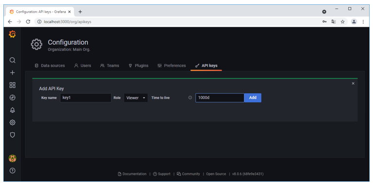

Сохраняем где-то отдельно полученный ApiKey, так как через интерфейс Grafana увидеть его больше будет невозможно:

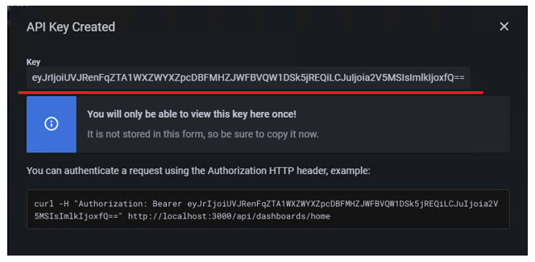

Закрываем модальное окно с новым ApiKey. Этот ApiKey под наименованием key1, которое ему дали ранее, будет отображаться в списке всех ApiKey:

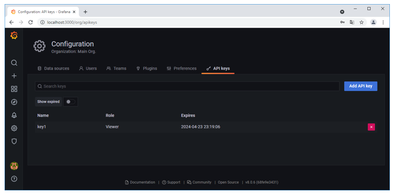

## Настройка Front

### nginx

Открываем файл C:\Primo\nginx-1.21.1\conf\nginx.conf и добавляем следующие правила:

После секции upstream app_server добавляем секцию:
```
upstream grafana {
        server localhost:3000;
}
```

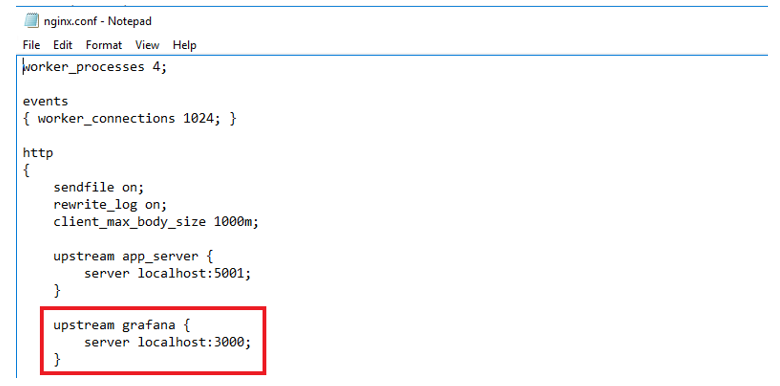

После правила перенаправления location/api/ добавляем правило:
```
location /grafana/ {
            proxy_set_header Authorization "Bearer {ApiKey}";            
            proxy_pass http://grafana;                        
}
```

ApiKey (без фигурных скобок) подставляем созданный в пункте выше.

Если не нужна автоматическая авторизация в Grafana, заголовок proxy_set_header Authorization можно не устанавливать (удалить всю строку).


Из cmd перезапускаем nginx:
```
C:\Primo\nginx-1.21.1>nginx -s reload
```

### IIS

Добавляем серверную переменную AUTHORIZATION:

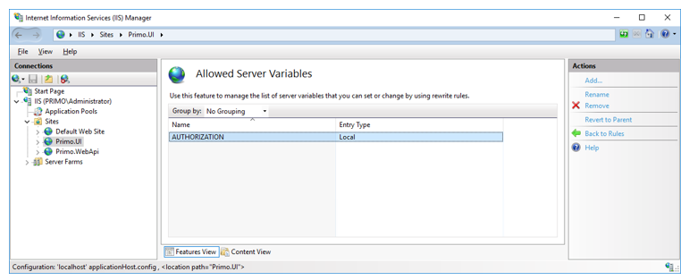

Открываем файл C:\Primo\UI\web.config и добавляем следующее правило после правила «Reverse Proxy to API»:
```
<rule name="Grafana" stopProcessing="false">
                <match url="^grafana(.*)" />
                <action type="Rewrite" url="http://localhost:3000/grafana{R:1}" />
                <serverVariables>
                      <set name="AUTHORIZATION" value="Bearer eyJrIjoickxTcUFDTWVvajlGNVVBT3pDUUxtQXBhMHFRbmVrOEEiLCJuIjoia2V5MSIsImlkIjoxfQ==" />
                </serverVariables>
 </rule>
```

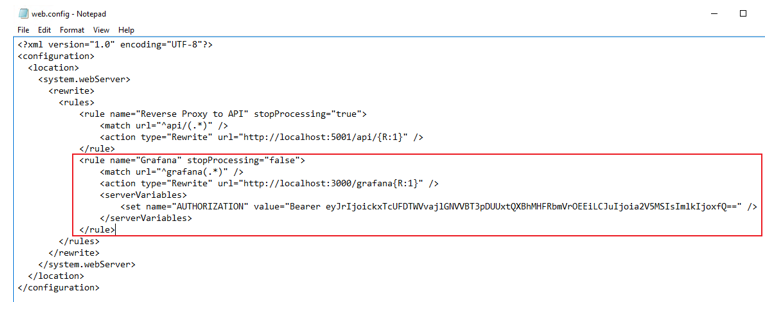

## Создание или импорт отчетов

Создание отчетов – отдельная большая тема. Для этого требуется, как минимум:
    * владение средствами Grafana;
    * владение SQL, в частности, его диалектом для PostgreSQL или Microsoft SQL Server и 
SQL-образным DSL Grafana;
    * понимание структуры и семантики данных БД ltoolslogs.

Поэтому для примера рассмотрим импорт готового отчета в Grafana. 

Вообще говоря, наличие view в БД для отчетов в Grafana не обязательно. Но, для этого примера потребуется создать view – v_AllWorked-postgres (или v_AllWorked-mssql). 
Скрипт создания v_AllWorked-postgres.sql (v_AllWorked-mssql.sql) включен в поставку. Этот скрипт требуется выполнить в БД ltoolslogs.

Для импорта отчета переходим в раздел Dashboards/Manage и нажимаем кнопку «Import»:

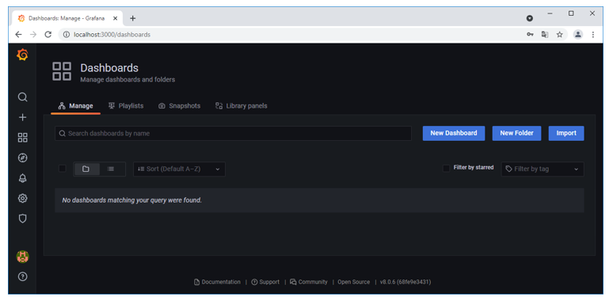

В открывшейся форме нажимаем кнопку «Upload JSON file»:

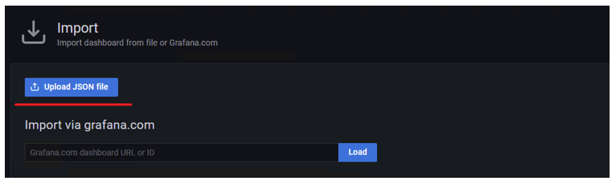

Выбираем идуший в комплекте поставки пример отчета – файл 
Роботы-1627543691525.json – и нажимаем кнопку «Import»:

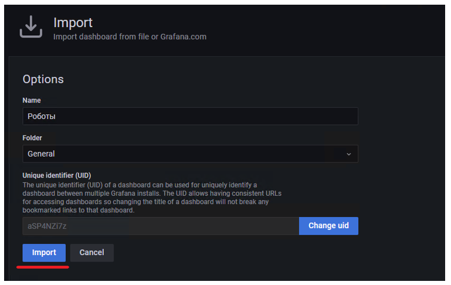

Если все выполнено верно, и файл отчета корректный, сразу откроется сам отчет:

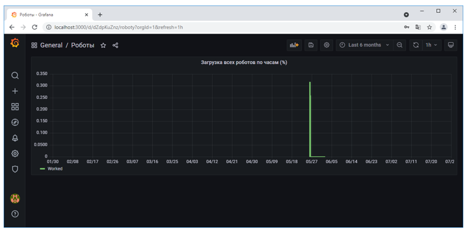

Далее публикуем его, чтобы получить внешнюю ссылку на этот отчет. Нажимаем на кнопку «Share dashboard or panel»:

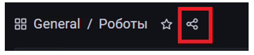

В открывшейся форме ставим Shorted URL = true и копируем адрес ссылки:

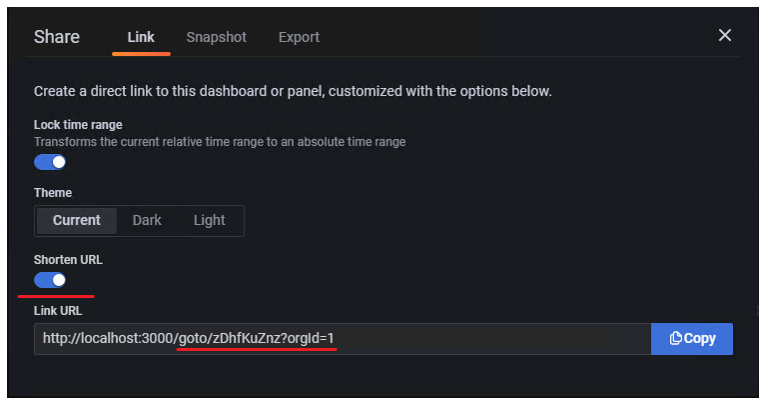

Окончательная ссылка на отчет получается после ручной корректировки как
```
https://{IP Оркестратора}:44392/grafana/goto/zDhfKuZnz?orgId=1
```

## Добавление в конфигурационный файл WebApi ссылок на опубликованные отчеты

Ссылки на опубликованные отчеты добавляются в конфигурационный файл C:\Primo\WebApi\appsettings.ProdWin.json в секцию Grafana:ReportItems:

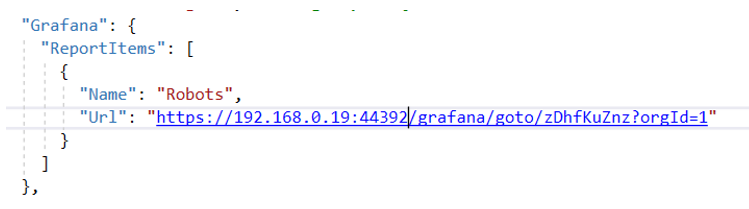

Задается Url отчета, полученный в п.6, и произвольное наименование отчета. После этого службу WebApi нужно перезапустить.

Проверить, что все настроено верно, можно через интерфейс Оркестратора в разделе Журнал/Отчеты:

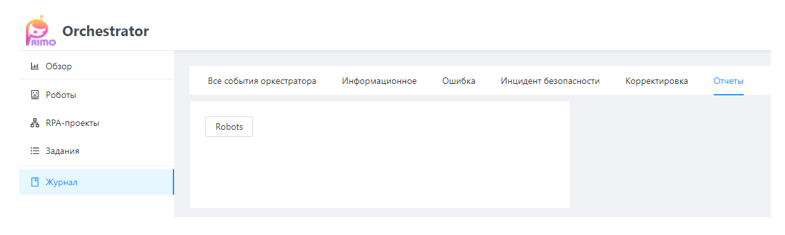

По клику по кнопке Robots («Robots» – наименование отчета из конфигурационного файла) откроется отчет в Grafana.

