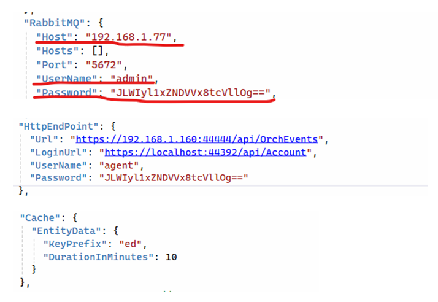

# Установка LogEventsWebhook как службы под Windows 2016 Server

В версии Windows 2016 Server среда исполнения ASP .NET Core предустановлена. Поэтому сразу устанавливаем WebApi. 

Разархивируем C:\Install\LogEventsWebhook.zip в C:\Primo\LogEventsWebhook. Можно при помощи PowerShell:
```
$InstallPath = "C:\Install"
Expand-Archive -LiteralPath "$InstallPath\LogEventsWebhook.zip" -DestinationPath "C:\Primo\LogEventsWebhook" -Force
```
Создаем системную переменную окружения. Для этого в PoweShell выполняем команду:
```
[System.Environment]::SetEnvironmentVariable('ASPNETCORE_ENVIRONMENT', 'ProdWin', [System.EnvironmentVariableTarget]::Machine)
```

Настраиваем appsettings/appsettings.ProdWin.json (некоторые параметры):



- **RabbitMQ:Host** – адрес сервера с RabbitMQ, учетные данные для подключения.
- Полностью задаем все параметры секции **HttpEndPoint**:  
    * **Url** – адрес end-point приема событий.
    * **LoginUrl** – адрес end-point получения токена.
    * **UserName** – имя пользователя для получения токена.
    * **Password** – пароль для получения токена. Пароль должен быть зашифрован утилитой LTools.Orchestrator.PasswordEncriptor
- **Cache:EntityData:DurationInMinutes** – время (минут) жизни кэша для получения расширенной информации о связанной с событием сущности Оркестратора.

Настраиваем уровни логирования (Information, Warning, Error):


Настраиваем путь до папки с логами и шаблон имени файлов логов:


Регистрируем Primo.Orchestrator.LogEventsWebhook.exe как службу Windows и сразу запускаем её. 
Служба должна работать как локальная служба. Для этого в PowerShell последовательно выполняем команды:
```
New-Service -Name Primo.Orchestrator.LogEventsWebhook -BinaryPathName "C:\Primo\LogEventsWebhook\Primo.Orchestrator.LogEventsWebhook.exe" -Description "Primo.Orchestrator.LogEventsWebhook" -DisplayName "Primo.Orchestrator.LogEventsWebhook" -StartupType Automatic 
$s = Get-Service "Primo.Orchestrator.LogEventsWebhook"
$s.Start()
```
После чего созданная служба Primo.Orchestrator.LogEventsWebhook будет отображаться в списке всех служб как запущенная:


В конфиге службы WebApi разрешаем интеграцию:


