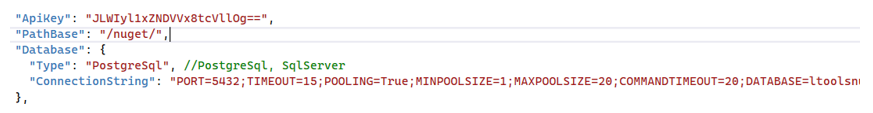
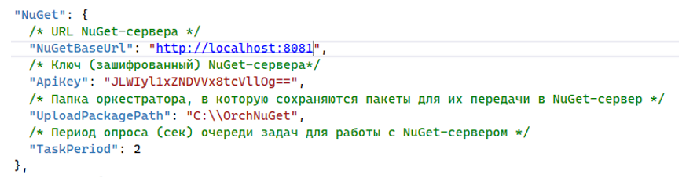

# Установка NuGet2 под Windows 2016 Server

Если используется PostgreSql, предварительно нужно установить на сервере БД расширение для PostgreSql citext (если не установлено):
```
sudo apt-get install postgresql-contrib-13 
```
Создаем БД ltoolsnuget в которой устанавливаем расширение citext:
```
sudo -i -u postgres psql -U postgres -c 'create database ltoolsnuget;'
sudo -i -u postgres psql -d ltoolsnuget -c 'CREATE EXTENSION IF NOT EXISTS citext WITH SCHEMA public;'
```
Разархивируем C:\Install\NuGet2.zip в C:\Primo\NuGet2

Редактируем конфиг NuGet2 (C:\Primo\NuGet2\appsettings.ProdWin.json):

Устанавливаем ApiKey (произвольная строка), предварительно зашифровав его, и ConnectionString с зашифрованным паролем:



Проверяем, что значение системной переменной окружения DOTNET_ENVIRONMENT равно ProdWin. Для этого в PoweShell выполняем команду:
```
[Environment]::GetEnvironmentVariable('ASPNETCORE_ENVIRONMENT', 'Machine')
```
Создаем системную переменную окружения ASPNETCORE_ENVIRONMENT, если она не создана ранее. Для этого в PowerShell выполняем команду:
```
> [System.Environment]::SetEnvironmentVariable('ASPNETCORE_ENVIRONMENT', 'ProdWin', [System.EnvironmentVariableTarget]::Machine)
```
Регистрируем BaGet.exe как службу Windows и сразу запускаем её. Служба должна работать как локальная служба. Для этого в PoweShell последовательно выполняем команды:
```
New-Service -Name Primo.Orchestrator.Nuget -BinaryPathName "C:\Primo\NuGet2\BaGet.exe" -Description "Primo.Orchestrator.Nuget" -DisplayName "Primo.Orchestrator.Nuget" -StartupType Automatic
$s = Get-Service "Primo.Orchestrator.Nuget "
$s.Start()
```
После чего созданная служба Primo.Orchestrator.Nuget будет отображаться в списке всех служб как запущенная.

В конфигурационном файле WebApi appsettings.ProdWin.json задаем параметры интеграции с NuGet-сервером:



**NuGetBaseUrl** – адрес NuGet-сервера. Если порт в конфигурационном файле NuGet-сервера не менялся, и он на том же сервере, что и WebApi, остается без изменения.

**ApiKey** – такой же, как в конфигурационном файле NuGet-сервера.

:small_orange_diamond: **Внешнее обращение в Nuget-серверу происходит через прокси (nginx/IIS). Поэтому сертификат у nginx/IIS обязательно должен быть валидным!**

