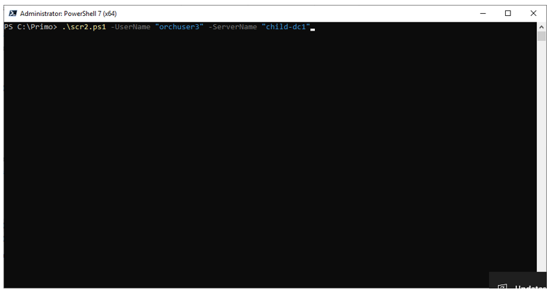

# Настройка теневого подключения к сессии робота

## Настройка групповых политик

1.	Копируем скрипт для подключения теневой сессии scr2.ps1 (для русской версии Windows необходимо использовать скрипт scr2_RU.ps1) в папку C:\Primo.

2.	Для каждого сервера (машины робота), к которому планируется теневое подключение, необходимо настроить политику. Запускаем gpedit.msc, 
переходим в **Computer Configuration -> Administrative Templates -> Windows Components -> Remote Desktop Services -> Remote Desktop Session Host -> Connections** 
и выбираем "Set rules for remote control of Remote Desktop Service user sessions" (для русской версии: **Конфигурация компьютера -> Административные шаблоны -> Компоненты Windows -> Службы удаленных рабочих столов -> Узел сеансов удаленных рабочих столов -> Подключения** 
и выбираем "Устанавливает правила удаленного управления для пользовательских сеансов служб удаленных рабочих столов"):

Для русской версии Windows:

3.	Заходим в политику, включаем и выбираем опцию в соответствии с иллюстрацией ниже:

Для русской версии Windows:

4.	Нажимаем Apply (Применить)

5.	Запускаем PowerShell под администратором и выполняем команду `gpupdate /force`

6.	В PowerShell переходим в папку C:\Primo и запускаем скрипт (зависит от версии Windows) с параметрами -UserName и -ServerName. 

7.	Полный контроль сессии 

## Альтернативный вариант теневого подключения 

1. В диспетчере задач на машине роботов в разделе Users (Пользователи) необходимо добавить колонку с ID (Кодом) сессии. 
Для этого необходимо кликнуть правой клавишей мыши на любом из заголовков, как показано на скрине:

2. Из диспетчера определяем ID сессии, к которой планируем подключиться, и подключаемся из PowerShell (под Администратором) с помощью команды `mstsc`:

