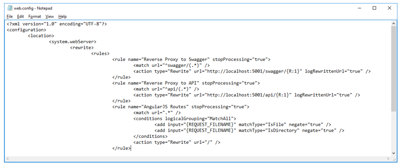
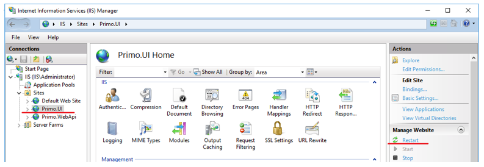
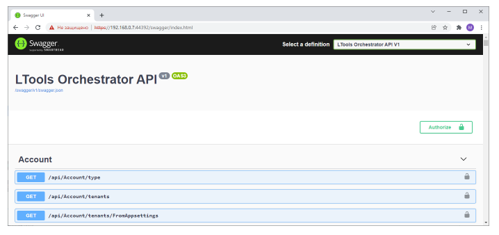

# Открытие Swagger в IIS под Windows 2016 Server

**Swagger** – интерактивная документация к Api Оркестратора. По умолчанию Swagger доступен только на машине Оркестратора по адресу: 

`http://localhost:5001/swagger/index.html`

Чтобы им можно было пользоваться на любой машине в сети организации, не открывая порт 5001 Оркестратора, требуется настроить в IIS проксирование этого адреса:

1.	Переходим в папку C:\Primo\UI

2.	Редактируем файл web.config – добавляем в начало секции <rules/> правило «Reverse Proxy to Swagger» для проксирования Swagger:



```
<rule name="Reverse Proxy to Swagger" stopProcessing="true">
	<match url="^swagger/(.*)" />
	<action type="Rewrite" url="http://localhost:5001/swagger/{R:1}" logRewrittenUrl="true" />
</rule>
```
3. При помощи оснастки IIS или `cmd (iisreset)` перезапускаем узел Primo.UI



4. Проверяем доступность Swagger по адресу:

`https://{IP}:44392/swagger/index.html`


