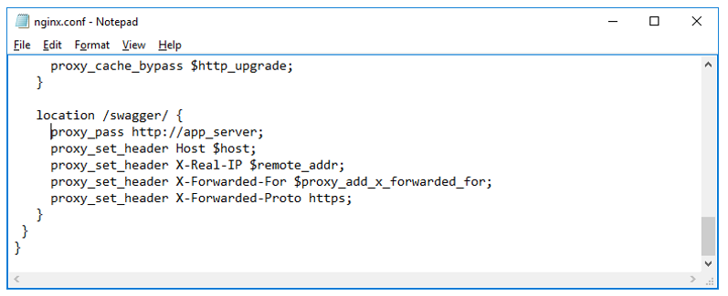
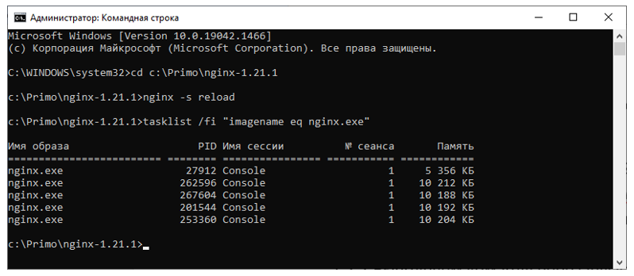
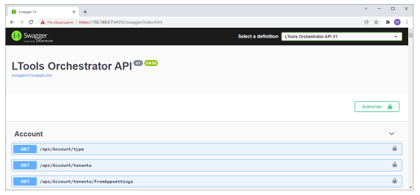

# Открытие Swagger в Nginx под Windows 2016 Server

**Swagger** – интерактивная документация к Api Оркестратора. По умолчанию Swagger доступен только на машине Оркестратора по адресу: 

`http://localhost:5001/swagger/index.html`

Чтобы им можно было пользоваться на любой машине в сети организации, не открывая порт 5001 Оркестратора, требуется настроить в nginx проксирование этого адреса:

1. Переходим в папку C:\Primo\nginx-1.21.1\conf
2. Редактируем файл nginx.conf – добавляем в конец файла секцию для проксирования Swagger:



```
location /swagger/ {
     proxy_pass http://app_server;
     proxy_set_header Host $host;
     proxy_set_header X-Real-IP $remote_addr;
     proxy_set_header X-Forwarded-For $proxy_add_x_forwarded_for;
     proxy_set_header X-Forwarded-Proto https;
   }
```
3. При помощи cmd перезапускаем nginx:

    * Переходим в папку с установленным nginx: 
    ```
    cd C:\Primo\nginx-1.21.1
    ```
    * Выполняем команду перезапуска nginx: 
    ```
    nginx -s reload
    ```
    * Убеждаемся, что nginx запущен, командой: 
    ```
    tasklist /fi "imagename eq nginx.exe" 
    ```



4. Проверяем доступность Swagger по адресу:

`https://{IP}:44392/swagger/index.html`


