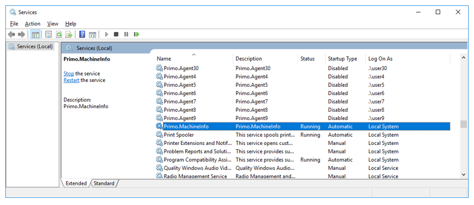
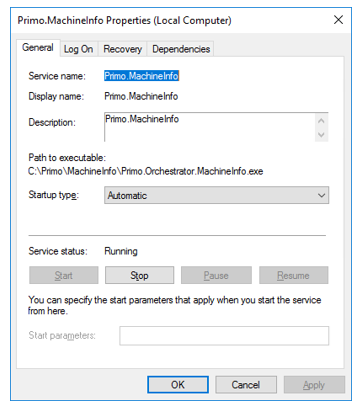
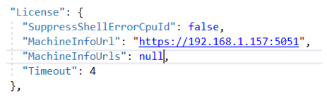
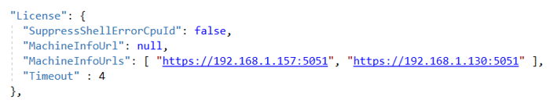

# Установка MachineInfo как службы под Windows 2016 Server

В версии Windows 2016 Server среда исполнения ASP .NET Core предустановлена. Поэтому сразу устанавливаем MachineInfo.

Разархивируйте C:\Install\MachineInfo.zip в C:\Primo\MachineInfo. Можно при помощи PowerShell:
```
$InstallPath = "C:\Install"
Expand-Archive -LiteralPath "$InstallPath\MachineInfo.zip" -DestinationPath "C:\Primo\MachineInfo" -Force
```
Создайте системную переменную окружения. Для этого в PoweShell выполните команду:
```
[System.Environment]::SetEnvironmentVariable('ASPNETCORE_ENVIRONMENT', 'ProdWin', [System.EnvironmentVariableTarget]::Machine)
```
Зарегистрируйте Primo.Orchestrator. MachineInfo.exe как службу Windows и сразу запустите её. Служба должна работать как локальная служба. Для этого в PowerShell последовательно выполните команды:
```
New-Service -Name Primo.Orchestrator.MachineInfo -BinaryPathName "C:\Primo\MachineInfo\Primo.Orchestrator.MachineInfo.exe" -Description "Primo.Orchestrator.MachineInfo" -DisplayName "Primo.Orchestrator.MachineInfo" -StartupType Automatic 
$s = Get-Service "Primo.Orchestrator.MachineInfo"
$s.Start()
```
После чего созданная служба Primo.Orchestrator.MachineInfo будет отображаться в списке всех служб как запущенная:





Откройте порт 5051 на файерволе.

Если используется один сервер с MachineInfo, в конфигурационном файле службы WebApi пропишите ссылку на него:



* Timeout (по умолчанию 4 сек) – время ответа, после которого сервис считается недоступным.

Если используется кластер MachineInfo, или MachineInfo используется в гео-кластере, в конфигурационном файле службы WebApi пропишите ссылки на все узлы кластера:



:small_orange_diamond: Порядок узлов имеет значение. В момент генерации запроса на лицензию должны быть доступны все узлы. Узлы нельзя скрывать за лоадбалансером!


