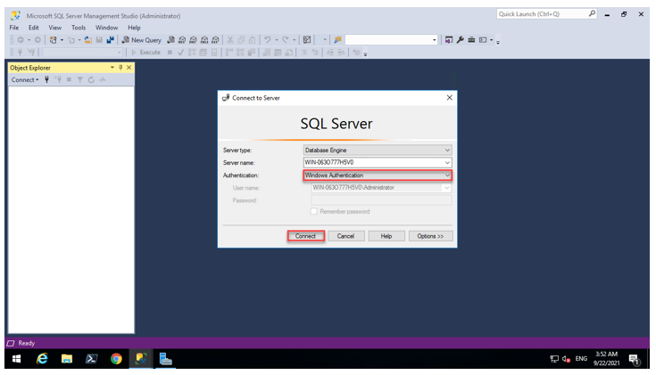
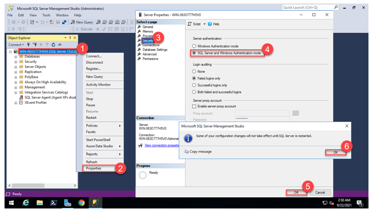
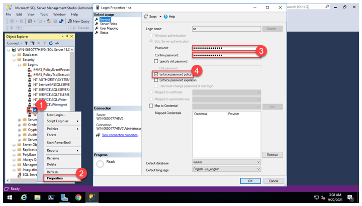
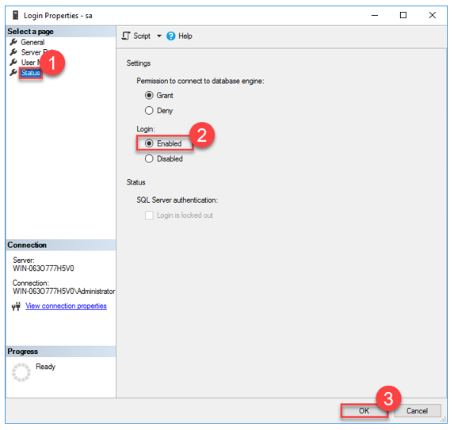
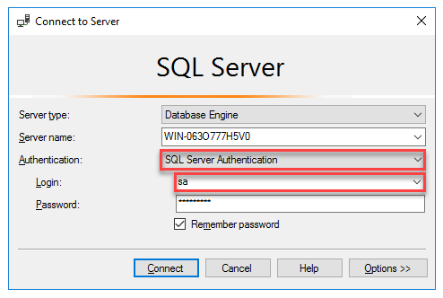
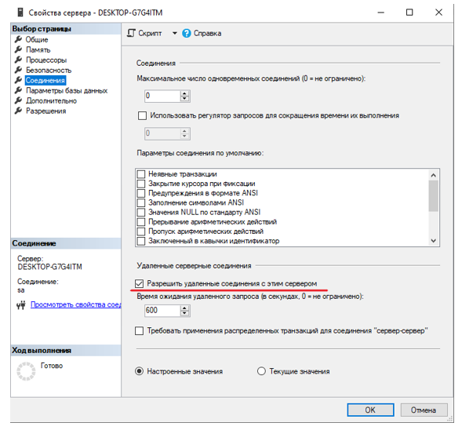
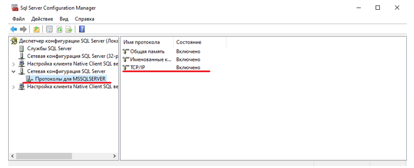
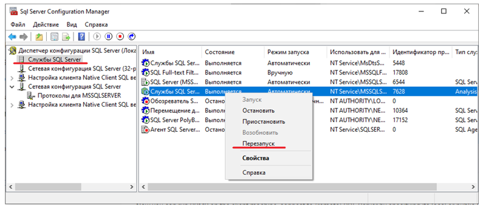

# Установка MS SQL SERVER 2019 и MS SQL Management Studio под Windows 2016 Server

1. В соответствии с имеющейся у компании лицензией, установите MSSQL SERVER, MS SQL MS, а также PowerShell.

2. Включите учетную запись суперпользователя **sa** базы данных. Для этого запустите **MS SQL Management Studio**. 

3. В разделе **Security** переключите Аутентификацию сервера как показано на скриншоте:

4. Не перезагружаясь, в свойствах суперпользователя **sa** вводим пароль два раза:

5. В этом же окне в разделе **Status** включить Login. Перезагрузить сервер:

6. При подключении к базе данных в MS SQL Management Studio, выберите Аутентификацию, ввести логин и пароль, как показано на скриншоте:

7. Разрешаем удаленное подключение к серверу БД:

8. При помощи утилиты `C:\Windows\System32\SQLServerManager15.msc` включаем TCP/IP для сервера БД:

> Название и расположение утилиты зависит от версии и установки MS SQL SERVER

9. Перезапускаем службу:

