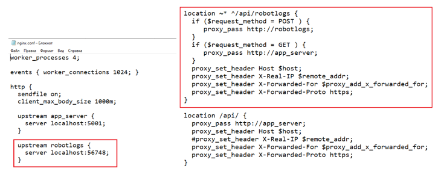
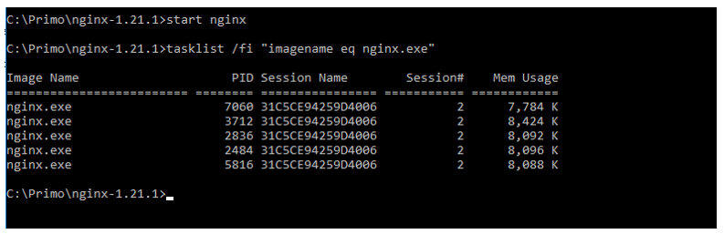
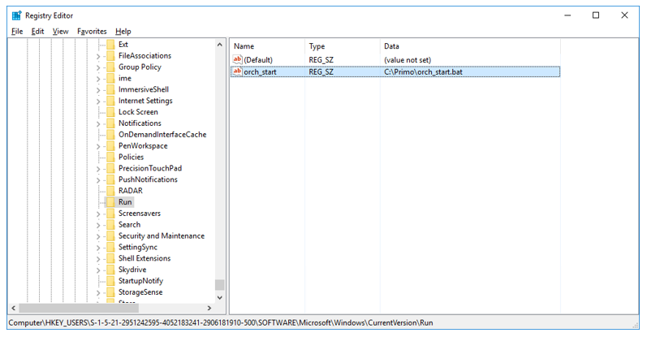

# Установка Nginx под Windows 2016 Server

Nginx используется как реверс-прокси для WebApi и как стандартный веб-сервер для отдачи статических файлов UI Оркестратора. 
Nginx настраивается при помощи файла nginx.config, который идет в комплекте поставки. Работа Nginx по https также настраивается в nginx.config. 
Файлы SSL-сертификата (самоподписанный, не валидный) также идут в комплекте поставки.  

1. [Скачайте](https://nginx.org/ru/download.html) и установите nginx. Также ознакомьтесь с информацией на [сайте продукта](https://nginx.org/ru/docs/windows.html).

2. Перейдите в папку с nginx (в общем случае - C:\Primo\nginx...)
Если для приема логов роботов не используется внешний сервис RobotLogs, нужно удалить из конфига nginx.conf проксирование в RobotLogs: 



3. При помощи cmd запустите nginx:
    * Перейдите в папку с установленным nginx:   
    `cd C:\Primo\nginx-1.21.1`
    * Создайте папку temp  
    `md temp`
    * Выполните команду запуска:   
    `start nginx`
    * Убедитесь, что nginx запущен, командой:   
    `tasklist /fi "imagename eq nginx.exe"` 



4. После каждой перезагрузки Windows требуется вручную запускать nginx. Чтобы этого не делать каждый раз, приложение nginx нужно поставить в автозагрузку. 
    * Cоздайте bat-файл C:\orch_start.bat со следующими командами: 
    ```
    cd C:\Primo\nginx-1.21.1 
    start nginx 
    ```
    * Внесите созданный файл в автозагрузку Windows командой:  
    `REG ADD HKCU\Software\Microsoft\Windows\CurrentVersion\Run /v orch_start /t REG_SZ /d "C:\orch_start.bat"`
	
    Добавится соответствующее значение в системный реестр:



5. Откройте порт 44392 на файерволе. В PowerShell выполните команду:  
`New-NetFirewallRule -DisplayName 'Primo Orchestrator (44392)' -Profile 'Private, Domain, Public' -Direction Inbound -Action Allow -Protocol TCP -LocalPort 44392`

6. При необходимости перезапустите nginx:  
`nginx -s reload`


