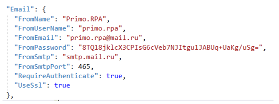
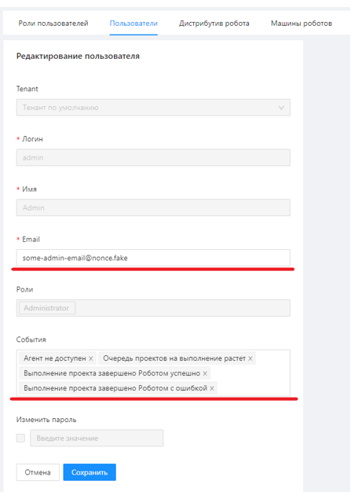

# Установка Notifications под Windows 2016 Server

Разархивируйте C:\Install\Notifications.zip в C:\Primo\Notifications.

Отредактируйте конфигурационный файл Notifications (C:\Primo\Notifications\appsettings.ProdWin.json):

Откорректируйте секцию Email, отвечающую за SMTP-сервер, с которого будет происходить рассылка:



Проверьте, что значение системной переменной окружения DOTNET_ENVIRONMENT равно ProdWin. Для этого в PoweShell выполните команду:
```
[Environment]::GetEnvironmentVariable('DOTNET_ENVIRONMENT', 'Machine')
```
Создайте системную переменную окружения DOTNET_ENVIRONMENT, если она не создана ранее. Для этого в PowerShell выполните команду:
```
[System.Environment]::SetEnvironmentVariable('DOTNET_ENVIRONMENT', 'ProdWin', [System.EnvironmentVariableTarget]::Machine)
```
Зарегистрируйте Primo.Orchestrator.Notifications.exe как службу Windows и сразу запускаем её. Служба должна работать как сетевая служба. Для этого в PoweShell последовательно выполните команды:
```
New-Service -Name Primo.Orchestrator.Notifications -BinaryPathName "C:\Primo\Notifications\Primo.Orchestrator.Notifications.exe" -Description "Primo.Orchestrator.Notifications" -DisplayName "Primo.Orchestrator.Notifications" -StartupType Automatic 
$s = Get-Service "Primo.Orchestrator.Notifications"
$s.Start()
```
После чего созданная служба Primo.Orchestrator.Notifications будет отображаться в списке всех служб как запущенная.

Через интерфейс Оркестратора в Настройки/Пользователи отредактируйте для пользователей параметры рассылки – укажите e-mail и типы событий:



