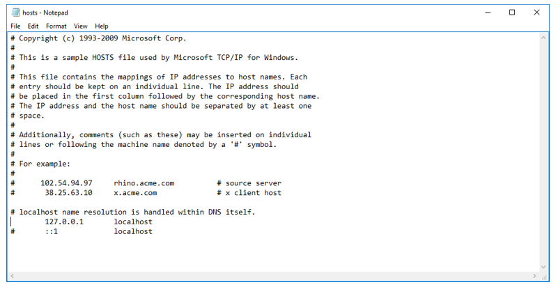

# Установка RabbitMQ под Windows 2016 Server

Разрешите localhost в файле `C:\Windows\System32\drivers\etc\hosts`:



Скачайте и установите нужную версию RabbitMQ, используя инструкции для [установки под Windows](https://www.rabbitmq.com/docs/install-windows).

Произведите первоначальное конфигурирование RabbitMQ:
```
cd C:\Program Files\RabbitMQ Server\rabbitmq_server-3.8.11\sbin
rabbitmq-plugins.bat enable rabbitmq_management
rabbitmqctl.bat add_user "admin" "Qwe123!@#" 
rabbitmqctl.bat set_user_tags admin administrator 
rabbitmqctl.bat set_permissions -p / admin ".*" ".*" ".*" 
rabbitmqctl.bat stop
rabbitmqctl.bat start_app
```
Откройте веб-интерфейс управления RabbitMQ на http://localhost:15672; убедитесь, что он открывается.

:small_orange_diamond: Авторизоваться со встроенной учетной записью guest можно только если административная панель работает на localhost.


Зайдите под пользователем admin/Qwe123!@#


Дальнейшее управление RabbitMQ можно осуществлять через этот веб-интерфейс.
