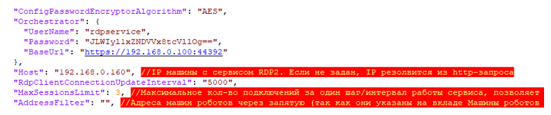
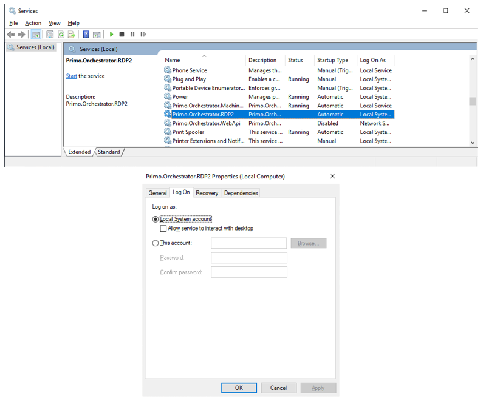
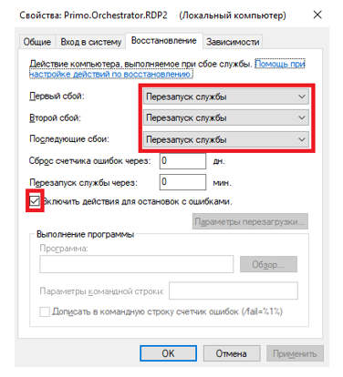
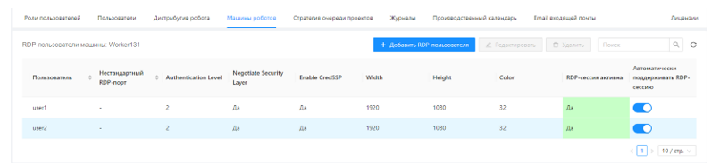
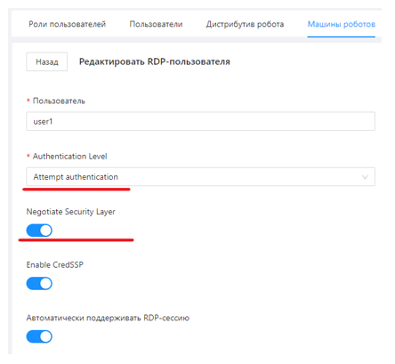

# Установка RDP2 под Windows 2016 Server

Разархивируйте C:\Install\RDP2.zip в C:\Primo\RDP2.

Отредактируйте конфигурационный файл RDP2 (C:\Primo\RDP2\appsettings.ProdWin.json):

Поменяйте в секции Orchestrator конфигурации адрес Оркестратора и учетную запись пользователя; используйте только системного пользователя rdpservice:



Если поменялся пароль пользователя rdpservice – поменяйте. Пароль предварительно зашифруйте программой шифрования паролей.  

При необходимости установите значение AddressFilter для фильтрации по машине Агента, либо оставьте поле пустым (будут использованы все Агенты системы).   

Значение RdpClientConnectionUpdateInterval задает шаг/интервал работы сервиса в мсек, его менять не рекомендуется.  

Значение MaxSessionsLimit задает максимально допустимое количество новых подключений за один шаг/интервал работы сервиса, позволяет сгладить нагрузку на Агента при большом количестве одновременных подключений. Если возникнет необходимость подключить сразу N сессий (где N > MaxSessionsLimit), то за первый шаг будут подключены только MaxSessionsLimit сесиий, далее через шаг/интервал RdpClientConnectionUpdateInterval еще MaxSessionsLimit сесиий и так далее пока не будут подключены все N сессий.  

Настройте путь до файла с логом и период ротации файла с логом (по умолчанию - день).  

Проверьте, что значение системной переменной окружения DOTNET_ENVIRONMENT равно ProdWin. Для этого в PoweShell выполните команду:
```
[Environment]::GetEnvironmentVariable('DOTNET_ENVIRONMENT', 'Machine')
```
Создайте системную переменную окружения DOTNET_ENVIRONMENT, если она не создана ранее. Для этого в PowerShell выполните команду:
```
[System.Environment]::SetEnvironmentVariable('DOTNET_ENVIRONMENT', 'ProdWin', [System.EnvironmentVariableTarget]::Machine)
```
Зарегистрируйте Primo.Orchestrator.RDP2.exe как службу Windows и сразу запустите её. Служба должна работать как локальная служба. Для этого в PowerShell последовательно выполните команды:
```
New-Service -Name Primo.Orchestrator.RDP2 -BinaryPathName   
"C:\Primo\RDP2\Primo.Orchestrator.RDP2.exe" -Description "Primo.Orchestrator.RDP2" -DisplayName "Primo.Orchestrator.RDP2" -StartupType Automatic 
```
Запустите службу. Служба должна работать под Local System account:



Перейдите на вкладку «Восстановление» (Recovery) и проверьте, что действия при сбое установлены:



После установки Агента выполните следующие действия:

Проверьте, что RDP-сессия устанавливается корректно:



Параметры сессии должны быть установлены: 

Authentication Level = Attemp Authentication  
Negotiate Security Layer = True


