# Установка RobotLogs как службы под Windows 2016 Server

## Базовая установка

Базовая установка – это установка на той же машине, где развернута служба WebApi.

Сначала требуется установить [RabbitMQ](../../orchestrator-new/install/windows/rabbitmq-windows.md).

Разархивируйте C:\Install\RobotLogs.zip в C:\Primo\RobotLogs. Можно при помощи PowerShell:
```
$InstallPath = "C:\Install"
Expand-Archive -LiteralPath "$InstallPath\RobotLogs.zip" -DestinationPath "C:\Primo\RobotLogs " -Force
```
Создайте системную переменную окружения (если не создана ранее). Для этого в PoweShell выполните команду:
```
[System.Environment]::SetEnvironmentVariable('ASPNETCORE_ENVIRONMENT', 'ProdWin', [System.EnvironmentVariableTarget]::Machine)
```
Настройте конфигурационный файл:
Настройте строки подключения в БД:

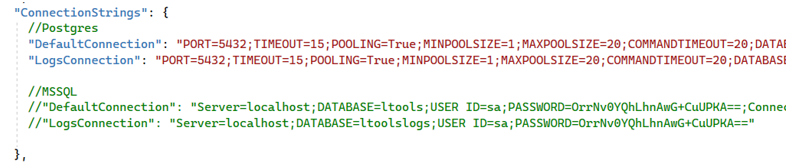

Если для Postgres используется схема, отличная от public, надо явно указать схему –  SearchPath=schema1.

Настройте UserName и Password сервера RabbitMQ, который используется для обработки логов со скринами рабочего стола:

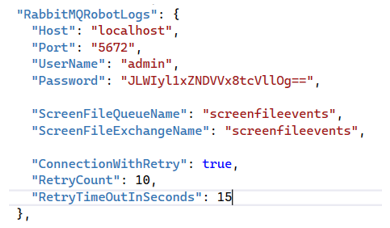

Настройте Host, UserName и Password сервера RabbitMQ, который используется для интеграции с Оркестратором:

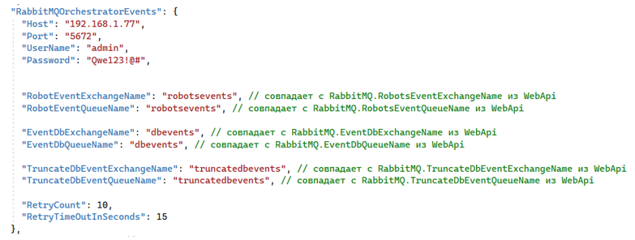

Откройте порт 5672 на файерволе сервера RabbitMQ, который используется для интеграции с Оркестратором. 

Сервер RabbitMQ, который используется для интеграции с Оркестратором, общий для очередей Primo.Orchestrator.RobotLogs и Primo.Orchestrator.WebApi. Поэтому требуется соблюдать соответствие названий очередей и обменников.

Настройте URL-оркестратора (при необходимости, можно поменять пароль встроенной системной записи Orchestrator – одновременно через UI Оркестратора и в этой секции конфигурации):

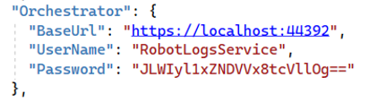

Настройте секцию ScreenFileUpload – параметры сбора файлов со скринами рабочего стола на машине робота:

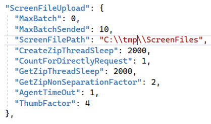

* MaxBatch – Максимальный размер пачки, извлекаемый из внутренней очереди ScreenFile за один раз, для отправки команды формирования Zip-архива файлов. Если больше нуля - файлы скринов запрашиваются асинхронно в виде Zip-архивов.
* MaxBatchSended – Максимальный размер пачки, извлекаемый из внутренней очереди ScreenFilesSended за один раз. При превышении GetZipNonSeparationFactor команда отправится в очередь повторно.
* ScreenFilePath – Путь до хранилища файлов скринов. Папку по этому пути желательно создать заранее. На неё должны быть настроены права на чтение и запись для всех. Из папки ScreenFilePath файлы скринов будет читать служба WebApi. Если служба RobotLogs (её экземпляры) находится не на одной машине с WebApi (см. п. 2. «Кластерный вариант»), то на машине с WebApi на эту сетевую папку (папки) должны быть настроены ссылки, или в качестве ScreenFilePath сразу использована общая сетевая папка. Или папки должна быть реплицированы по узлам с WebApi.
* CreateZipThreadSleep – Время засыпания потока опроса очереди (в милисекундах) формирования команд создания Zip-архивов Агентом.
* CountForDirectlyRequest – Кол-во команд, вычитанное из очереди, которое считается сильно маленьким, чтобы формировать запрос на архив. Запрос файлов по этим командам будет произведен напрямую.
* GetZipThreadSleep – Время засыпания потока опроса (в милисекундах) Агента на отдачу готовых Zip-архивов.
* GetZipNonSeparationFactor – Насколько отдельными будут обращения к одному агенту для получения Zip-архивов. Отдельное – в рамках разных итераций службы запросов. Чем выше значение, тем больше кол-во запросов (не превышая этот фактор) в рамках одной итерации.  
* AgentTimeOut – Таймаут (сек) запроса агента. Не стоит делать большим, чтобы не создать повышенную нагрузку на Агента.
* ThumbFactor – Коэффициент уменьшения оригинального изображения скрина. Уменьшенные изображения показываются в журнале робота в UI Оркестратора.

При наличии тенантов настройте в соответствии с конфигурацией WebApi их список:

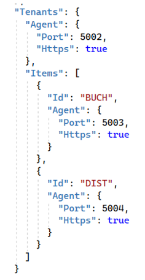

Зарегистрируйте Primo.Orchestrator.RobotLogs.exe как службу Windows и сразу запустите её. Служба должна работать как локальная служба. Для этого в PowerShell последовательно выполните команды:
```
New-Service -Name Primo.Orchestrator.RobotLogs -BinaryPathName "C:\Primo\RobotLogs\Primo.Orchestrator.RobotLogs.exe" -Description "Primo.Orchestrator.RobotLogs" -DisplayName "Primo.Orchestrator.RobotLogs" -StartupType Automatic 
$s = Get-Service "Primo.Orchestrator.RobotLogs"
$s.Start()
```
После чего созданная служба Primo.Orchestrator.RobotLogs будет отображаться в списке всех служб как запущенная.

Откройте порт 56748 на файерволе (если служба RobotLogs не на одном сервере с nginx для WebApi).

Проверьте, что в конфигурации nginx настроено проксирование на RobotLogs:

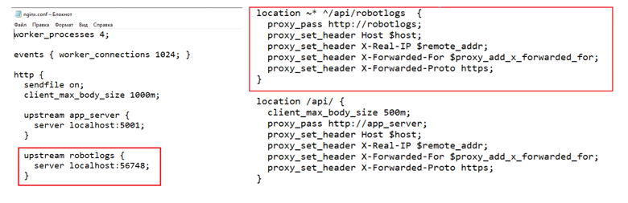

Если запросы в RobotLogs проксируются через отдельный от WebApi эндпоинт, нужно указать в конфиге Primo.Orchestrator.WebApi этот эндпоинт в RobotLogsBaseUrl:

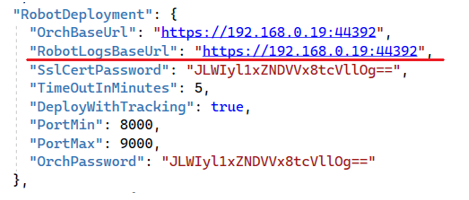

В настоящее время RobotLogsBaseUrl не поддерживается. Зарезервирован для дальнейшей оптимизации приема логов от роботов.

Тонкая настройка производительности приема логов при необходимости настраивается в секцииях InputBufferRobotLogs и InputBufferAttendedRobotLogs:

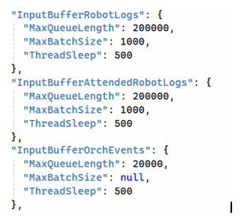

* MaxQueueLength – максимальный размер входного буфера приема логов от робота. Чем выше, тем больший размер пачек логов робот без потерь может слать в Оркестратор.
* MaxBatchSize – максимальный размер пачки за один раз сбрасываемый сервисом в БД ltoolslogs. Чем выше, тем меньше обращений в БД потребуется, но тем большее количество данных за один раз должно быть передано.
* ThreadSleep – время (мсек) опроса входного буфера.
Для оптимизации таблицы OrchEvents из неё периодически удаляются старый события, связанные с внутренней очередью триггеров Оркестратора – значение поле Event 9016, 9017, 9018. В секции TriggerNativeEventsQueueLogs настраиваются параметры этого удаления:

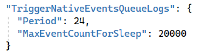

* Period – какие события считаются старыми (время в часах).
* MaxEventCountForSleep – сколько событий внутренней очереди с последней чистки должен принять сервис RobotLogs, чтобы запустилась новая чистка. Чтобы с одной стороны не делать её излишне часто, и с другой, чтобы чистка не затронула большой объем записей.

## Кластерный вариант

Если развернуто несколько экземпляров службы RobotLogs на нескольких узлах  для обеспечения масштабируемости, то требуется обеспечить возможность доступа WebApi к собранным RobotLogs файлам скринов.

Каждый узел RobotLogs пишет в БД абсолютный путь до файла скрина в соответствии со своей настройкой ScreenFileUpload:ScreenFilePath по Id записи лога. При отдаче файла скрина в UI Оркестратор определяет этот путь на основе Id записи лога. 

Рассмотрим схемы развертывания RobotLogs на нескольких машинах. Обеспечить возможность доступа WebApi к собранным RobotLogs файлам скринов можно несколькими способами, в зависимости от схемы.

### Репликация папок

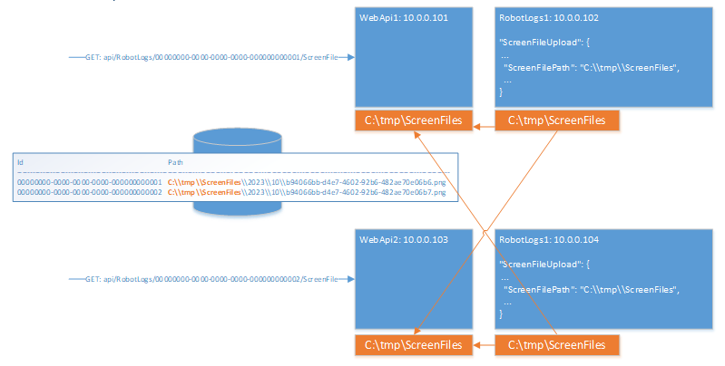

В этом случае на узлах с WebApi создается папка/папки с названием, как на узлах с RobotLogs, в которую реплицируются папки со всех узлов RobotLogs.   
Тогда не имеет значения, как называются папки на узлах RobotLogs, но репликация должна быть настроена во все такие одноименные (одноименные по абсолютному пути) папки на узлах WebApi. 

В этом случае оптимально в ScreenFileUpload:ScreenFilePath использовать одинаковые пути для разных узлов RobotLogs, чтобы не создавать несколько папок на узлах WebApi.

### Символические ссылки

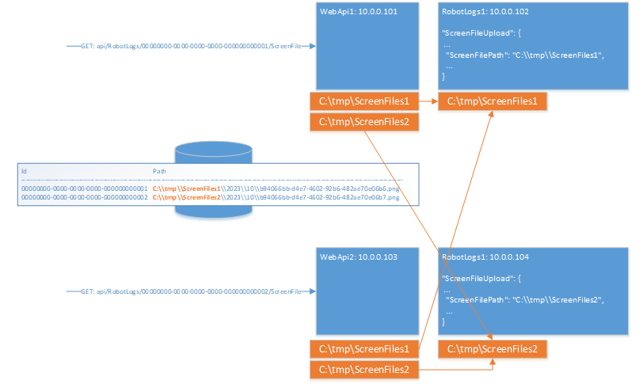

В этом случае на узлах с WebApi папки для скринов не создаются. На узлах RobotLogs в ScreenFileUpload:ScreenFilePath обязательно используются разные папки, расшаренные по сети. 
На папки узлов RobotLogs на узлах WebApi создаются символические ссылки.

### Общая сетевая папка 

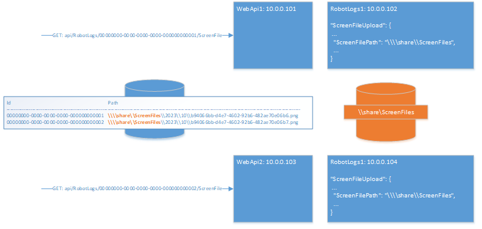

На отдельном узле создается расшаренная сетевая папка, на которую настраивается на каждом узле RobotLogs в ScreenFileUpload:ScreenFilePath путь до неё.
