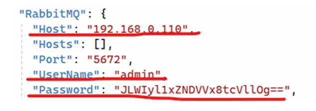
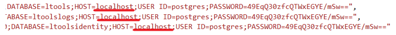

# Установка States под Windows 2016 Server

Разархивируйте C:\Install\States.zip в C:\Primo\States.

Отредактируйте конфигурационный файл States (C:\Primo\States\appsettings.ProdWin.json):

Поменяйте в секции ConnectionStrings конфига appsettings.ProdWin.json HOST для всех строк подключения к БД на реальный IP серверов БД:

Тут:



Поменяйте это:



Если поменялся пользователь/пароль БД – их также поменяйте.

Если для Postgres используется схема, отличная от public, надо явно указать схему –  SearchPath=schema1.

Проверьте, что значение системной переменной окружения DOTNET_ENVIRONMENT равно ProdWin. Для этого в PoweShell выполните команду:
```
[Environment]::GetEnvironmentVariable('DOTNET_ENVIRONMENT', 'Machine')
```
Создайте системную переменную окружения DOTNET_ENVIRONMENT, если она не создана ранее. Для этого в PowerShell выполните команду:
```
[System.Environment]::SetEnvironmentVariable('DOTNET_ENVIRONMENT', 'ProdWin', [System.EnvironmentVariableTarget]::Machine)
```
Зарегистрируйте Primo.Orchestrator.States.exe как службу Windows и сразу запустите её. 
Служба должна работать как сетевая служба. Для этого в PowerShell последовательно выполните команды:
```
New-Service -Name Primo.Orchestrator.States -BinaryPathName "C:\Primo\States\Primo.Orchestrator.States.exe" -Description "Primo.Orchestrator.States" -DisplayName "Primo.Orchestrator.States " -StartupType Automatic 
$s = Get-Service "Primo.Orchestrator.States"
$s.Start()
```
После чего созданная служба Primo.Orchestrator.States будет отображаться в списке всех служб как запущенная.

