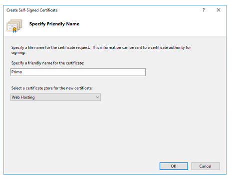
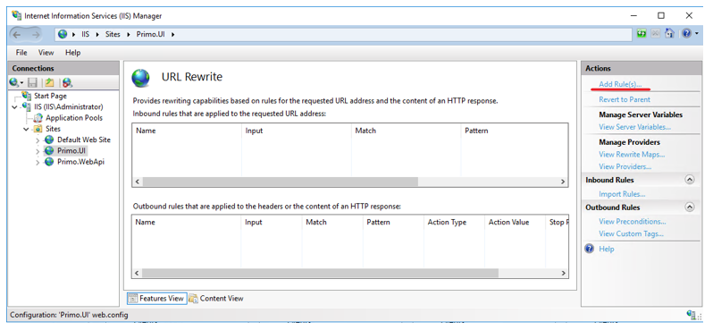

# Установка WebApi и UI на IIS под Windows 2016 Server

:small_orange_diamond: Перед началом работы установите все последние обновления Windows.

### 1. Включение компьютера в AD 
(не требуется, если используется DHCP)

Перед установкой IIS настройте статический IP адрес и DNS. В DNS пропишите IP контроллера AD. Это нужно для включения компьютера в AD.

Правой кнопкой мыши щелкните по иконке «Network» в правом нижнем углу:


Во всплывающем меню выберите «Open Network and Sharing Center»:


В открывшемся окне «Network and Sharing Center» в левом меню выберите «Change adapter settings»:


В открывшемся окне «Network Connections» выберите сетевой адаптер и щелкните по нему правой кнопкой мыши:


Во всплывающем меню выберите «Properties»:


В открывшемся окне «Ethernet Properties» щелкните по «Internet Protocol Version 4 (NCP/IPv4)»:


В открывшемся окне «Internet Protocol Version 4 (NCP/IPv4) Properties» (рисунок 7) настройте параметры:


Выберите «Use the following IP address» и пропишите значения полей «IP address», «Subnet mask» и «Default gateway». 
> Для VM значения этих полей можно узнать командой ipconfig

Выберите «Use the following DNS server addresses» и пропишите в поле «Preferred DNS server» IP контроллера домена.

Для удобства дальнейших настроек поменяйте имя компьютера, например, на «IIS». В главном меню Windows выберите пункт «Settings»:


В открывшемся окне «Settings» выберите пункт меню «System»:


И потом «About»:


При помощи кнопки «Rename PC» переименуйте компьютер, дождитесь перезагрузки.

Здесь же присоедините компьютер к AD:


Нажмите кнопку «Join a domain» и выберите имя AD:


Нажмите кнопку «Next» и введите логин/пароль доменной учетной записи:


Добавьте информацию о доменной учетной записи на компьютер, выбрав «Account type» = «Administrator»:


Перезагрузите компьютер:


После перезагрузки компьютера появится возможность входа в AD с доменной учетной записью:


## 2. Установка IIS

Войдите в систему с локальной учетной записью Administrator:


В «Server Manager» (откроется автоматически после входа в систему, также его можно запустить из главного меню), выберите «Add Roles and Features»:


В «Before you begin» нажмите кнопку «Next»:


В «Installation Type» оставьте выбор по умолчанию:


В «Server Selection» оставьте по умолчанию:


В «Server Roles» выберите «Web Server (IIS)»:


В «Features» оставьте выбор по умолчанию:


В «Web Server Role (IIS)» нажмите кнопку «Next»:


В «Role Services» выберите «HTTP Redirection» и «Windows Authentication»:


:small_orange_diamond: «WebDAV Publishing» выбирать нельзя. Если он выбран ранее – требуется его отключить, сняв галку.

В «Confirmation» нажмите кнопку «Install» и дождитесь завершения установки:


### 3. Разворачивание узлов веб-приложения

Откройте оснастку для управления IIS:


Создайте системную переменную окружения ASPNETCORE_ENVIRONMENT= ProdWin. Для этого в PoweShell выполните команду:
```
[System.Environment]::SetEnvironmentVariable('ASPNETCORE_ENVIRONMENT', 'ProdWin', [System.EnvironmentVariableTarget]::Machine)
```
Для узла WebApi создайте отдельный неуправляемый Application Pool с наименованием Primo.WebApi, 
**Start Mode = AlwaysRunning и Regular Time Interval (minutes) = 0** (чтобы пулл приложений не выгружался, так как при выгрузке сломается работа фоновых служб приложения).

Добавление Application Pool:


Параметры Application Pool:


Добавлен Application Pool с наименованием Primo.WebApi:


Создайте папки `C:\Primo\UI` и `C:\Primo\WebApi`, в которые разархивируйте UI.zip и 
WebApi-IIS.zip из комплекта поставки.

Рабочий каталог узла UI:


Рабочий каталог узла WebApi:


Добавьте веб-узел Primo.WebApi, установите для него ранее созданный Application Pool с наименованием Primo.WebApi.

Добавление веб-узла Primo.WebApi:


Параметры веб-узла Primo.WebApi:


Добавлен веб-узел Primo.WebApi:


Чтобы Primo.WebApi заработал под IIS, установите `dotnet-hosting-7.0.11-win.exe` 
(https://dotnet.microsoft.com/en-us/download/dotnet/thank-you/runtime-aspnetcore-7.0.11-windows-hosting-bundle-installer)
из комплекта поставки и перезагрузите компьютер.

Для создания узла UI сначала создайте для веб-сервера SSL-сертификат , так как этот узел будет работать по https.

> Для промышленного узла необходимо использовать SSL-сертификат, выданный доверенным удостоверяющим центром.

Открытие оснастки управления сертификатами:


Добавление самоподписанного SSL-сертификата:


Параметры SSL-сертификата:



SSL-сертификат с наименованием Primo установлен:


Добавьте веб-узел Primo.UI, установите для него Application Pool с наименованием DefaultAppPool и выберите ранее созданный SSL-сертификат с наименованием Primo: 


На этом шаге узлы Primo.WebApi и Primo.UI по отдельности рабочие. Далее надо связать Primo.UI и Primo.WebApi, настроив реверс-прокси для API. 
Предварительно надо установить модули IIS из комплекта поставки (обязательно в приведенной ниже последовательности), обеспечивающие 
функциональность реверс-прокси:  
`rewrite_amd64_en-US.msi`  
`requestRouter_amd64.msi`  

На узле Primo.UI настраиваем реверс-прокси для API.

Иконка оснастки управления правилами URL Rewrite:


Добавление правила URL Rewrite:



Выбор шаблона правила URL Rewrite:


Параметры правила URL Rewrite:


Параметры правила URL Rewrite:
* Name: Reverse Proxy to API
* Pattern: ^api/(.*)
* Rewrite URL: http://localhost:5001/api/{R:1} 

Правило URL Rewrite добавлено:


Чтобы ARR заработал, надо его активировать. Для этого попробуйте добавить «Reverse Proxy» правило:


IIS выдаст предупреждение об активации ARR, на которое надо согласиться и нажать «ОК»:


Добавлять «Reverse Proxy» правило не надо, это все нужно было только для активации ARR. Поэтому нажмите «Cancel»:


Теперь ARR активировано, и узел Primo.UI может работать как реверс-прокси.

Управлять правилами также можно из Web.config (секция <rewrite/>) узла.

Расположение Web.config узла Primo.UI:


Секция <rewrite/> Web.config:


Для каждого узла – Primo.UI и Primo.WebApi настройте максимальный размер загружаемых файлов.

Размер файлов для узла Primo.UI:


Размер файлов для узла Primo.WebApi:


Проверяем, что в appsettings.ProdWin.json для UseIISIntegration = true. 
Остальные настройки appsettings.ProdWin.json выставляем аналогично описанному в статье [Установка WebApi как службы под Windows 2016 Server](../../orchestrator-new/install/windows/webapi-windows.md). 

:small_orange_diamond: **ВНИМАНИЕ!!! Файлы web.config для каждого узла идут в комплекте поставки: для Primo.WebApi в архиве WebApi-IIS.zip, для Primo.UI в папке Distr\Windows. 
Их содержимое может отличаться от приведенных в руководстве скриншотов.**

> Дополнительную информацию можно найти на официальном сайте Microsoft: [URL Rewrite Module Configuration Reference](https://learn.microsoft.com/en-us/iis/extensions/url-rewrite-module/url-rewrite-module-configuration-reference) и
[Using Failed Request Tracing to Trace Rewrite Rules](https://learn.microsoft.com/en-us/iis/extensions/url-rewrite-module/using-failed-request-tracing-to-trace-rewrite-rules).

Проверьте работоспособность, запуская приложение в браузере по адресу:

`https://[адрес]:44392`

Если WebApi работает с MS SQL SERVER, используя Windows-аутентификацию (Trusted_Connection=True), то для Application Pool с наименованием Primo.WebApi необходимо задать этого (доменного) Windows-пользователя. 

Правой кнопкой мыши откройте окно Advanced Settings и найдите свойство Identity:


Поменяйте значение свойства Identity – выберите Custom account и нажмите кнопку «Set…»:


