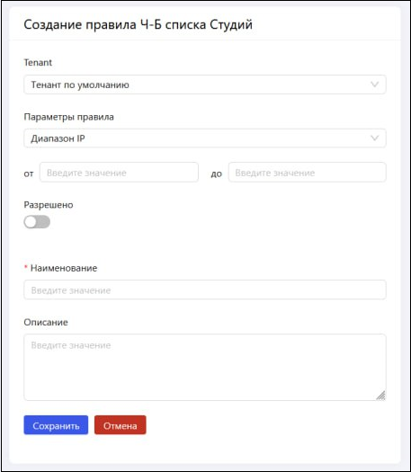

# Черный/Белый список Студий
Существует возможность сформировать списки машин Студий, которым:
* разрешено пользоваться [оркестраторными лицензиями](https://docs.primo-rpa.ru/primo-rpa/orchestrator-new/orchestrator-admin/licensing/license-types) на Студию (**белый список**);
* запрещено это делать (**черные списки**).

Белый список имеет приоритет над черным.

Права на создание списков есть только у администратора. Функция доступна в разделе **Настройки > Администрирование > Ч-Б список Студий** по кнопке **Добавить правило**:

В результате откроется форма настроек правила фильтрации:

1. **Tenant** - выберите тенант, к которому относятся учетные записи машин Студий. 
2. **Параметры правила** - по умолчанию настроена фильтрация по диапазону IP. Потребуется указать начало и конец диапазона IP-адресов машин.\
   Другие значения:
   * Маска подсети - потребуется ввести IP-адрес подсети и ее маску. Оба значения обязательны.
3. **Разрешено** (переключатель) - определяет, могут ли машины использовать лицензии Студии. По умолчанию выключен - машина будет добавлена в черный список. 
4. **Наименование** - название правила может состоять только из букв и цифр, дефиса и подчеркивания. Пробелы недопустимы.
5. **Описание** - произвольное описание правила, опционально. Описание поможет быстрее понять назначение правила при просмотре в общем списке.

Нажмите **Сохранить**, чтобы создать список.
