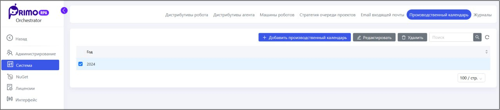
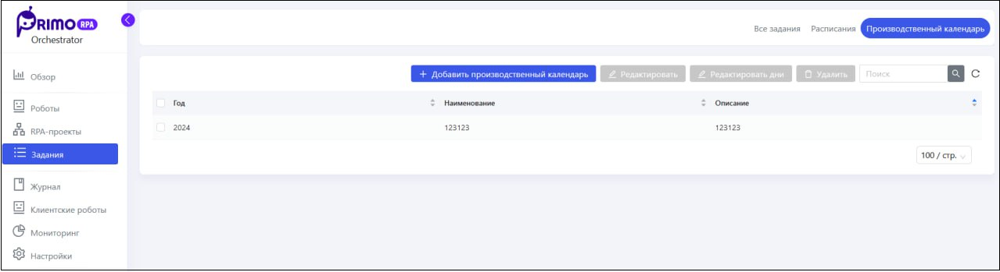

# Производственный календарь

Производственный календарь — это специальный календарь, в котором отмечены рабочие, выходные и праздничные дни за соответствующий год. Производственный календарь может понадобиться пользователю при создании расписания, по которому он планирует запускать [задания](https://docs.primo-rpa.ru/primo-rpa/orchestrator-new/orchestrator-user/tasks-overview). Календарь поможет автоматически определять дни, в которые задание запускать не нужно — это все нерабочие дни, отмеченные в календаре. 

Управление календарями осуществляется:
* на странице **Настройки ➝ Система ➝ Производственный календарь** - если не включены множественные календари
* на странице **Настройки ➝ Задания ➝ Производственный календарь** - если множественные календари включены

Доступ к разделу есть только у администратора Оркестратора, администратору тенанта он недоступен. 

## Производственный календарь по умолчанию

По умолчанию в Оркестратор можно добавить только 2 производственных календаря — один на текущий календарный год и один на следующий.

Добавление производится по кнопке **Добавить производственный календарь**. Если кнопка неактивна, то в Оркестраторе уже создано максимальное количество календарей.

Для гибкой настройки производственного календаря, выделите его в таблице и нажмите кнопку **Редактировать**. 

Откроется форма редактирования календаря. Все рабочие дни будут отмечены синим, а все нерабочие — красным цветом. Вы можете выбрать нужный вам день месяца и изменить его тип. Например, сделать нерабочий день рабочим.

## Множественные производственные календари

Оркестратор позволяет использовать *множественные производственные календари* — возможность создавать несколько производственных календарей для указанного календарного года. Функциональность может пригодиться в случае, если возникла необходимость добавить дополнительный календарь, в котором отсутствуют, например, какие-то праздники.

Чтобы разрешить создание множественных производственных календарей, необходимо сначала внести изменения в конфигурационный файл — подробнее см. [здесь](https://docs.primo-rpa.ru/primo-rpa/orchestrator-new/fine-tuning/multiple-production-calendars). По умолчанию множественные календари в системе не используются.

При создании множественных календарей в UI, для каждого из них указывается название и краткое описание.

