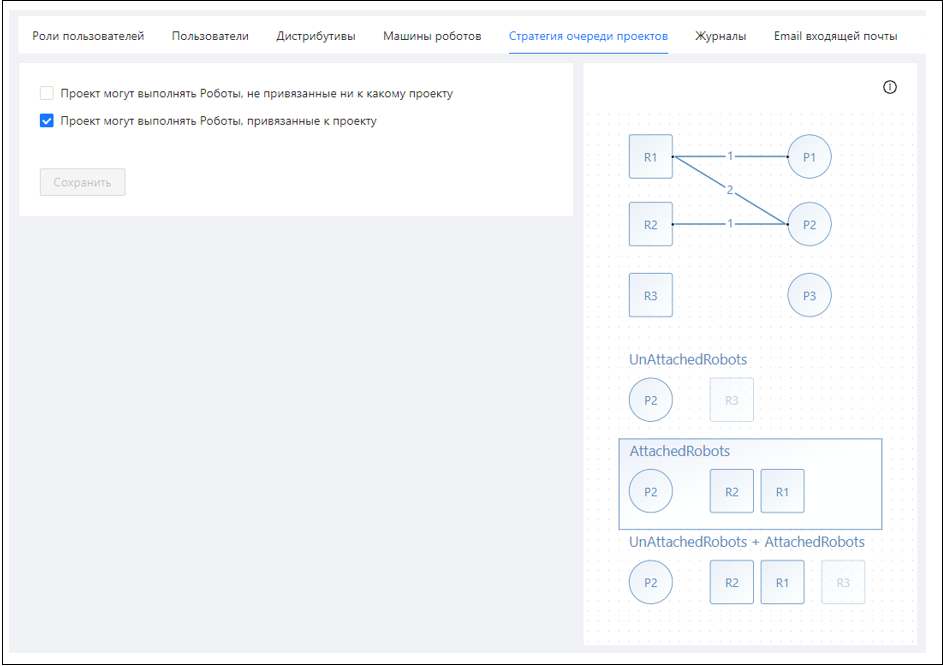
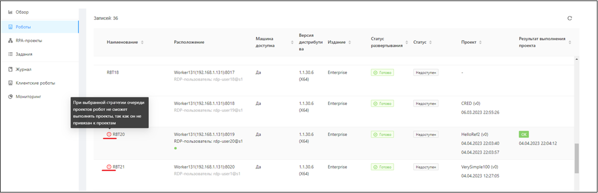
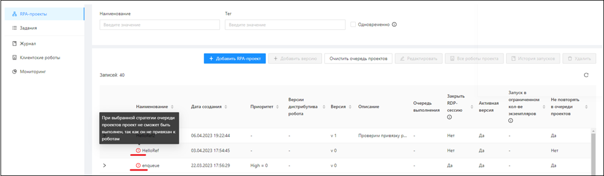

# Стратегия очереди RPA-проектов

В UI Оркестратора можно определить стратегию назначения роботов на выполнение RPA-проекта. Стратегию настраивает администратор Оркестратора **глобально для всех тенантов.**

[ЗАМЕНИТЬ ССЫЛКУ Стратегию для отдельного тенанта](https://docs.primo-rpa.ru/primo-rpa/orchestrator/fine-tuning/project-queue-strategies-for-tenant) можно задать только в конфигурационном файле.

## Глобальная стратегия

Перейдите в раздел **Настройки > Стратегия очереди проектов**. От выбранной стратегии зависит, по какому принципу будут назначаться роботы на RPA-проекты, помещенные в очередь на выполнение. 

В таблицах с роботами (рисунок 1) и RPA-проектами (рисунок 2) отображаются напоминания, если отсутствуют необходимые привязки для выбранной стратегии.

Рисунок 1:

Рисунок 2:

## Стратегия для отдельного тенанта
Индивидуальную стратегию для каждого тенанта можно назначить только в конфигурационном файле WebApi (через веб-интерфейс настройка недоступна). Описание процесса см. [ЗАМЕНИТЬ ССЫЛКУ здесь](https://docs.primo-rpa.ru/primo-rpa/orchestrator/fine-tuning/project-queue-strategies-for-tenant).