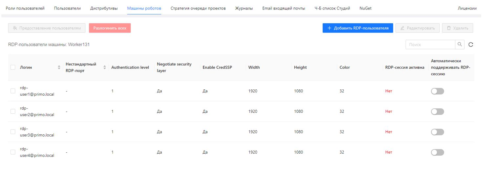
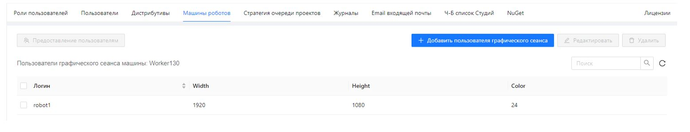
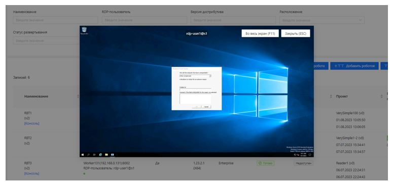
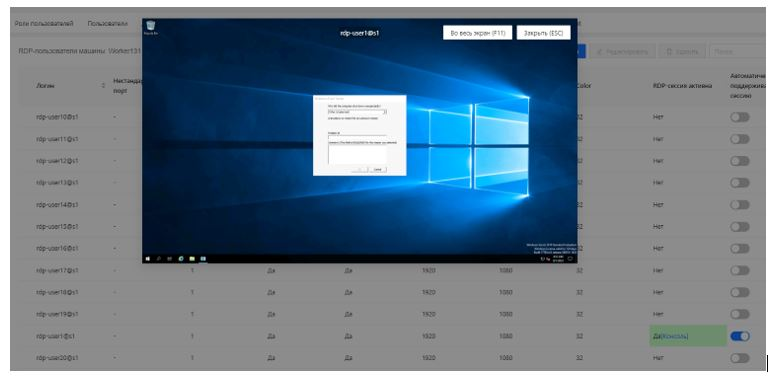

# Регистрация RDP-пользователей на машине робота

RDP-пользователи могут быть созданы в AD или локально на машине робота; пользователи графического сеанса на Linux-машине только локальные.
И те, и другие могут быть зарегистрированы в Оркестраторе. 

RDP-пользователи Windows-машины робота:

Пользователи графического сеанса Linux-машины робота:

Для привязанного\* к RDP-пользователю робота RDP-сессия открывается автоматически при старте робота. 
Чтобы сессия закрылась также автоматически после завершения роботом выполнения RDP-проекта, на форме создания/редактирования RPA-проекта нужно поставить галочку «Закрыть RDP-сессию».
Это выполняется администратором или администратором тенанта.

> \**См. раздел [Привязка RDP-пользователя к роботу](https://docs.primo-rpa.ru/primo-rpa/orchestrator-new/orchestrator-user/robots/tie-user-robot).*

## Просмотр RDP-сессии

> *Данная возможность доступна только для Windows-машин.*

Просмотр активной RDP-сессии RDP-пользователя Робота можно выполнить на странице Оркестратора **Роботы/Все роботы**, используя кнопку **Консоль**:

Также просмотр активной RDP-сессии RDP-пользователя доступен на странице **Машины роботов/RDP-пользователи**: 

## Управление RDP-сессиями через трансляцию

В версии Оркестратора 1.25.1 добавлена функция управления RDP-сессиями через трансляцию, что расширяет возможности работы с удалёнными сессиями.

**Функции управления**: ввод текста на латинице, кириллице, числовых значений и символов, а также выполнение операций, таких как создание файлов, поиск в браузере и другие действия.

**Включение стрима по запросу**:

* При запуске RDP2 стрим отключён для всех сессий.

* При запросе просмотра экрана клиент RDP автоматически перезапускается с включённым стримом, передавая изображение рабочего стола в браузер.

* После закрытия браузерной вкладки или нажатия кнопки "Стоп" клиент RDP автоматически перезапускается с отключённым стримом.

Управление и трансляция доступны через службу RDP2 (Windows, Linux, Linux с внешним клиентом) и NGINX.

