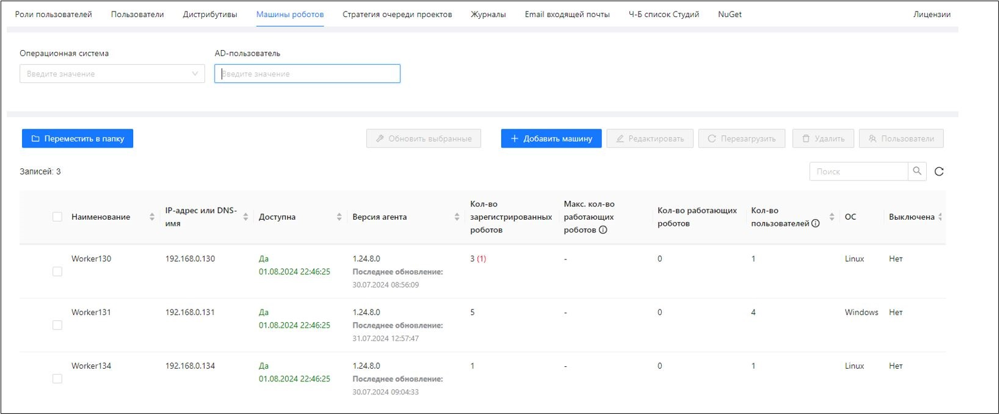
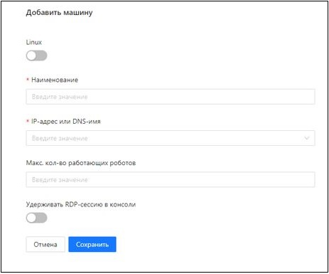
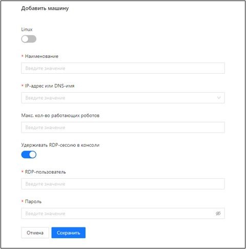
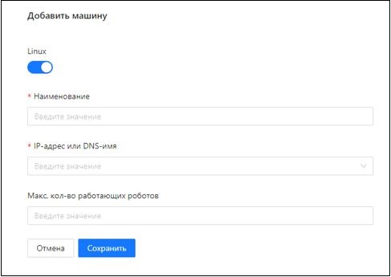

# Регистрация машины робота

Перед регистрацией машины робота в Оркестраторе ее необходимо настроить на основе информации в разделах:
* [настройка машины под Windows](https://docs.primo-rpa.ru/primo-rpa/orchestrator-new/install/windows/setting-up-machines-win/presetting-robot-machine-win);
* [настройка машины под Linux](https://docs.primo-rpa.ru/primo-rpa/orchestrator-new/install/linux/setting-up-machines-linux/presetting-robot-machine-linux).

## Как зарегистрировать машину

Перед регистрацией в Оркестраторе машина Робота должна быть доступна из Оркестратора. 

Чтобы зарегистрировать машину робота, перейдите в **Настройки > Машины роботов** и нажмите кнопку **Добавить машину**.
После регистрации убедитесь в доступности машины, просмотрев значение в колонке **Доступна**. Выключение машины означает, что она не участвует в опросе состояния.

Регистрация отличается для Windows- и Linux-машин.

Регистрация Windows-машины для удержания множества RDP-сессий:

Регистрация Windows-машины для удержания единственной RDP-сессии в консоли:

Регистрация Linux-машины:

