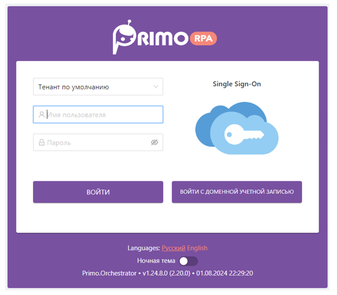

# Пользователи AD

При использовании технологии единого входа (SSO) допускается не создавать пользователей в Оркестраторе, а использовать учетные записи пользователей Active Directory (AD). 
Аутентификация\* пользователя AD осуществляется средствами AD. 

Для того чтобы назначить права пользователю AD, чтобы он смог авторизоваться  в Оркестраторе, необходимо провести сопоставление роли Оркестратора с группами AD такого пользователя. 
Эта привязка осуществляется на форме создания/редактирования роли для всех AD, в поле **Группы AD**.

Добавлением пользователей и групп в AD занимается администратор AD.
Рекомендуется завести для Оркестратора специальную группу в AD, в которую будут включены пользователя Оркестратора.

После добавления/изменения учетной записи в AD, например, включения её в группы AD, необходимо залогиниться/перелогиниться под этой учетной записью, чтобы изменения применились в Оркестраторе. 
При разрешенной  и включенной (галочкой на форме авторизации) мультитенантной AD-авторизации, AD-группа может быть сопоставлена ролям Оркестратора из разных тенантов. 
В этом случае пользователь для разрешения неоднозначности выбора тенанта по роли Оркестратора должен будет явно указывать тенант:

> \* - *Идентификация пользователя.*