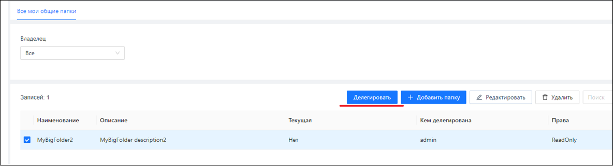

# Создание, редактирование и делегирование папок

Создаются/редактируются папки в меню «Общие папки/Все общие папки». Одну из папок пользователь может назначить текущей (отображаются слева под главным меню, ниже меню «Мониторинг»). 

Фильтрация всех объектов будет происходить на основе текущей папки. Все новые объекты создаются в текущей папке.

## Перемещение объектов между папками

Пользователь может перемещать объекты между своими папками:

Пользователь может переместить объекты из своей папки в корневую папку. Из корневой папки пользователь может переместить объекты в свою папку, если нет явного запрета (на корневую папку заданы права не ниже Удаления).

При старте Оркестратора/после перемещения объекта в папку происходит:
* Разрыв связей между Роботами и Проектами, которые противоречат папкам.
* Разрыв связей между Роботами и Группами, которые противоречат папкам.
* Разрыв связей между Роботами и Ресурсами (ассетами), которые противоречат папкам.
* Разрыв связей между Роботами и Очередями обмена, которые противоречат папкам.
* Помещение Задания в ту же папку, в которой находится Проект.
* Помещение Робота, связанного через триггер, в ту же папку, в которой находится Задание.
* Помещение Проекта, связанного через триггер, в ту же папку, в которой находится Задание.
* Помещение Очереди обмена, связанной через триггер, в ту же папку, в которой находится Задание.
* Помещение Расписания, связанного через триггер, в ту же папку, в которой находится Задание.
* Помещение Календарей в ту же папку, в которой находится Расписание.
* Помещение RDP-пользователя в ту же папку, в которой находится Windows-Робот.

Перечисленные действия продиктованы самостоятельной структурой связей между папочными сущностями, не зависящей от структуры папок:

Направленные связи (синие/оранжевые стрелки) - это связи типа 1-M (непосредственные или опосредованные). Ненаправленные связи (зеленые линии) - это связи M-M. 
Некорректные направленные связи корректируются, некорректные ненаправленные разрываются.

## Делегирование папок

Пользователь может предоставлять права на свои папки (делегировать) другим пользователям. 
Администратор/администратор тенанта это может сделать либо из формы **Все общие папки** (рисунок 1) – делегировать конкретную папку пользователям, либо из формы **Пользователи** (рисунок 2) – делегировать конкретному пользователю общие папки/.

Рисунок 1:

Рисунок 2:

Обычный пользователь, не администратор/администратор тенанта, это может сделать только из формы **Все общие папки**: 

По кнопке «Делегировать» откроется отдельная форма делегирования:

