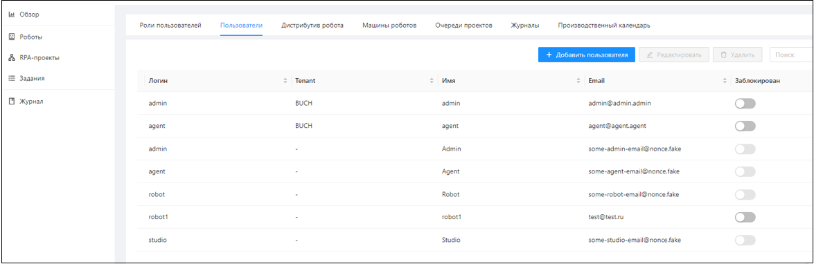
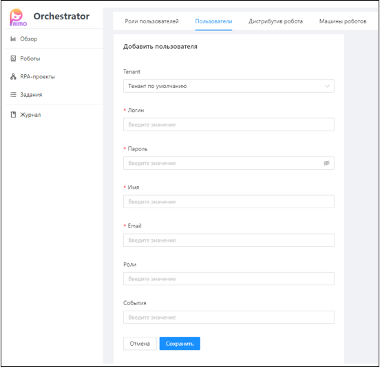

# Пользователи Оркестратора

Пользователи Оркестратора – это пользователи, учетные данные которых хранятся в самом Оркестраторе. 
Управление пользователями Оркестратора осуществляется на вкладке **Настройки/Пользователи**. 

Добавление нового пользователя Оркестратора осуществляется по кнопке **Добавить пользователя**:

