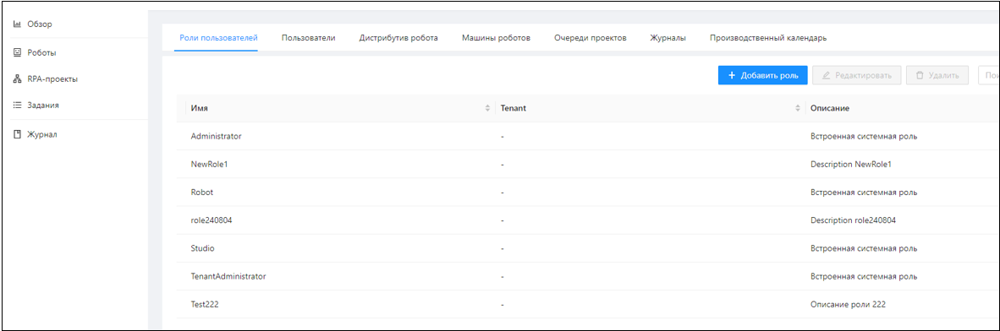
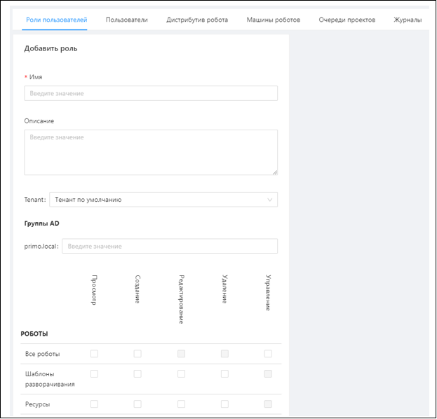

# Роли пользователей

Права пользователей в Оркестраторе настраиваются при помощи ролей. Каждая роль содержит в себе набор прав по работе с сущностями системы. 
Права делятся на категории: «Просмотр», «Создание», «Редактирование», «Удаление», «Управление».

В дальнейшем, при работе с пользователями, роли назначаются пользователю. Управление ролями осуществляется на вкладке **Настройки/Роли пользователей**. 
Добавление новой роли осуществляется по кнопке **Добавить роль**:

Форма добавления роли:

**Управление** – это права на специфические операции, например, «Запуск робота с проектом» для роботов.

Встроенные системные роли - Administrator, TenantAdministrator, Robot и Studio - не настраиваются. 
Невозможно создать через UI Оркестратора прикладную роль, которая имеет в точности такие же права, как эти перечисленные роли. 
Поэтому для административных задач, для роботов, Студий и Агентов должны использоваться эти системные роли. 
Они кросстенантные, их можно использовать как в дефолтном тенанте, так и в любом другом тенанте. 

Подробнее о назначении встроенных системных ролей можно узнать в разделе [Типовые сценарии управления пользователями](https://docs.primo-rpa.ru/primo-rpa/orchestrator-new/orchestrator-admin/users/common-scenarios).
