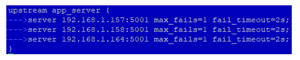
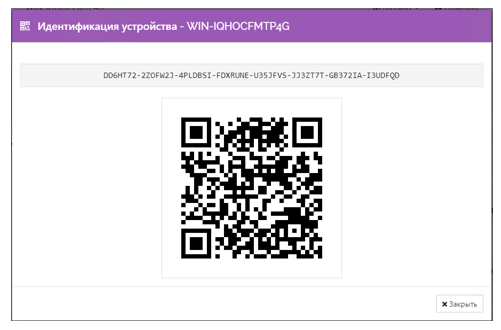
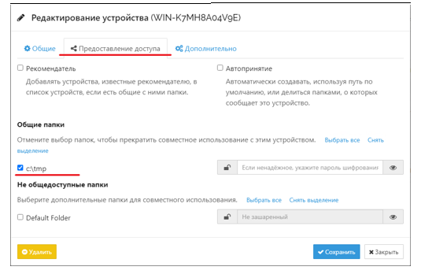
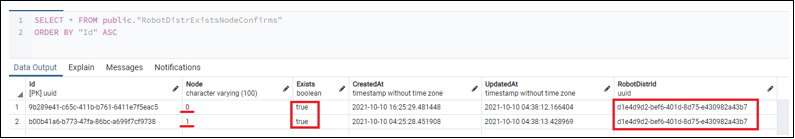
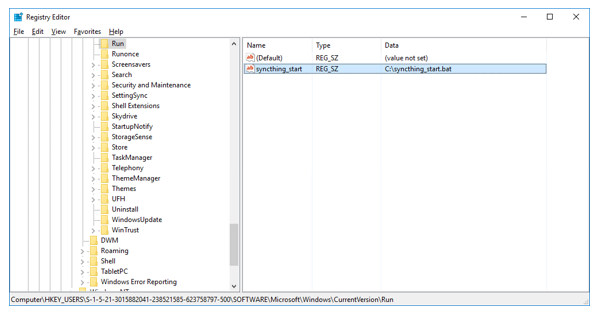

# Развертывание фермы WebApi за Nginx

1. Развертываем по инструкциям компоненты WebApi, States, Notifications на каждом узле фермы.
2. Правим конфигурационный файл WebApi (`c:\Primo\WebApi\appsettings.ProdWin.json` или `c:\Primo\WebApi\appsettings.ProdLinux.json`), где:\
   RobotDeployment: **OrchBaseUrl** – url, на который отвечает nginx;\
   InstanceInfo: **Id** – уникальный номер для каждого узла:
   ```json
   "RobotDeployment": {
     "OrchBaseUrl": "https://192.168.0.19:44392",
     "SslCertPassword": "JLWIyl1xZNDVVx8tcVllOg==",
     "TimeOutInMinutes": 5,
     "DeployWithTracking": true,
     "PortMin": 8000,
     "PortMax": 9000,
     "OrchPassword": "JLWIyl1xZNDVVx8tcVllOg=="
   },

   "InstanceInfo": {
     "Id": 0
   },
   ```
3. Правим конфигурационный файл nginx (`/etc/nginx/nginx.conf``````):
   * Прописываем url узлов фермы (на узлах порты должны быть открыты):\
     
   * Настраиваем [Passive Health Checks](https://docs.nginx.com/nginx/admin-guide/load-balancer/http-health-check/):\
     **fail_timeout** – время, в течение которого должно произойти количество неудачных попыток, чтобы сервер был помечен как недоступный, а также время, в течение которого сервер помечается как недоступный (по умолчанию 10 секунд).\
     **max_fails** – количество неудачных попыток, которые должны произойти в течение периода fail_timeout, чтобы сервер был помечен как недоступный (по умолчанию – 1 попытка).
4. Запускаем программу синхронизации папок [Syncthing](https://docs.syncthing.net/index.html) (идет в комплекте поставки) и 
настраиваем через её UI синхронизацию папки `C:\tmp`\* (или `/srv/samba/shared/tmp` для Linux) на узлах фермы:

> \* - В зависимости от того, какая папка указана в `appsettings.ProdWin.json` (`appsettings.ProdLinux.json`) в секции RobotDistrUpload:TargetFilePath

   * На **Windows** просто запускаем `syncthing.exe` (его потом нужно добавить в автозагрузку).
   * На **Linux**:\
     Разархивируем архив в директорию `/srv/samba/shared/install/syncthing-linux-amd64-v1.18.2` командой:
     ```
     # tar -xvf /srv/samba/shared/install/syncthing-linux-amd64-v1.18.2.tar.gz -C 
     /srv/samba/shared/install/syncthing-linux-amd64-v1.18.2/
     ```
     Запускаем программу Syncthing командой (потом нужно настроить как службу):
     ```
     # /srv/samba/shared/install/syncthing-linux-amd64-v1.18.2/syncthing
     ```
   * Добавляем папку `C:\tmp` (или `/srv/samba/shared/tmp` для Linux) в папки синхронизации для текущего устройства:

     
   
   * Добавляем удаленные устройства:

     

     Удаленные устройства добавляются при помощи ID устройства:\
     

     ID устройства можно просмотреть в модальном окне, которое открывается из **Главное меню/Действия/Показать ID**.
   * Редактируем удаленные устройства, указывая удаленную папку `C:\tmp` (или `/srv/samba/shared/tmp` для Linux) на вкладке **Предоставление доступа**:

     

5. Программу Syncthing помещаем в автозагрузку Windows или для Linux запускаем её как службу (файл службы syncthing.service идет в комплекте поставки). Подробнее эти процессы описаны в подразделах ниже.
6. Убеждаемся, что синхронизация работает: визуально наблюдаем содержимое папки `C:\tmp` (или `/srv/samba/shared/tmp` для Linux) на разных узлах и результат её проверки WebApi в БД ltools в таблице RobotDistrExistsNodeConfirms:



7. Если какой-то узел будет выведен из фермы, а запись в RobotDistrExistsNodeConfirms для него останется с **Exists=false**, то эта запись должна быть удалена из таблицы вручную.
8. Системное время должно быть синхронизировано на всех узлах.


## Добавление Syncthing в автозагрузку Windows
Создаем bat-файл `C:\syncthing_start.bat` со следующими командами\*: 
> *\*путь зависит от того, куда распакован архив syncthing-windows-amd64-v1.18.2.zip*. 
```
cd C:\Install\syncthing-windows-amd64-v1.18.2\syncthing-windows-amd64-v1.18.2 
start syncthing
```
Вносим созданный файл в автозагрузку Windows командой:
```
> REG ADD HKCU\Software\Microsoft\Windows\CurrentVersion\Run /v syncthing_start /t REG_SZ /d "C:\syncthing_start.bat"
```
Добавится значение в системный реестр:




## Запуск Syncthing как службы в Linux
Копируем папку с файлами из комплекта поставки (архив предварительно распаковываем):
```
#cp -R  /srv/samba/shared/install/syncthing-linux-amd64-v1.18.2 /opt/Primo/syncthing
```

Копируем syncthing.service из комплекта постави:
```
#cp /srv/samba/shared/install/syncthing.service /etc/systemd/system/syncthing.service
```

Перезапускаем service:
```
#systemctl daemon-reload
```

Ставим в автозагрузку:
```
#systemctl enable /etc/systemd/system/syncthing.service
```

Даем права на исполнение syncthing:
```
#chmod -R 777 /opt/Primo/syncthing/syncthing
```

Запускаем службу syncthing.service:
```
#systemctl start syncthing.service
```

Проверяем состояние службы:
```
#systemctl status syncthing.service
```


