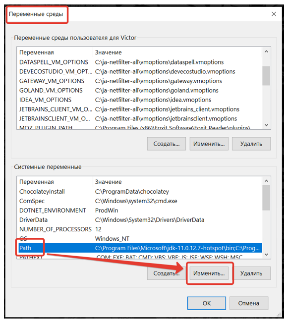

# Настройка PostgreSQL для работы через SSL

Данная статья содержит следующие подразделы:
1.	Заведение OpenSSL сертификатов для работы через SSL.
2.	Настройка PostgreSQL 15 на Linux для работы через SSL.
3.	Настройка PostgresPro 11 на Astra Linux для работы через SSL.
4.	Настройка PostgreSQL 15 на Windows для работы через SSL.
5.	Проверка работоспособности связки PostgreSQL с SSL.
6.	Настройка WebApi для работы с PostgreSQL через SSL.
7.	Полезные ссылки.

## Заведение OpenSSL сертификатов для работы через SSL.

1. Устанавливаем OpenSSL либо с [официального сайта](https://www.openssl.org/), либо используем ту версию, что идет в составе одной из утилит (например, можно использовать ту, которая идет в составе git).
2. Для того, чтобы в скриптах каждый раз не использовать полный путь к файлу `openssl.exe`, рекомендуется добавить этот путь в настройки системной переменной `Path` (если же вы предпочитаете работать через PowerShell, а не через командную строку, и не хотите изменять системную переменную `Path`, то можно использовать сеансовые алиасы). 
3. Далее в данном руководстве предполагается, что полный путь прописан в системной переменной `Path`. 
4. Прописать путь в `Path`, если Вы работаете в Windows  можно таким образом:
Открываем указанное ниже диалоговое окно (и далее выбираем соответствующие вкладки / нажимаем указанные кнопки / выбираем указанные строки из списков): 
- В нерусифицированной версии Windows:  
**System Properties > Advanced > Environment Variables… > System variables > Path > Edit… > New > [Тут указываем полный путь к файлу openssl.exe]:**
- В русской версии Windows:  
**Свойства системы > Дополнительно > Переменные среды… > Системные переменные > Path > Изменить… > Создать > [Тут указываем полный путь к файлу openssl.exe]:**

 
 
 

5. Далее создаем каталог, в котором будут размещаться как сами сертификаты, так и необходимые для их создания файлы и переходим в него.
6. Первым делом создаем корневой ключ для CA и затем создаем корневой сертификат CA.  
Открываем командную строку и выполняем в ней такие 2 команды:  
```
openssl genrsa -out rootCA.key 2048
openssl req -x509 -new -key rootCA.key -days 10000 -out rootCA.crt
```
Заполняем необходимые поля для сертификата. Имена выбираем произвольно. На этом корневой сертификат CA создан.
7. Генерируем ключ для сервера:
```
openssl genrsa -out server.key 2048
```
8. Теперь создаем запрос на сертификат сервера. 
```
openssl req -new -key server.key -out server.csr
```
При заполнении полей, в поле **Common Name** важно указать имя сервера: домен или IP адрес сервера (например домен: `db.example.com` или IP-адрес: `192.168.0.116`).

9. Подписываем запрос на сертификат нашим корневым сертификатом:
```
openssl x509 -req -in server.csr -CA rootCA.crt -CAkey rootCA.key -CAcreateserial -out server.crt -days 5000
```
10. Теперь таким же образом (как описано в трех предыдущих пунктах) создаем связку ключ-сертификат для клиента. Имена файлов соответственно меняем (например: `client.key, client.crt, client.csr`) :
```
openssl genrsa -out client.key 2048
openssl req -new -key client.key -out client.csr
openssl x509 -req -in client.csr -CA rootCA.crt -CAkey rootCA.key -CAcreateserial -out client.crt -days 5000
```
При заполнении полей сертификата клиента, в поле **Common Name** указываем логин под которым будет выполняться подключение к БД (здесь используется имя: `postgres` – далее во всех скриптах в этом руководстве подразумевается, что было задано именно такое имя для этого параметра).  

11. В итоге в нашей рабочей папке должно быть 9 таких файлов:

 

12. Теперь, когда с ключами покончено, переходим к настройке PostgreSQL, как описано далее в статье.


## Настройка PostgreSQL 15 на Linux для работы через SSL.

1. Копируем корневой сертификат CA, ключ и сертификат сервера (созданные ранее в п.1. настоящего руководства) в каталог БД (допустим он расположен по такому пути: `/var/lib/postgresql/data`, при этом мы сейчас находимся в папке с сертификатами, созданными ранее в разделе 1). 
В командной строке выполняем такие 3 команды:
```
cp server.key /var/lib/postgresql/data
cp server.crt /var/lib/postgresql/data
cp rootCA.crt /var/lib/postgresql/data
```
Пример: Если БД развернута в докер-контейнере с именем pg, а мы сейчас находимся в папке с сертификатами, созданными ранее в разделе 1, то указанные выше команды будут выглядеть таким образом:
```
docker cp server.key pg:/var/lib/postgresql/data
docker cp server.crt pg:/var/lib/postgresql/data
docker cp rootCA.crt pg:/var/lib/postgresql/data
```
2. Меняем имя владельца для указанных выше файлов на то имя, от которого мы будем коннектится к серверу и которое мы ранее (в п.9 раздела 1) указали при создании сертификата клиента в поле Common Name (здесь это имя: `postgres`):
Для этого переходим в каталог БД и выполняем такую команду:
```
chown postgres: server.crt server.key rootCA.crt
```
3. Изменяем права доступа для файлов `server.crt` и `server.key` (мы еще находимся в каталоге БД):
```
chmod 600 server.crt
chmod 600 server.key
```
4. В итоге в каталоге БД должны быть установлены указанные выше файлы с такими правами:

 

5. Теперь переходим к правке конфигурации PostgreSQL. PostgreSQL должен быть собран с поддержкой SSL. 
Для этого необходимо внести изменения в файлы `postgresql.conf` и `pg_hba.conf`.
6. В файл `postgresql.conf` добавляем такие строки:
```
ssl = on
ssl_ciphers = 'HIGH:MEDIUM:+3DES:!aNULL'
ssl_cert_file = 'server.crt'
ssl_key_file = 'server.key'
ssl_ca_file = 'rootCA.crt'
```

 

7. В файл `pg_hba.conf` добавляем такую строку:
```
hostssl     all       postgres          all	       cert
```
Тут предполагается, что мы ранее указали при создании сертификата клиента в поле **Common Name** имя: `postgres`.

 

8. Если нам требуется, чтобы коннект с сервером БД происходил только через SSL, то в дополнение к тому, что было сделано в п.7 раздела 2, в файл `pg_hba.conf` требуется добавить выше остальных конфигурационных строк такую строку:
```
hostnossl  all  		all  			all		  reject
```
и удалить (или закомментировать) строки, которые начинаются таким образом:
```
local   all
host    all
```
 

9. После этого перезапускаем сервер и проверяем коннект к нему через SSL (например, как описано в п.4. далее).


## Настройка PostgrePro 11 на Astra Linux 1.7 для работы через SSL.

Настройка аналогична таковой для PostgreSQL 15 на Linux (см. раздел 2 данной статьи), за исключением того, что теперь все серверные конфигурации и сертификаты будут расположены по такому пути: `/var/lib/pgpro/std-11/data`.


## Настройка PostgreSQL 15 на Windows для работы через SSL.

1. Копируем корневой сертификат CA, ключ и сертификат сервера (созданные ранее в разделе 1 настоящего руководства) в каталог БД (для PostgreSQL 15 он по умолчанию расположен по такому пути: `C:\Program Files\PostgreSQL\15\data`). 
Т.е. надо в этот каталог добавить файлы: `server.key, server.crt, rootCA.crt`:

 

2. Теперь переходим к правке конфигурации PostgreSQL. PostgreSQL должен быть собран с поддержкой SSL. Для этого необходимо внести изменения в файлы `postgresql.conf` и `pg_hba.conf`.
3. В файл `postgresql.conf` добавляем такие строки:
```
ssl = on
ssl_ciphers = 'HIGH:MEDIUM:+3DES:!aNULL'
ssl_cert_file = 'server.crt'
ssl_key_file = 'server.key'
ssl_ca_file = 'rootCA.crt'
```
 

4. В файл `pg_hba.conf` добавляем такую строку:
```
hostssl     all       postgres          all	       cert
```
Тут предполагается, что мы ранее указали при создании сертификата клиента в поле **Common Name** имя: `postgres`.

 

5. Если нам требуется, чтобы коннект с сервером БД происходил только через SSL, то в дополнение к тому, что было сделано в п.4 раздела 3, в файл `pg_hba.conf` требуется добавить выше остальных конфигурационных строк такую строку:
```
hostnossl  all  		all  			all		  reject
```
и удалить (или закомментировать) строки, которые начинаются таким образом:
```
local   all
host    all
```

 

6. После этого перезапускаем сервер и проверяем коннект к нему через SSL (например, как описано в разделе 4).


## Проверка работоспособность связки PostgreSQL с SSL.

Для этого будем использовать утилиту `pgAdmin4`. Создаем в ней новый коннект с такими параметрами:

1. Вкладка **Connection**:
-	В поле Host name/address вводим то имя **Common Name**, которое было для него указано при заведении серверного сертификата `server.crt`  
-	В поле Port указываем тот же самый порт, что используется для обычных tcp-соединений с сервером
-	В поле Username вводим то имя **Common Name**, на которое был оформлен клиентский сертификат `client.crt` (в данном руководстве мы ранее задавали его как `postgres`):

 

2. Вкладка SSL:
-	В поле **SSL mode** выбираем из выпадающего списка **Verify-Full**
-	В поле **Client certificate** указываем полный путь к папке с сертификатом клиента (т.е. к файлу `client.crt`) и имя этого сертификата
-	В поле **Client certificate key** указываем полный путь к папке с ключом сертификата клиента (т.е. к файлу `client.key`) и имя этого ключа сертификата
-	В поле **Root certificate** указываем полный путь к папке с сертификатом CA (т.е. к файлу `rootCA.crt`) и имя этого сертификата:

 

3. Далее сохраняем настройки этого коннекта.
4. Далее дважды кликаем по имени только что созданного коннекта в дереве **Servers** слева. При условии корректного заполнения указанных выше полей и соответствия введенных данных тем, что были указаны при заведении SSL-сертификатов и их ключей, мы должны без проблем установить SSL-коннект к серверу и выполнить любой допустимый SQL-запрос.  
Например, как показано тут:

 

## Настройка WebApi для работы с PostgreSQL через SSL.

1. Копируем на машину с WebAPI в удобное место клиентский сертификат и его ключ (файлы `client.crt` и `client.key`).
Например, для машин с ОС Windows это может выглядеть так:

 

Или для машин под ОС из семейства Linux:

 

2. Далее меняем конфигурационный файл WebApi (файл `appsettings.ProdWin.json` для машин семейства Windows, или `appsettings.ProdLinux.json` для машин семейства Linux):
* В секции **PostgresWithSslOptions** для параметра **ClientCertPath** указываем полный путь и имя клиентского сертификата.
* В той же секции для параметра **ClientCertKeyPath** указываем полный путь и имя ключа клиентского сертификата.
* В той же секции для параметра **UseSsl** указываем значение `true`.
* В секции `ConnectionStrings` для каждой из срок подключения добавляем в ее конец такую подстроку: `SSLMode=Require;TrustServerCertificate=true;`.  
Например, эти секции конфига для машин с ОС Windows могут выглядеть так:

 

Или для машин под ОС из семейства Linux:

 


## Полезные ссылки:

1. [Сайт OpenSSL](https://www.openssl.org/)
2. Документация по [настройкам PostgresPro с SSL (на русском языке)](https://postgrespro.ru/docs/postgresql/9.5/ssl-tcp)
3. Документация по [настройкам PostgreSQL с SSL (на английском языке)](https://www.postgresql.org/docs/current/ssl-tcp.html)
4. Описание [параметров `postgresql.conf` (на английском языке)](https://github.com/CrunchyData/os-pg-testing/blob/master/conf/postgresql.conf)
5. Описание [параметров `pg_hba.conf` (на английском языке)](https://github.com/CrunchyData/os-pg-testing/blob/master/conf/pg_hba.conf)
6. Руководство по [настройке связки PostgreSQL для работы через SSL на Windows (на английском языке)](https://methoddev.com/blog/postgresql-windows-encrypted-connection-ssl)


