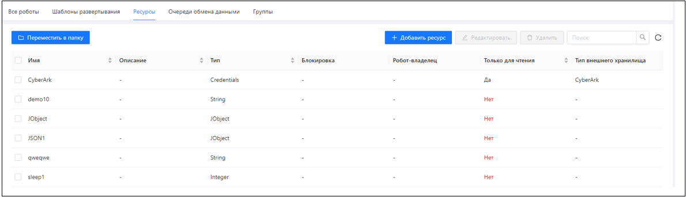
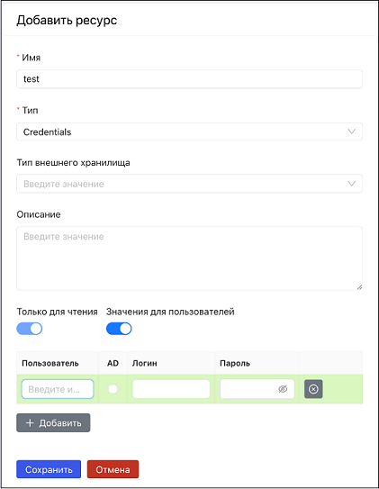

# Ресурсы

Ресурсы – это именованные переменные в хранилище Оркестратора, которые при выполнении RPA-проектов могут читать/устанавливать роботы и Студия. 

Ресурсы делятся на глобальные и локальные. Глобальные ресурсы – доступны всем роботам (в зависимости от настроек *чтение/запись*). Локальные ресурсы привязаны к конкретному роботу (роботу-владельцу), и только этот робот имеет к ним доступ (в зависимости от настроек чтение/запись). 

Для создания ресурса нужно на вкладке **Роботы/Ресурсы** нажать на кнопку **Добавить ресурс**: 

* **Имя** – уникальное наименование ресурса, по которому робот будет к нему обращаться.
* **Описание** – произвольное текстовое описание ресурса. Обычно содержит описание назначения ресурса, его содержимого.
* **Тип** – тип данных:
    * String – произвольная строка
    * Integer – целое число
    * Floating – число с плавающей точкой
    * Boolean – логический, строка true/false
    * DateTime – дата-время
    * Credentials – логин-пароль или ссылка на внешнее хранилище Credentials
    * JObject – строка с валидным json   

Например, если выбрано значение Сredentials, то будет создан ресурс с учетными данными пользователя. Пароль от учетных данных будет храниться в формате SecureString — в базу данных он попадет в зашифрованном виде и передаваться в Студию будет тоже зашифрованным.
* **Тип блокировки**\* – определяет тип блокировки ресурса роботом. Блокировка необходима при конкурентном доступе роботов к общему ресурсу. Например, при одновременной работе двух и более роботов с проектом, содержащим данный ресурс. При этом проект должен содержать элемент, устанавливающий блокировку. Если робот заблокировал элемент, то действия других роботов с данным ресурсом будут ограничены на установленное время. Настройка работает независимо от параметра **Робот-владелец** (владельцы могут быть установлены или отсутствовать).
Возможные типы блокировки:
    * Разрешено чтение — другие роботы смогут только читать этот ресурс. Запись запрещена.
    * Запрещено чтение — другим роботам полностью запрещено использовать этот ресурс. Настройка помогает исключить «грязное» чтение: когда один робот меняет значение заблокированного ресурса, другой робот не может прочитать старое значение.
* **Робот-владелец** — позволяет назначить робота (-ов) для работы с ресурсом. В этом случае ресурс будет считаться локальным, привязанным к роботу. Если вы хотите, чтобы ресурс был доступен всем роботам, оставьте это поле пустым.
* **Только для чтения** — устанавливает допустимые действия с ресурсом для роботов. По умолчанию переключатель выключен — роботы могут читать и изменять (перезаписывать) значение ресурса. Если включить настройку, то ресурс будет доступен только для чтения.
* **Тип внешнего хранилища** – применим только к ресурсам типа Credentials при настроенной интеграции с CyberArc. В этом случае Credentials физически хранится в CyberArc, а в Оркестраторе хранится только идентификатор из внешнего хранилища.
* **Таймаут** — время блокировки ресурса в секундах.

>\* - *В версии 1.24.2 не применяется*.

## Работа с ресурсами из Студии

За работу с ресурсами отвечают элементы Студии, входящие в группу **Оркестратор > [Значения](https://docs.primo-rpa.ru/primo-rpa/g_elements/el_basic/els_orch/els_assets)**. Поместите нужный элемент в свой RPA-проект, чтобы получить ресурс из Оркестратора либо чтобы перезаписать его значение при наличии соответствующих настроек.

Пример:
* Чтобы получить из Оркестратора ресурс с типом Сredentials, используйте в RPA-проекте элемент [Получить учетные данные](https://docs.primo-rpa.ru/primo-rpa/g_elements/osnovnye-elementy/orkestrator/els_assets/el_orch_getcredentials).
* Чтобы изменить в Оркестраторе значение ресурса с типом Сredentials, используйте в RPA-проекте элемент [Установить учетные данные](https://docs.primo-rpa.ru/primo-rpa/g_elements/el_basic/els_orch/els_assets/el_orch_setcredentials).